<h1 align="center">👀 peekdocs</h1>

<p align="center">
  <a href="https://github.com/exbuf/peekdocs/actions/workflows/test.yml"></a>&nbsp;&nbsp;
  <a href="https://www.python.org/downloads/"></a>&nbsp;&nbsp;
  <a href="LICENSE"></a>
</p>

peekdocs is a privacy-first local document search and analysis tool for Windows, macOS, and Linux, available as a point-and-click GUI, a command-line CLI, and a Python API. Search across 100+ file types—including PDFs, Office documents, email archives, ZIP/7z files, source code, and scanned documents via OCR—using keyword, fuzzy, Boolean, proximity, and advanced regex searches. Generate yellow-highlighted reports, automate recurring searches, perform batch analysis, and save reusable search profiles. Free and open-source under the MIT License.

Built for people who prefer local, transparent, deterministic tools over cloud services, subscriptions, and black-box AI workflows.

## Feature Highlights

peekdocs extracts and searches text from PDFs, Word documents, Excel spreadsheets, email archives, ZIP files, scanned images (OCR), and 100+ other formats that traditional text-search tools cannot read — then generates highlighted reports you can save, print, or share.

- **100+ file types in one query** — Word, PDF, Excel, email, source code, archives, and more — searched simultaneously
- **Yellow-highlighted reports with surrounding context** — .docx, .html, and .pdf reports with matches highlighted alongside their surrounding paragraphs or lines, plus .csv, .json, and .txt output
- **OCR** — search scanned PDFs and images that most tools can't handle. Tesseract (free, open-source) must be installed separately — but once it is, peekdocs handles the rest. *Accuracy depends on source quality: clean printed pages work well; handwriting, low-resolution scans, and complex layouts may extract poorly.*
- **11 search modes** — Boolean, fuzzy, wildcard, regex, proximity, inverse, whole-word, range, AND/OR, and more
- **Search Wizard** — 21 pre-built search types, no syntax to memorize
- **Regex Search** — run up to 10 named regex patterns per collection, with unlimited saved collections. Switch between collections for different tasks (e.g., "code patterns", "log analysis", "invoice extraction") — or run any collection from Python via `run_regex_collection()`
- **Search Suites** — group saved searches and run them all with one click — or from Python via `run_suite()`
- **Scriptable** — Python API, JSON output, and exit codes for cron jobs, CI pipelines, and other automation
- **Read-only** — peekdocs runs locally and never modifies, moves, or deletes your files

&nbsp;

<p align="center"><b>Free &nbsp;&nbsp;·&nbsp;&nbsp; Open-Source (MIT License) &nbsp;&nbsp;·&nbsp;&nbsp; No Cloud &nbsp;&nbsp;·&nbsp;&nbsp; Private &nbsp;&nbsp;·&nbsp;&nbsp; Easy to Use</b></p>
<p align="center"><b>Windows &nbsp;&nbsp;·&nbsp;&nbsp; macOS &nbsp;&nbsp;·&nbsp;&nbsp; Linux &nbsp;&nbsp;&nbsp;&nbsp;|&nbsp;&nbsp;&nbsp;&nbsp; GUI &nbsp;&nbsp;·&nbsp;&nbsp; CLI &nbsp;&nbsp;·&nbsp;&nbsp; Python API</b></p>

&nbsp;

**Two ways to install:**
1. Developers with Python: `pipx install git+https://github.com/exbuf/peekdocs.git` (below)
2. Everyone else: [download the standalone app](#option-a-standalone-download-recommended-for-most-users) — no Python needed, just download and run

```bash
# Install (requires Python 3.10+)
pipx install git+https://github.com/exbuf/peekdocs.git    # recommended (isolated)
# — or —
pip install git+https://github.com/exbuf/peekdocs.git     # if you prefer pip

# Search from the terminal
peekdocs "budget" ~/Documents
# Found 47 match(es) in 12 file(s). Files searched: 238 (142.50 MB).
#   2024_tax_return_summary.pdf: 8
#   quarterly_report_Q1.docx: 6
#   vendor_contract_2024.pdf: 5  ...

# Search with the GUI
peekdocs-gui

# Search from Python API
from peekdocs import search
results = search(["budget"], directory="~/Documents")
for match in results.matches:
    print(f"{match.filename}:{match.line_num} {match.text}")
```

## Contents

- [Feature Highlights](#feature-highlights)
- [CLI at a Glance](#cli-at-a-glance)
- [Screenshots](#screenshots)
- [Who Is It For?](#who-is-it-for)
- [Features](#features)
- [Supported File Types](#supported-file-types)
- [Installation](#installation)
- [Prerequisites](#prerequisites)
- [Quick Start](#quick-start)
- [Documentation](#documentation)
- [Why peekdocs?](#why-peekdocs)
- [What peekdocs Is Not](#what-peekdocs-is-not)
- [Performance](#performance)
- [Platform Notes](#platform-notes)
- [Preparing Documents](#preparing-your-documents-for-searching)
- [FAQ](#frequently-asked-questions)
- [Glossary](#glossary)
- [For IT and Security Teams](#for-it-and-security-teams)
- [Testing](#testing)
- [Contributing](#contributing)
- [Author](#author)
- [Disclaimer](#disclaimer)
- [License](#license)

## CLI at a Glance

Type `peekdocs` with no arguments to see a quick command reference:

```
$ peekdocs

By default, only the current folder is searched. Use -r to include subfolders.

── Search Modes (examples — flags can be combined freely) ────────
  peekdocs term1 term2           OR search (any term matches)
  peekdocs -a term1 term2        AND search (all terms required in same line)
  peekdocs -e "(A AND B) OR C"   Boolean expression with AND, OR, NOT, parens
  peekdocs -x "\d{3}-\d{4}"      Regex pattern matching
  peekdocs -w "budg*"            Wildcard (* = any chars, ? = one char)
  peekdocs -z budgt              Fuzzy matching (typo-tolerant)
  peekdocs -W bob                Whole-word only (not "bobcat")
  peekdocs -p 5 budget revenue   Word proximity (terms within 5 words of each other)
  peekdocs -P 3 budget acme      Line proximity (terms within 3 lines of each other)
  peekdocs --inverse budget      Find files that do NOT contain "budget"
  peekdocs -n draft budget       Find "budget" but exclude lines containing "draft"
  peekdocs -s quarterly budget   Save a named copy of the report
  peekdocs --open docx budget    Search and auto-open the highlighted Word report
  peekdocs --open html budget    Search, generate HTML, and open in browser

── Common Options ───────────────────────────────────────────────
  peekdocs -r budget               Search all subfolders recursively
  peekdocs -t pdf,docx budget      Search only PDF and Word files
  peekdocs -A 5 -B 5 budget        Show 5 lines before and after each match
  peekdocs -R amount:1000..5000 "" Filter by dollar range
  peekdocs -O budget               Enable OCR for scanned PDFs and images
  peekdocs -o csv,json,pdf,html budget  Additional output formats (any combination)
  peekdocs -m 5000 budget          Max matches in reports (0 = no limit, default: 1000)
  peekdocs --max-file-size 500     Skip files larger than 500 MB (default 100, 0 = no limit)
  peekdocs --index                 Build search index for faster repeated searches
  peekdocs --suite "My Suite"      Run a saved search suite by name (auto-locates folder)
  peekdocs --suite ~/Documents/MyDocs/"Example 1"  Run a suite by full path (explicit folder)
  peekdocs --list-suites           List every known suite and its folder
  peekdocs --config max_matches=5000  Save a default setting permanently

── Piping and automation ─────────────────────────────────────────

  # Output structured JSON to stdout (no report files created)
  peekdocs --stdout -r "budget"

  # Use jq to extract match statistics
  peekdocs --stdout -r "budget" | jq '.matches_found'

  # Run a saved regex workflow
  peekdocs --regex-collection "code patterns"

  # Run recursively across subdirectories
  peekdocs --regex-collection "code patterns" -r

  # Emit regex workflow results as JSON
  peekdocs --regex-collection "code patterns" --stdout

  # List available regex collections
  peekdocs --regex-collection --list

  # Workflow: run overnight recursive analysis and save JSON results
  peekdocs --regex-collection "research review" -d ~/Documents -r --stdout > results.json

  GUI users: Tools → Schedule Search can generate these commands
  with step-by-step instructions — no terminal experience needed.

── Cleanup ──────────────────────────────────────────────────────
  peekdocs --list-files          List all peekdocs-created files
  peekdocs --clear               Delete peekdocs_*_results* files
  peekdocs --clear-all           Delete all peekdocs output files

Exit codes: 0 = matches found, 1 = no matches, 2 = error.

Type peekdocs -h for full help (all flags, file types, regex patterns).
```

**When to use quotes around search terms:** Single words don't need quotes (`peekdocs budget`). Use quotes for phrases (`peekdocs "budget report"`), regex (`peekdocs -x "\d{3}-\d{4}"`), and anything with special characters like `$`, `*`, `(`, `)`, `|`, or `=` — the shell will interpret them before peekdocs sees them. When in doubt, use quotes — they never hurt.

Condensed version of `peekdocs -h` (all flags and options):

```
Search modes:
  (default)          OR    -a AND    -e "EXPR" Boolean    -x Regex
  -w Wildcard    -z Fuzzy    -W Whole-word    -p Word proximity
  -P Line proximity    --inverse

Filters:  -t pdf,docx  -r (recursive)  -n draft (exclude)  -O (OCR)
          -R amount:1000..5000  --max-file-size 500  -f report.pdf
Output:   -o csv,json,pdf,html  -s name (save)  --timestamp
          --open docx  --open html  -sa archive (append)
          --stdout (JSON to stdout for piping, no report files)
Index:    --index (build)  --index-refresh  --index-clear
Cleanup:  --clear  --clear-all  --list-files
Settings: --config KEY=VAL  --config --reset  --check
```

Run `peekdocs -h` for the full list of flags, file types, and regex patterns.

### Screenshots

*The examples below lean toward source-code use cases — searching for `TODO`, regex patterns for URLs / UUIDs / version strings, and so on. That bias is deliberate: developers and Python users are the most likely first adopters since they're the ones browsing GitHub and PyPI for a tool like this. peekdocs works equally well on personal documents, research archives, legal filings, scanned receipts, and anything else made of text — the screenshots just happen to showcase the audience most likely to be reading them.*

#### 1. Same search, four ways

One `TODO` search, shown across the four surfaces peekdocs ships: GUI, CLI, Python API, and the auto-generated Word report.

**(a) GUI — main page searching for `TODO` across a source tree.** Index-backed search returned 69 matches in 54 files (out of 453 files / 808 MB scanned) in 0.54 seconds. Every match is highlighted in yellow with surrounding context.

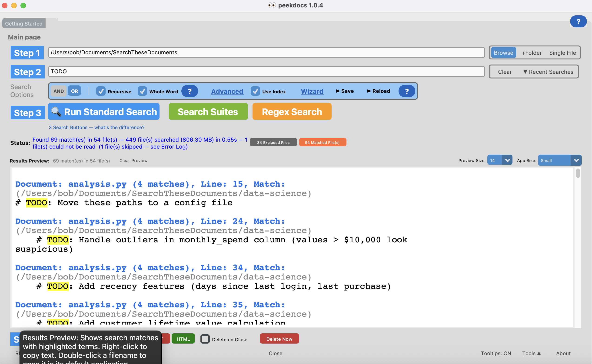

**(b) CLI — same search from the terminal.** Same folder, same Whole Word + indexed mode, same 69 matches in 54 files. Quiet output (`-qq`) keeps the screenshot to the headline numbers; stderr redirected so optional-format warnings don't clutter the frame.

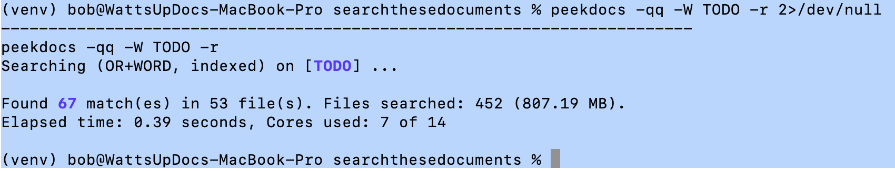

**(c) Python API — same search from a script or notebook.** The same engine is exposed as a library: `from peekdocs import search` returns a typed `SearchResult` of `SearchMatch` dataclasses (`file_dir`, `filename`, `line_num`, `text`) — no parsing strings out of CLI output. Drop it into a Jupyter notebook, a script, or any Python program. Same index, same `0.3`-second result.

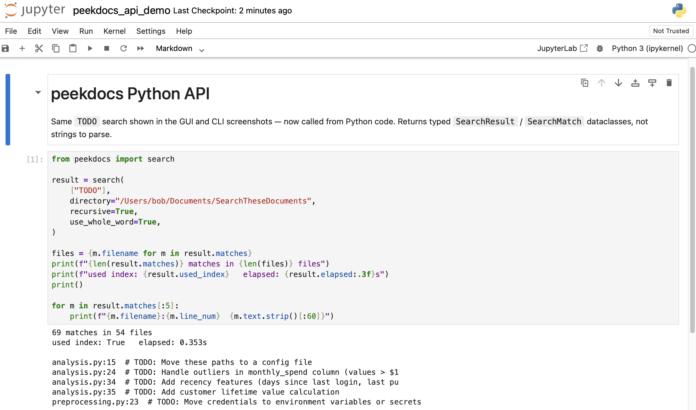

**(d) Word report — the shareable artifact.** Every search automatically produces `peekdocs_standard_results.docx` alongside the .txt — yellow-highlighted matches, file paths as section headings, line numbers, surrounding context preserved. Hand it to a colleague who's never heard of peekdocs and they immediately understand what's in it. Opens in Microsoft Word, [LibreOffice](https://www.libreoffice.org/download/download-libreoffice/) (free), Apple Pages, or any word processor — the screenshot below is LibreOffice. Optional CSV, JSON, PDF, and HTML outputs are also available (checkboxes under Advanced Search Options).

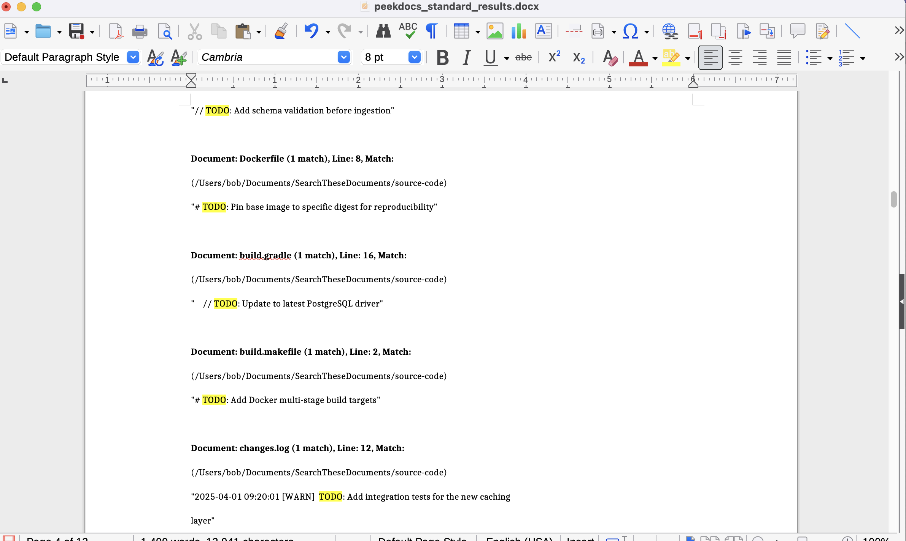

#### 2. Advanced Search Options — every option in one GUI panel

The CLI flags this README mentions — `--regex`, `--fuzzy`, `--whole-word`, `--ocr`, `--exclude`, `-t` (file types), `--range`, `--max-file-size`, `--output-dir`, `--timestamp`, CSV/JSON/PDF/HTML output, and so on — every one of them has a checkbox or field in the **Advanced Search Options** panel under the main search bar. Click the panel header on the main page to expand it. As the note at the top says: *"All searches are based on this screen and the Search Terms on the main screen. Your selections take effect immediately on the next search."* **Save As Defaults** persists the current configuration to `~/.peekdocsrc` for the next session; **Restore Factory Settings** clears it. Hover any control for a tooltip describing what it does.

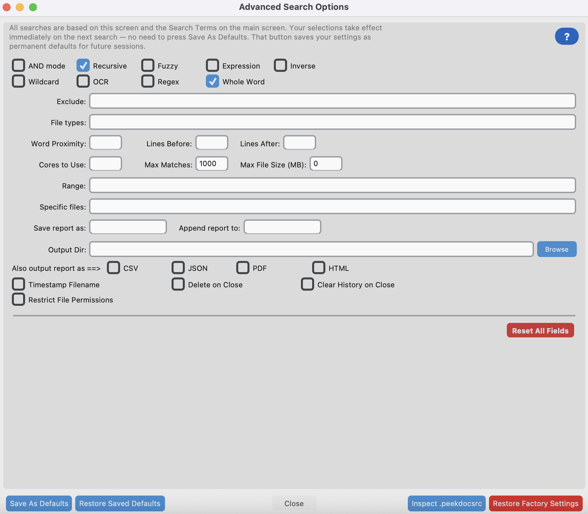

#### 3. Regex Search — full workflow

A four-shot tour through the Regex Search popup using a saved collection of 10 common code patterns (URL, IPv4 address, Local port, ISO date, UPPER_CASE constant, Python decorator, Email, Semver version, UUID, Markdown link).

**(a) Setup.** All 10 patterns enabled, recursive search across the same 452-file folder.

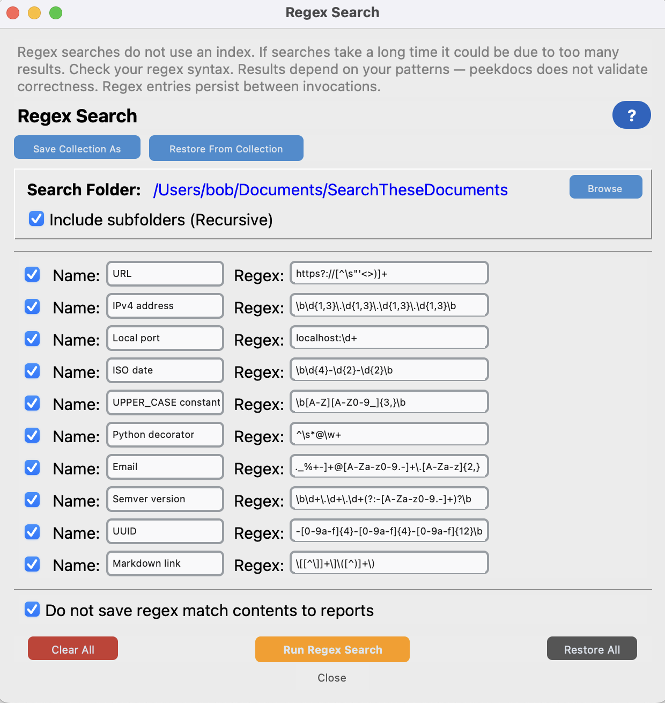

**(b) Results.** 1,402,532 matches across 452 files in 20.7 seconds, broken down per pattern. Each row has a **View Files** button to drill into that pattern's hits.

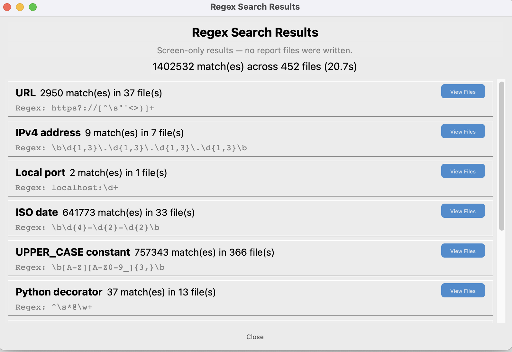

**(c) Drilling in.** Clicking **View Files** on the "Local port" row (above) narrows from millions of matches down to the one file containing `localhost:<port>` — a `Dockerfile`, with 2 matches on lines 19 and 25.

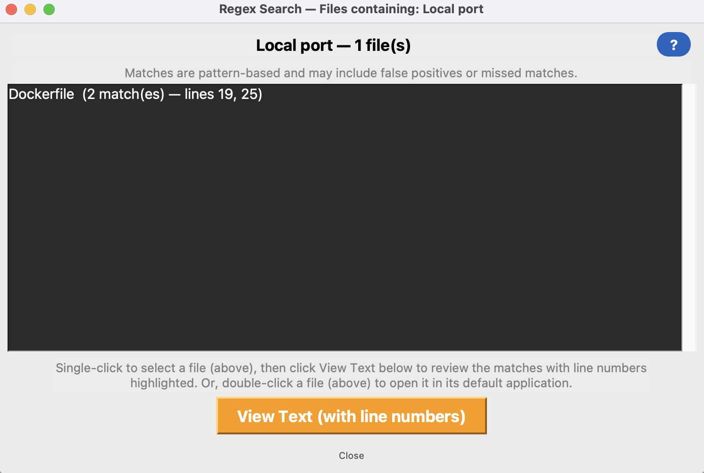

**(d) Context view.** Clicking **View Text (with line numbers)** opens the file with matches highlighted in yellow — here, `localhost:5432` and `localhost:8080` show up as hardcoded values that should probably come from environment variables. Reviewable in context, no leaving the GUI.

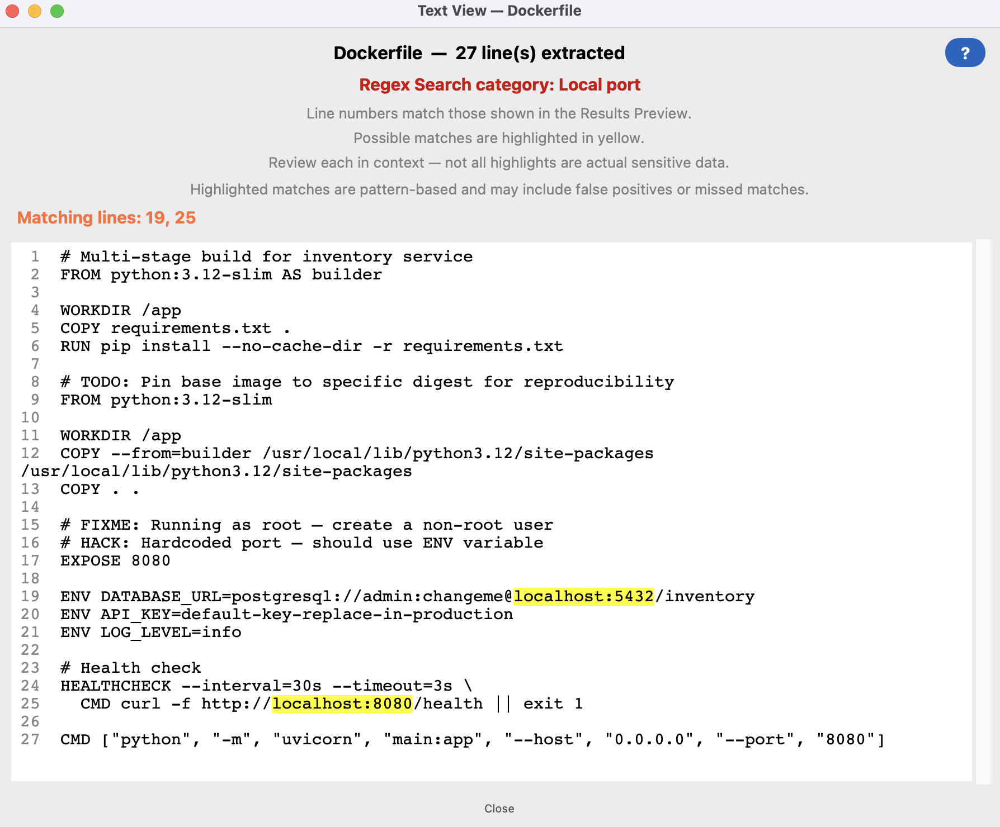

#### 4. Search Suites — recurring multi-search workflows

Where Regex Collections run many *patterns* at once, Search Suites run many *complete saved Standard Searches* at once — each with its own settings (AND/OR, Whole Word, Recursive, etc.). Demo: a "Code hygiene" suite that runs five common pre-commit checks in one click.

**(a) Setup.** Five saved searches (`TODO`, `FIXME`, `HACK` with Whole Word on; `print(` and `console.log(` with Whole Word off — same kit, different option per search). Run order is top-to-bottom; the Up/Down buttons reorder. HTML output added to the always-on TXT and DOCX defaults.

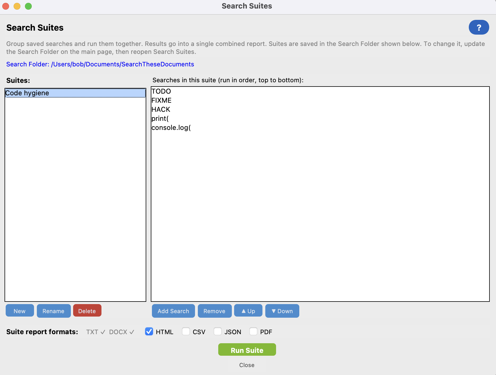

**(b) Results on the main page.** 235 total matches across 176 files in 7.0 seconds. The Section summary at the top of the combined report lists every search's match count up front — no scrolling through 67 TODO matches to discover there were 7 `console.log` hits at the bottom.

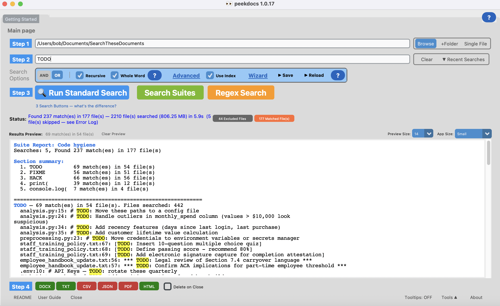

**(c) HTML report opened in the browser.** Same Section summary at the top, but each entry is a clickable anchor link that jumps to that section. Yellow match highlighting throughout. The report is a single self-contained file on disk — nothing uploaded, nothing requires the GUI to view.

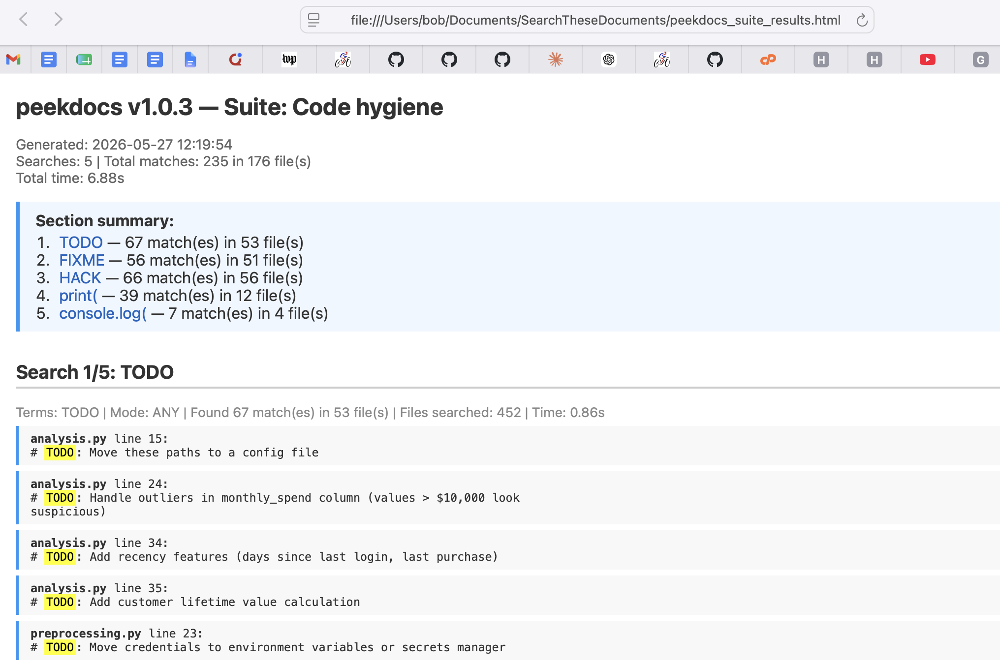

**What this demo proves**, in three shots:

- Same source tree, **five distinct questions** answered in one click.
- **Per-search settings** — three searches with Whole Word on, two with it off. A regex collection couldn't express that mix as cleanly.
- **Combined report** with sections per saved search, plus the Section summary up front so the smallest result count is as visible as the largest.
- **Real workflow** — every developer recognizes this as their actual pre-commit / pre-PR sanity check, not a contrived demo.

#### 5. Diff Snapshots — what changed between two scans

For users who want to know not just *what's in my documents* but *what changed since last time*: the **Diff Snapshots** tool compares two peekdocs JSON snapshots and reports what's NEW, CHANGED, UNCHANGED, or REMOVED. Useful for periodic source-tree scans, weekly compliance reviews, and any "is the situation better or worse than last week?" question.

**(a) Finding it.** Tools menu in the lower-right corner of the main page. Lists every available power-user feature in plain English; **Diff Snapshots** is between **Bookmarks** and **Indexes**.

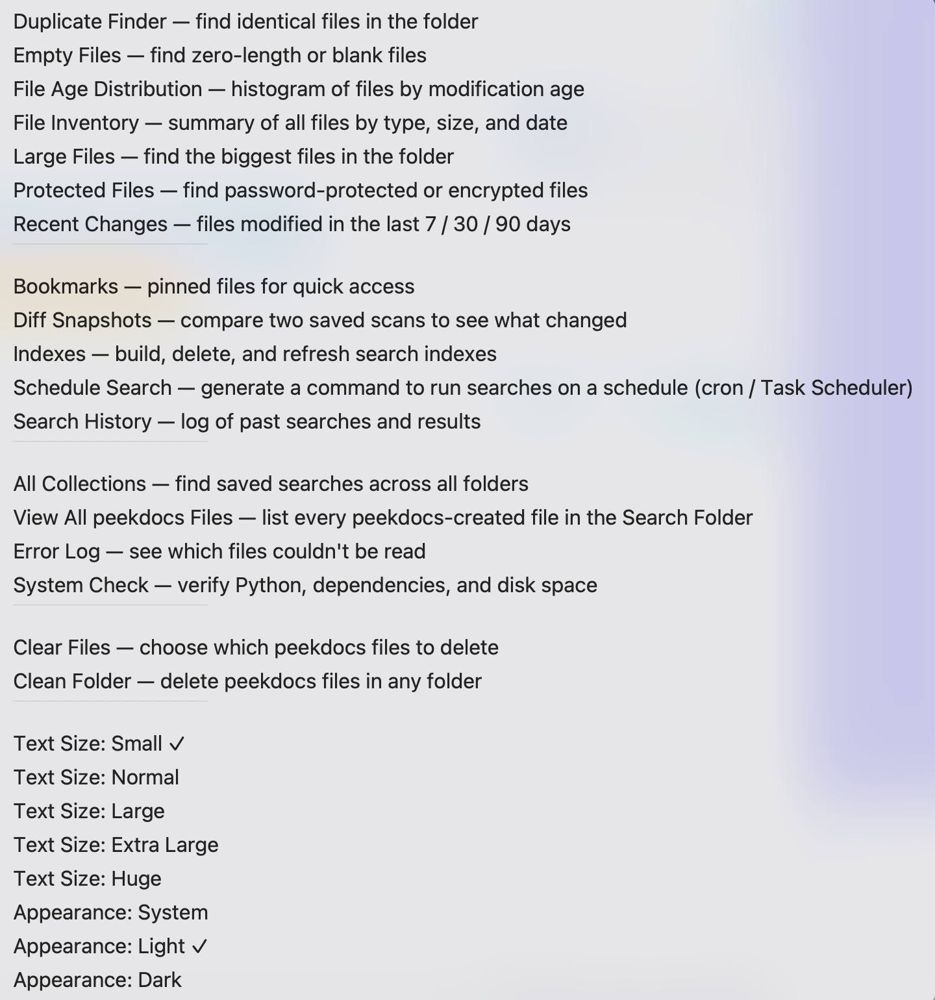

<p align="center"><b>Tools</b></p>

**(b) Comparing two snapshots.** Picked two snapshots of a `TODO` search captured before and after a small code change: one new file gained a TODO, one existing file went from 1 to 2 TODOs. The result pane shows the three distinct categories in color (green NEW, orange CHANGED, muted UNCHANGED summary) plus a red status line at the top — *"Actionable changes: 1 new, 1 changed, 0 modified."*

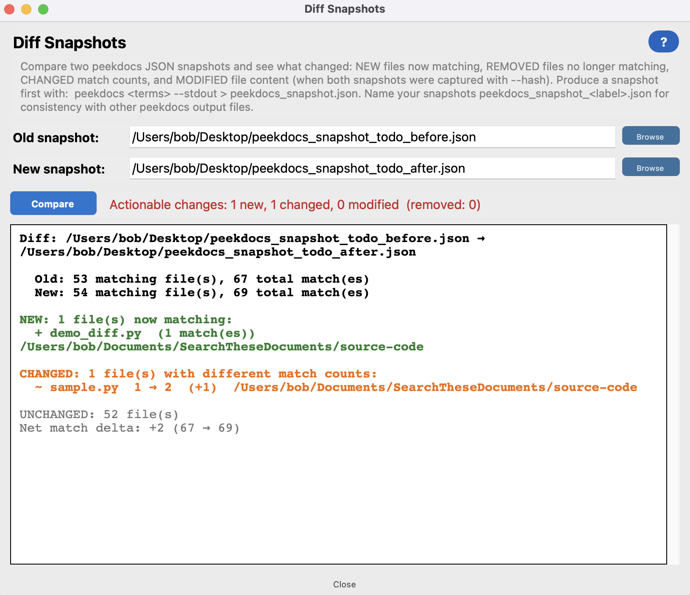

Both snapshot JSON files used in this demo are checked into `docs/images/` (`peekdocs-snapshot-todo-before.json` and `peekdocs-snapshot-todo-after.json`) so a reader can download them and try the diff themselves. Snapshots were generated with:

```bash
peekdocs TODO -W -r --hash --stdout > peekdocs-snapshot-todo-before.json
# ... time passes, files change ...
peekdocs TODO -W -r --hash --stdout > peekdocs-snapshot-todo-after.json
peekdocs --diff peekdocs-snapshot-todo-before.json peekdocs-snapshot-todo-after.json
```

The same diff is also available as a CLI command — see [Automation and IT Use → Diff between runs](docs/USER_GUIDE.md#diff-between-runs) in the User Guide for the scheduled-scan use case.

#### 6. Schedule Search — generate a ready-to-paste cron / Task Scheduler command

For recurring scans (nightly source-tree audits, weekly code-hygiene runs, monthly project reviews), **Tools → Schedule Search** generates the scheduler command for you. Pick a Search Suite or Regex Collection, choose a folder, set the frequency (hourly, daily, weekly, monthly), and the dialog writes a complete `cd … && peekdocs …` one-liner with the right flags already in place — including `--timestamp` so each run's report is preserved instead of overwritten. Copy to Clipboard, then paste into `crontab -e` (Mac/Linux) or Task Scheduler (Windows). Platform-specific step-by-step instructions are shown right below the command box.

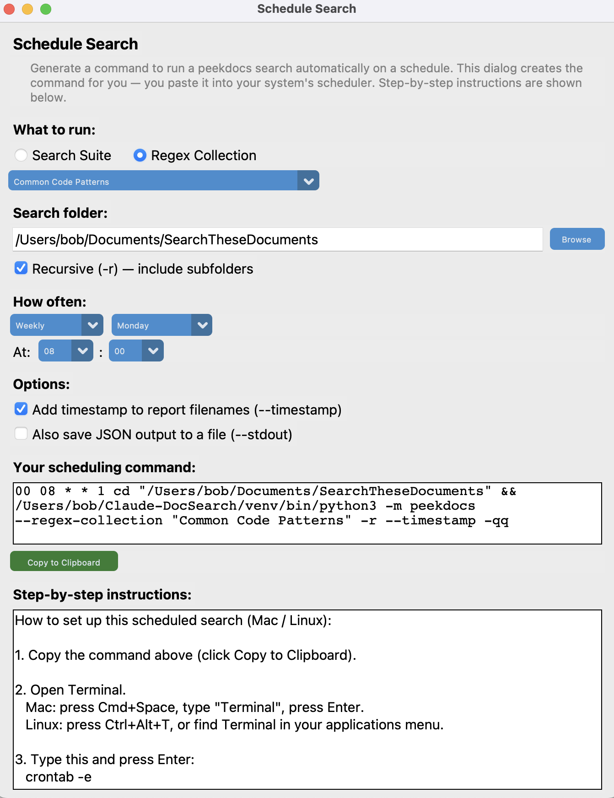

#### 7. `peekdocs --check` — operational health probe

For IT staff, scheduled jobs, and anyone wrapping peekdocs in automation: `peekdocs --check` verifies the installation in one shot. Reports the peekdocs version, Python version, OS, every required and optional dependency with its installed version, Tesseract (the OCR engine), SQLite version, and free disk space. Exit code 0 = everything healthy, exit code 2 = something missing. Run it once after install and at the start of any deployment script — and at the top of any scheduled command from the dialog above to fail fast on a broken environment.

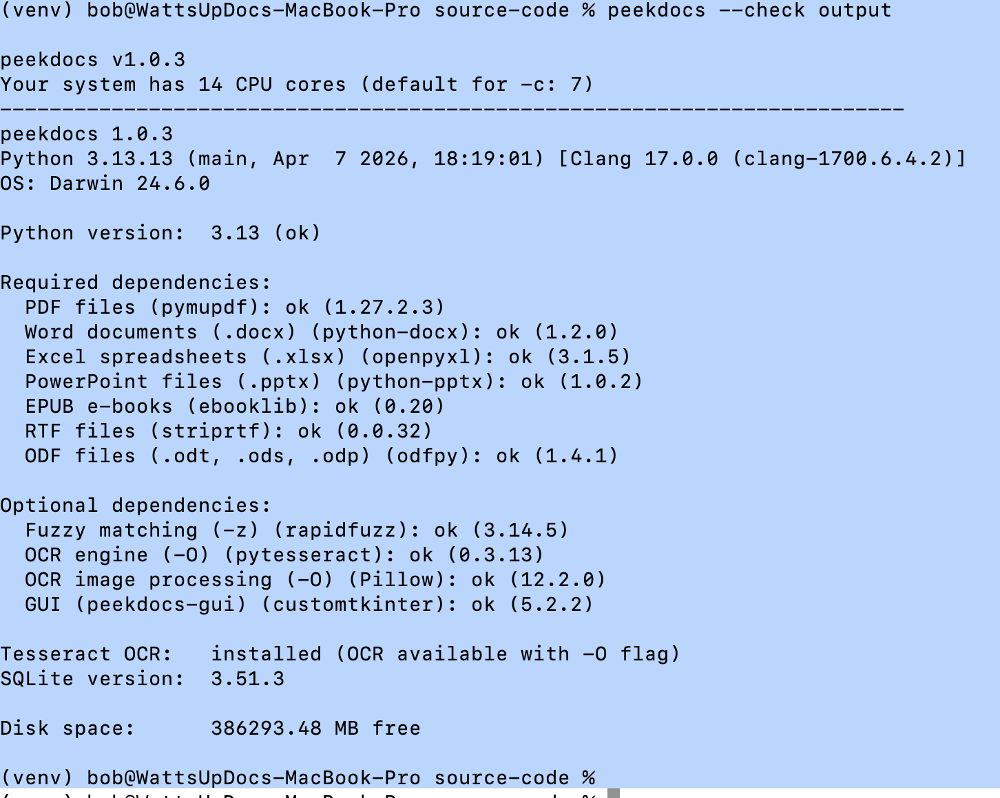

Most users never leave the search bar. Power users can go deeper with regex, Boolean logic, range queries, fuzzy matching, wildcards, proximity search, a command-line interface, and a Python API.

Searches text in any language (Unicode-based; see [Multilingual notes](docs/USER_GUIDE.md#multilingual-support) for caveats). Runs on Windows, macOS, and Linux. No fees, no subscriptions, no cloud. Everything stays on your computer. Nothing is uploaded anywhere. Your files are not altered or deleted. Free and open-source.

**[See peekdocs in action →](https://robertdschoening.com/peekdocs)**

## Who Is It For?

**You have files. You need to find something in them.**

peekdocs is built to do exactly that across many kinds of files at once — Word, PDF, Excel, email, scanned documents, archives, and 100+ more — entirely on your own computer. The sections below describe who finds it most useful and why.

### Home users and individuals

peekdocs works just as well on personal documents as it does on professional ones. Most people accumulate years of digital files — scanned forms, insurance documents, school papers, family correspondence, statements, warranties, e-books, downloaded receipts — spread across folders, drives, and cloud backups. peekdocs searches all of it locally with whatever words come to mind: a vendor name, a policy number, a year, a phrase from an old letter. Nothing is uploaded; nothing is sent anywhere; the search runs on your computer and the results stay there.

No technical knowledge required. The GUI handles everything with a folder picker, a search box, and a Run button — no terminal, no flags, no syntax to learn.

### Core technical users

Developers, sysadmins, engineers, and technical writers — people who work with the tool from a terminal, automate it, or integrate it into pipelines.

| Who | Why they care | What they do with it |
|-----|--------------|---------------------|
| **Developers and technical power users** | Integrate document search into scripts and CI pipelines with CLI, JSON output, Python API, and regex collections | Search source trees for patterns, analyze logs, scan repos for TODO/FIXME, build automation scripts, generate machine-readable reports |
| **Engineers** | Search across datasheets, specs, and engineering files that most tools can't read, with highlighted reports for design reviews | Search SPICE netlists, Verilog/VHDL, DXF, MATLAB files alongside PDFs, test reports, maintenance records, and standards references |
| **Technical writers and documentation teams** | Catch inconsistencies across large documentation sets using fuzzy matching, regex workflows, and recursive analysis | Find inconsistent terminology, review documentation trees, audit references across manuals, search exported HTML/Markdown/DOCX collections |

### System administrators and IT staff at small-to-mid-sized organizations

peekdocs is useful for solo IT professionals and small teams who need to search large document collections quickly across mixed Mac, Windows, and Linux environments. Common scenarios include independent IT consultants visiting multiple client sites, [MSP technicians](#glossary), financial or accounting offices, school districts or municipal offices, and technical staff managing document-heavy environments.

The common thread: one person owns the problem end-to-end, needs fast local document discovery with exportable reports, and prefers a privacy-first tool that runs entirely offline. Users can build their own search patterns (including regex) for whatever content matters to them.

See [Automation and IT Use](docs/USER_GUIDE.md#automation-and-it-use) in the User Guide. It opens with a [worked example](docs/USER_GUIDE.md#a-worked-example-nightly-source-tree-watch) — a full nightly cron script using `--stdout`, `--hash`, `--diff`, and an alert step — so you can see how the pieces compose before reading the reference material on exit codes, JSON schemas, the `--on-match` hook, headless deployment, and where reports and run logs land on disk.

### Professional and research audiences

Researchers, analysts, consultants, and business users — people who use peekdocs for literature review, due diligence, fact-checking, or finding information across years of mixed-format files.

| Who | Why they care | What they do with it |
|-----|--------------|---------------------|
| **Researchers and academics** | Search large research collections accurately, including scanned PDFs and historical documents, with highlighted exportable reports | Literature review across hundreds of PDFs, find themes across research collections, search scanned historical documents, extract references and citations |
| **Investigators, journalists, and analysts** | Sift through large document archives with precision using Boolean logic, proximity search, regex workflows, and OCR | Review large archives, investigate document collections, contract review, timeline reconstruction, email archive analysis |
| **Archivists and digital historians** | Search digitized and scanned collections locally without uploading to cloud services, with full OCR and Boolean support | Search digitized archives, historical newspapers, scanned records, museum and university collections, long-term document preservation |
| **Consultants and independent analysts** | Analyze client documents locally with no cloud exposure, then generate shareable highlighted reports | One-off document analysis, client archive review, research and report generation, technical due diligence |
| **Business and office power users** | Search years of mixed-format files without learning any syntax — just type keywords and click Run | Find contracts, search invoices, review budgets, search years of Word/PDF files, find information across correspondence |

*The audiences and scenarios above describe possible uses of peekdocs. peekdocs is provided "as is" under the [MIT License](LICENSE), without warranty of any kind, express or implied.*

### What makes peekdocs distinctive

The combination of **local + privacy-first + grep-like power + OCR + regex workflows + reporting + automation** across heterogeneous document collections is unusual. Most tools do one or two of these well. peekdocs does all of them in a single install.

<details>
<summary><b>Detailed use cases by role (click to expand)</b></summary>

- **Programmers** — VS Code is an excellent editor, but peekdocs searches the files it doesn't natively search: legacy specs and requirements in Word/PDF, email archives from past projects, vendor documentation and SDK guides in PDF, archived releases inside .zip/.7z files, scanned whiteboard photos (OCR), old project logs and meeting notes. A developer who needs to find "what did the client say about the authentication requirement in 2019" can't do that in VS Code if the answer is in a .docx email attachment inside a .zip archive. peekdocs can. One pipx command and you're running in seconds — CLI, GUI, or Python API (see [Option B](#option-b-quick-install-with-pipx-for-python-users)). **Search across entire codebases** — find every file that references a function, variable, endpoint, or error message across all source code files in all folders at once. Use Lines Before/After to see the full function or block surrounding each match, not just the matching line. Supported source code formats: .py, .c, .cpp, .h, .hpp, .html, .java, .js, .ts, .go, .rs, .rb, .sh, .bat, .ps1, .r, .swift, .kt, .cs, .vb, .f90, .f, .asm, .s, .pl, .tcl, .makefile
- **More for programmers** — find every TODO, FIXME, and HACK across all your projects at once, not just the one open in your IDE. Pre-upgrade audit: search all repos for a deprecated API or library before upgrading. Search log files for error patterns or request IDs across gigs of `.log` files. Search config files (`.yaml`, `.toml`, `.json`, `.ini`, `.properties`, `.conf`) and build files (`.gradle`, `.cmake`) to find where a setting, port, or environment variable is referenced. Multi-repo search: point peekdocs at a parent folder containing all your repos and search everything at once.
- **AI/ML engineers** — search training logs for specific metrics, hyperparameters, or error messages across experiment runs. Find every reference to a model name, checkpoint path, or dataset version across scripts, configs, and documentation. peekdocs reads Jupyter notebooks (`.ipynb`), JSONL training data (`.jsonl`), Scala Spark pipelines (`.scala`), and all common config formats. Search across READMEs, docstrings, and markdown files for outdated model names or deprecated API versions.
- **Data researchers** — search hundreds of CSV and Excel files for a specific value, account number, or outlier. Cross-reference interview transcripts, survey responses, and field notes for the same keyword to triangulate findings. Literature review: search 500 downloaded PDFs for a method name, author, or statistical technique. Find which analysis scripts reference a specific dataset, parameter, or threshold.
- **Engineers** — search hundreds of datasheets, design reviews, test reports, and failure analyses for a specific component value, part number, or tolerance. Find which documents reference a standard (MIL-STD-810, IEC 61508, ISO 9001). Search old design reviews and trade studies to find why a decision was made years ago. Locate error codes and symptoms across equipment manuals and maintenance logs. OCR reads scanned engineering drawings and handwritten notes. The highlighted Word report can be attached to a design review or emailed directly. Supported engineering formats: .m (MATLAB), .v .vhd .vhdl .sv (Verilog/VHDL/SystemVerilog), .cir .sp .spice (SPICE netlists), .dxf (AutoCAD interchange), .vsdx (Visio diagrams), .cmake (CMake build files)
- **Documentation teams and tech writers** — search for outdated references, inconsistent terminology, deprecated product names, or specific version numbers across an entire documentation set. Verify consistency across Word docs, PDFs, HTML exports, and Markdown files in a single search.
- **Researchers** — search across hundreds of downloaded journal articles (PDF), interview transcripts, survey responses, field notes, and datasets for a specific term, author, citation, or data point. OCR reads scanned source materials and historical documents. The highlighted Word report doubles as an annotated bibliography.
- **Small businesses** — find information across contracts, invoices, reports, and correspondence. Save searches by name and reload them later. Search across vendor contracts for specific terms, pricing, or expiration dates.
- **Home users** — tax returns, insurance policies, receipts, warranties, estate documents, email archives. Once installed, type your keyword(s), click Run Search, done. No configuration, no manual.
- **Email archives** — search exported email files (.eml, .msg, .pst, .mbox) for old correspondence, attachments, and contacts. Most general-purpose search tools can't read email formats — peekdocs can.

</details>

**What makes peekdocs different:**

- **[100+ file types at once](#supported-file-types)** — Word, PDF, Excel, PowerPoint, email (.eml, .msg, .pst), archives (.zip, .7z, .rar), source code, engineering files, e-books, calendars, contacts, and more. All searched simultaneously in a single pass. **Note:** `.pst` requires `libpff-python` (no Windows wheel) and `.rar` requires the `unrar` tool — both covered in [Prerequisites](#prerequisites).
- **Highlighted Results**
  Matches are highlighted in two ways:
  - **1) Results Preview (in-app):**
    - See matches instantly inside peekdocs
    - Right-click to copy text
    - Double-click a filename to open the file
  - **2) Word Report (.docx):**
    - Standalone document with all matches highlighted in yellow
    - Organized by file with surrounding context, search metadata, and match counts
    - Easy to save, print, email, or share
  - Both views show the same matches: Preview = quick scanning, Report = saving and sharing
  - **How matches are displayed:**
    - Word documents and PDFs: full paragraph is shown (based on text extraction)
    - Plain text files: individual lines are shown
    - Use Context Lines (Advanced Search Options) to include extra lines before/after matches
    - The yellow highlighting makes a real difference when reviewing large result sets — your eyes go straight to the matches instead of reading every line
  - **Other output options:**
    - A plain-text (.txt) report is generated automatically
    - Optional formats: CSV, JSON, PDF, HTML
  - **No Microsoft Word?**
    - Enable HTML output in Advanced Search Options
    - Click the HTML button to open the highlighted report in your browser
    - The file is stored locally — nothing is uploaded or shared
  - **Compatibility and privacy:**
    - The `.docx` report opens in Microsoft Word or [LibreOffice](https://www.libreoffice.org/download/download-libreoffice/) (free)
    - peekdocs avoids opening reports in Google Docs, Apple Pages, or other cloud-based apps that may upload your data
- **Regex Search** — run up to 10 custom regex patterns per collection from a dedicated popup (GUI only), each executed separately with per-pattern results and status updates. Each pattern has a name and regex field, with settings saved across sessions. Create unlimited named collections (Save Collection As / Restore From Collection) to maintain separate profiles for different tasks — "code patterns", "log analysis", "invoice extraction", and as many others as you need. Clear All erases all patterns; Restore All undoes the last clear. Results show per-pattern match counts with View Files buttons to see affected files and View Text to review highlighted matches. Cancel button stops the search between patterns. Check "Do not save regex match contents to reports" to prevent sensitive information from being saved to files — results are displayed in a screen-only popup only. Always scans files directly (index is bypassed) to ensure current results. The ? help includes 50 common regex patterns you can copy and paste. Note: you can also run a single regex search via Standard Search (check "Regex" in Advanced Search Options) — Standard Search supports all 11 search modes (AND, Boolean, fuzzy, wildcard, proximity, etc.) that the Regex Search popup does not.
- **11 search modes** — plain keywords, AND/OR, Boolean expressions (`(budget OR revenue) AND NOT draft`), regex, wildcards, fuzzy matching (typo-tolerant), whole-word, word proximity (terms within N words on the same line), line proximity (terms within N lines of each other), inverse search (find files that DON'T contain a term), and range queries (filter by dollar amounts, dates, percentages, ages, file sizes).
- **Three interfaces** — point-and-click GUI (`peekdocs-gui`), terminal CLI (`peekdocs`), and Python API (`from peekdocs import search`). All search modes work from all three interfaces except the Search Wizard, which is GUI-only. Use the GUI for daily work, the CLI for scripting, the API for integration.
- **Scanned documents** — OCR reads text from scanned PDFs and images (.jpg, .png, .tiff, .bmp) that most tools can't search. Tesseract (free, open-source) must be installed separately — but once it is, peekdocs handles the rest. *OCR accuracy depends on source quality: clean printed pages and modern scanner output extract well; handwriting, low-resolution scans, faxed pages, and documents with complex multi-column layouts may extract poorly or partially.*
- **Search inside archives** — searches inside .zip, .7z, and .rar files without extracting them first. Find a document buried in a compressed backup without unzipping anything.
- **Multi-folder search** — search across multiple top-level folders at once using the +Folder button, with optional recursive searching into subfolders. Results are combined from all folders. With recursive mode, you can even search your entire computer from a single search — point it at your root folder and peekdocs will search every supported file on the drive (system files that can't be read are logged and skipped).
- **Search Wizard** — configures complex searches for you with 21 pre-built search types (keywords, Boolean, fuzzy, proximity, dollar ranges, dates, phone numbers, and more) plus a regex pattern builder grouped into 8 profession-themed tabs. No regex or technical knowledge needed.
- **Save and reload searches** — save a configured search by name and reload it later with one click. Each folder has its own collection of saved searches.
- **Search Suites** — group multiple saved searches into a named suite and run them all at once with a single click. Each search runs independently with its own settings, and results are organized by search in a single combined highlighted report. Choose your output formats (TXT and DOCX are always generated; HTML, CSV, JSON, and PDF are optional — select them in the Search Suites popup). Create suites for recurring tasks like pre-publication checks, quarterly audits, onboarding reviews, or any workflow that involves the same set of searches. Suites are stored per folder, but the CLI finds them by name from anywhere: `peekdocs --suite "My Suite"` auto-locates the folder it was saved in, and `peekdocs --list-suites` shows every suite and where it lives. Available from the GUI (Tools → Search Suites) and CLI.
- **Search index** — optional SQLite FTS5 index for faster repeated searches. Build once, search in sub-second time. Auto-refresh keeps the index current when files change.
- **Built-in file analysis tools** — the Tools menu includes File Inventory (summary by type/size/date), Duplicate Finder (identical files by content hash), Large Files, Empty Files, Recent Changes, Protected Files (password-encrypted detection), Search History (automatic log of past searches), Bookmarks (pin files for quick access), and App Files (lists every file peekdocs has created in the folder — results, reports, indexes, saved searches — so you always know what's yours and what's peekdocs').
- **Offline and private** — your documents never leave your computer.
  - peekdocs never uploads, transmits, alters, moves, or deletes your files
  - No cloud, no accounts, no subscriptions, no internet connection required
  - **Safe report handling:**
    - Reports (.docx, .pdf, .csv, .json) are opened only in trusted local applications
    - peekdocs launches installed programs directly (e.g., Microsoft Word, LibreOffice, Adobe Reader), bypassing the operating system's default file handler
    - Cloud-based apps (e.g., Google Docs, Apple Pages) are never used
  - **Protection against cloud syncing:**
    - If your output folder is inside a cloud-synced directory (OneDrive, Google Drive, iCloud Drive, Dropbox), peekdocs automatically redirects reports to a local folder (`~/peekdocs_reports`)
    - This allows you to search cloud-synced documents without uploading report files
  - **Automatic cleanup:**
    - Enable **Delete on Close** to remove all result files when the app closes
- **Report security** — peekdocs takes steps to reduce the risk of your search results being exposed. Reports are opened in safe local applications rather than cloud-based viewers like Google Docs or Apple Pages. If your search folder is inside OneDrive, Google Drive, iCloud Drive, or Dropbox, peekdocs automatically redirects report output to a safe local folder (`~/peekdocs_reports`) — your documents are still searched, but no report files are written to the cloud-synced location. The status line tells you where reports were saved and why. **Delete on Close** automatically removes result files when you close the app. **Clear History on Close** clears your search history and recent searches (useful if a search term you'd rather not leave on disk has been typed). **Clear Preview** wipes the Results Preview pane on demand. **Delete Now** (main screen) immediately deletes result files, clears the preview, and wipes search history in one click — useful if you don't close the app regularly. If your search term matches certain numeric ID patterns, peekdocs warns you before proceeding because that term will appear in report files. See [For IT and Security Teams](#for-it-and-security-teams) for details.
- **Network folders** — search documents on a shared network drive just like a local folder. Map or mount the network share (e.g., `Z:\` on Windows, `/Volumes/` on macOS) and point peekdocs at it. Tip: build a search index on your first search — subsequent searches query the local index instead of re-reading files over the network, which is much faster.
- **Cross-platform** — Windows, macOS, and Linux. Tested on all three.
- **Performance** — 1,000 mixed-format documents (PDFs, Word, Excel, email) searched in ~1 second. 105 real Word docs (1.9 GB) in 4 seconds (0.24 seconds with index). See [Performance](#performance) for detailed benchmarks.
- **Help everywhere** — every screen has a **?** button that opens a detailed help page explaining all the features on that screen. Every data field, button, and checkbox has a hover tooltip that explains what it does. No need to open the manual — the answers are right where you need them. Toggle tooltips on/off with the **Tooltips: ON/OFF** button on the bottom row of the main screen. Saved automatically.
- **Adjustable text size** — five sizes from Small to Huge, accessible from the Tools menu. All text, labels, and buttons scale together. Helpful for users with low vision or high-DPI displays. Saved automatically.
- **Dark mode** — switch between Dark, Light, or System (follows your OS setting) from the Tools menu. Saved automatically. Note: on Windows, popup windows may briefly flash white before the dark theme is applied — this is a normal Windows/tkinter limitation, not a bug. If the flashing is distracting, switch to Appearance: Light in the Tools menu.

## Features

peekdocs has **three search modes**, each writing its own self-described report family next to your documents so they never collide:

| Mode | How to run | Reports |
|------|-----------|---------|
| **Standard Search** | GUI button, or `peekdocs <terms>` | `peekdocs_standard_results.{txt,docx,csv,json,pdf,html}` |
| **Regex Search** | GUI button, or `peekdocs --regex-collection NAME` | `peekdocs_regex_results.{txt,docx}` |
| **Suite** (group of saved searches) | GUI **Run Suite**, or `peekdocs --suite NAME` | `peekdocs_suite_results.{txt,docx,html,csv,json}` |

> *The "mode" is the workflow, not the flag set. A one-off `peekdocs -x "pattern"` (or `-z`, `-w`, `-W`) is a Standard Search with a regex/fuzzy/wildcard flag and writes `peekdocs_standard_results.*`. Only the dedicated Regex Search workflow — the GUI popup or `--regex-collection` — produces `peekdocs_regex_results.*`.*

All three share the same engine, flags, and 100+ file-type support. The matching `peekdocs_<mode>_results.*` naming means a Regex run never overwrites a Standard run (and vice versa), and `peekdocs --clear` / **Clear Files** can find them by prefix. Within a mode, each run overwrites the previous report — add `--timestamp` (CLI) or check **Timestamp** in Advanced Search Options (GUI) to append `_YYYYMMDD_HHMMSS` so every run is preserved. The **Schedule Search** dialog enables timestamping by default for cron / Task Scheduler use.

- **Offline and private** — your documents never leave your computer. peekdocs never uploads, transmits, alters, moves, or deletes your files. No cloud, no accounts, no subscriptions. Everything runs locally and stays local
- **100+ file types** — Word, PDF, Excel, PowerPoint, emails (.eml, .msg, .pst, .mbox), archives (.zip, .7z, .rar), source code (Python, C/C++, Java, Go, Rust, and more), engineering files (MATLAB, Verilog, VHDL, SPICE, DXF, Visio), Apple Pages/Numbers/Keynote, calendars (.ics), contacts (.vcf), e-books, HTML, and more. **Note:** `.pst` requires `libpff-python` (no Windows wheel) and `.rar` requires the `unrar` tool — see [Prerequisites](#prerequisites)
- **Highlighted reports** — results saved to `.docx` and `.pdf` with yellow-highlighted matches, `.txt` with full context, and optional CSV and JSON output
- **Results preview** — see matches inline in the GUI with highlighted terms; right-click to copy. **To locate all matches in a specific file:** click the orange **Matched Files** button on the status line, single-click a file, then click **View Text** — peekdocs displays the file's full extracted text with line numbers and every match highlighted in yellow. This is the fastest way to see exactly where your search terms appear in each file, without opening external software. You can also double-click any file to open it in its native application (Word, Adobe Reader, etc.), or click the **DOCX**, **HTML**, or **PDF** button to open the highlighted report with all matches across all files
- **Recent searches** — dropdown next to the search bar remembers your last 10 searches
- **Save Search / Load Search** — save a configured search by name and reload it later with one click
- **Search Suites** — group saved searches into a named suite and run them all at once (Tools → Search Suites)
- **Search Wizard** — guided search builder with 20 pre-built search types (phone, email, dollar range, date range, Boolean, fuzzy, and more) plus a regex pattern builder with several profession categories — no flags or regex knowledge needed
- **Inverse search** — find files that are *missing* required content
- **Search modes** — plain keywords, AND/OR, Boolean expressions, regex, wildcards, fuzzy matching, whole-word, word proximity, line proximity
- **Range queries** — filter by dollar amounts, dates, percentages, ages, file sizes
- **OCR** — search scanned PDFs and images (requires Tesseract)
- **Works in any language** — peekdocs searches documents written in English, Spanish, French, German, Chinese, Japanese, Korean, Arabic, Hindi, Russian, Greek, and every other language. All text handling is Unicode-based. Type your search terms in any language and peekdocs finds them. **Note:** peekdocs performs exact text matching — it finds the character sequence you type, which works well for all languages including CJK (Chinese, Japanese, Korean). It does not perform language-specific processing such as word segmentation, stemming, or stop-word removal. Documentation and the GUI are in English only. In fairness, any search tool that uses Unicode can do the same thing — this is not unique to peekdocs. **PDF report limitation:** The PDF output format (`.pdf`) uses a built-in font that only supports Latin-1 characters (Western European languages). Non-Latin characters (Chinese, Japanese, Korean, Russian, Arabic, Greek, Hindi, Thai, etc.) will appear as `?` in PDF reports. This does not affect searching — all languages are searched correctly. It only affects the PDF report output. The `.txt`, `.docx`, `.html`, `.json`, and `.csv` reports display all languages correctly. Use HTML or DOCX output for non-Latin content
- **Multi-folder search** — search across multiple folders at once, with optional recursive searching into subfolders. Click **+Folder** to add folders, or type semicolon-separated paths. Results are combined from all folders
- **HTML export** — don't have Word or LibreOffice? Enable HTML in Advanced Search Options and click the HTML button — your highlighted report opens instantly in your web browser. Every computer has a browser, so no extra software is needed. The HTML file is stored locally on your computer — nothing is uploaded or made public. Also easy to share via email — the recipient just opens the file in their browser
- **Three interfaces** — terminal CLI, point-and-click GUI (`peekdocs-gui`), Python API
- **Cross-platform** — Windows, macOS, Linux
- **Search index** — optional SQLite FTS5 index for faster repeated searches
- **Read-only** — peekdocs never modifies, moves, or deletes your files. It does create its own output files (reports, indexes, settings) and can delete those when you ask (e.g., Clear Results, Delete Index)
- **Delete on Close** — check the **Delete on Close** checkbox (on the main screen next to the report buttons, or in Advanced Search Options) to automatically delete all search result files and the search index when you close peekdocs. Applies to every folder searched during the session — not just the last one. The index is included because it contains extracted text from every indexed file. You can check or uncheck it at any time — it only matters at the moment you close the app. Review your results first, then check the box and close. Saved reports (`peekdocs_report_*`), accumulated reports (`peekdocs_accumulated_*`), saved searches (`.peekdocs_collection.json`), settings (`~/.peekdocsrc`), and bookmarks are never deleted.
- **Safe defaults** — files over 100 MB are automatically skipped to prevent slow searches and memory issues. Very large files (huge PDFs, massive spreadsheets, database exports) can take minutes to parse and may exhaust available memory. Skipped files appear in the **Excluded Files** list after each search, so you always know what was missed. To change the limit, set **Max File Size (MB)** in Advanced Search Options — or set it to 0 for no limit. Changing the limit automatically rebuilds the index on the next search. ZIP archives that would expand to over 500 MB are also skipped to prevent archive bombs. **Note:** raising Max File Size can sometimes result in *fewer* matched files, not more — a very large file with thousands of matches can consume most of the Max Matches budget (default 1,000), leaving fewer slots for matches from other files. If you see this, raise Max Matches too (or set it to 0 for unlimited)
- **Excluded Files view** — after each search, click the **View N excluded file(s)** button to see exactly which files were skipped and why (unsupported type, prior output, oversized, hidden, etc.) — no more guessing why a `find` count differs from peekdocs's file count
- **Tools menu** — built-in utilities beyond search:
  - **File Inventory** — instant summary of every file in a folder: total count, size breakdown by type, oldest and newest files
  - **Duplicate Finder** — finds identical files by content (not just name), shows how much space is wasted by extra copies
  - **Large Files** — shows the 50 biggest files so you can reclaim disk space
  - **Empty Files** — finds zero-byte files: failed downloads, placeholders, junk
  - **Recent Changes** — which files were modified in the last 7, 30, or 90 days
  - **Protected Files** — detects password-protected PDFs, Word/Excel/PowerPoint, ZIP/7z/RAR archives that peekdocs can't search
  - **Indexes** — build, refresh, or delete the optional search index that makes repeated searches dramatically faster
  - **Search History** — automatic diary of every search you run: date, terms, match count, file count, elapsed time
  - **Bookmarks** — pin files from search results for quick access later
  - **Diff Snapshots** — compare two saved scans to see what files are new, changed, removed, or unchanged between them
  - **Schedule Search** — generates a ready-to-paste cron (Mac/Linux) or Task Scheduler (Windows) command to run any saved search suite or regex collection on a schedule. Step-by-step instructions are included — no terminal experience required
  - **Error Log** — opens `peekdocs_errors.log` to see any files that couldn't be read and why (corrupt, locked, password-protected, etc.)
  - **Clear Files** — selectively delete peekdocs's output files (reports, error log, saved searches, index) from the current folder
  - **Clean Folder** — same idea for any other folder, in case peekdocs files were generated elsewhere

### For Developers

- **Simple setup** — one pipx command and you're running. No accounts, no configuration, no Docker containers.
- **Fast results** — 1,000 mixed-format documents in ~1 second. Milliseconds with the search index.
- **Local-first** — no cloud, no API keys, no internet required. Works on air-gapped machines.
- **Useful immediately** — basic searches need no learning curve; advanced modes (Boolean, regex, ranges) are there when you want them.
- **No restrictions** — no seat licenses, no sales calls, no feature gating, no telemetry. MIT license. Use it, modify it, share it.

### Supported File Types

| Category | Formats |
|----------|---------|
| **Documents** | .doc .docx .epub .html .key .md .odp .odt .pages .pdf .ppt .pptx .rst .rtf .tex |
| **Spreadsheets** | .csv .numbers .ods .tsv .xls .xlsx |
| **Email** | .eml .mbox .msg .pst (`.pst` requires `libpff-python` — no Windows wheel; see [Troubleshooting](docs/TROUBLESHOOTING.md)) |
| **Archives** | .7z .bz2 .gz .rar .tar .tgz .zip (`.rar` requires the `unrar` tool — see [Prerequisites](#prerequisites)) |
| **Calendar/Contacts** | .ics .vcf |
| **Source Code** | .asm .bat .c .cmake .cpp .cs .css .f .f90 .go .gradle .h .hpp .java .js .kt .lua .pl .ps1 .py .r .rb .rs .s .scala .scss .sh .swift .tcl .ts .vb |
| **Engineering** | .cir .dxf .m .sp .spice .sv .v .vhd .vhdl .vsdx |
| **Data/Config** | .cfg .conf .dockerfile .env .graphql .gql .ini .json .jsonl .log .makefile .ndjson .properties .proto .sql .tf .toml .txt .xml .yaml .yml |
| **Notebooks** | .ipynb (Jupyter) |
| **Images (OCR)** | .bmp .jpg .jpeg .png .tif .tiff (requires `-O` flag) |

**Note:** Apple Numbers (.numbers) and Keynote (.key) files created with recent versions of iWork use a protobuf-based internal format. peekdocs extracts whatever readable text exists inside these files, which may be partial. Older iWork files extract fully. Apple Pages (.pages) is fully supported.

## Installation

[Prerequisites](#prerequisites) · [Option A: Standalone Download](#option-a-standalone-download-recommended-for-most-users) · [Option B: pipx (for Python users)](#option-b-quick-install-with-pipx-for-python-users) · [Advanced: source install for contributors](#advanced-source-install-for-contributors) · [Upgrading](#upgrading)

### Prerequisites

*Using Option A (standalone download)? Skip this section — no prerequisites needed.*

- **Python 3.10+** (required for Options B, C, D) — check if it's already installed: `python3 --version` (macOS/Linux) or `python --version` (Windows). If not installed, download from [python.org/downloads](https://www.python.org/downloads/). **Note:** Python version numbers are not decimals — 3.13 is newer than 3.9 (it's the 13th release, not "three point one three").
  - **macOS users:** Your Mac may come with an older Python (3.9.x) pre-installed. If `python3 --version` shows 3.9.x, you need a newer version. Install from [python.org/downloads](https://www.python.org/downloads/) or via Homebrew (`brew install python`). Don't worry — installing a newer Python does **not** replace or affect the old version. Each version installs to its own folder (e.g., system Python lives at `/usr/bin/python3`, Homebrew Python at `/opt/homebrew/bin/python3.13`). They live side by side, and any programs that use the older version will continue to work. After installing, the plain `python3` command may still point to the old 3.9 — use `python3.13` (or whichever version you installed) instead. You also need tkinter for the GUI: `brew install python-tk@3.13` (replace 3.13 with your version if different).
  - **Windows users:** Windows does not come with Python pre-installed, but you may have installed it previously. Open a Command Prompt and type `python --version`. If you see a version number (e.g., `Python 3.12.4`), Python is already installed and in your PATH — you're good to go. If the version is older than 3.10, install a newer one — it won't replace the old version (each installs to its own folder, e.g., `C:\Users\YourName\AppData\Local\Programs\Python\Python313\`). If you see "not recognized" or the Microsoft Store opens, Python is either not installed or not in your PATH. Download it from [python.org/downloads](https://www.python.org/downloads/) and make sure to check **"Add Python to PATH"** at the bottom of the first installer screen. This ensures that `pip`, `python`, and `peekdocs` commands work from any Command Prompt window. If you've already installed Python without this option, the easiest fix is to re-run the Python installer and check the box.
  - **Linux users (Ubuntu, Debian, Linux Mint, Pop!_OS):** Most distros include Python 3.10+ already. If yours is older, you can install a newer version alongside it (e.g., via the `deadsnakes` PPA: `sudo add-apt-repository ppa:deadsnakes/ppa && sudo apt install python3.13`) — this won't replace your system Python (it installs to `/usr/bin/python3.13` alongside the existing `/usr/bin/python3`). The base `python3` package does not include `venv`, `pip`, or `tkinter`. You must install them before creating a virtual environment. Run this single command to get everything peekdocs needs:
    ```bash
    sudo apt install python3-venv python3-pip python3-tk
    ```
    Without `python3-venv` and `python3-pip`, `python3 -m venv venv` will fail with an `ensurepip` error. Without `python3-tk`, the CLI works but the GUI (`peekdocs-gui`) will not launch. This is a one-time setup.
- **pip** (Python's package installer) — included automatically when you install Python 3.10+. No separate installation needed. **pipx** is a separate tool that must be installed via pip (see Option B below).
- **Tkinter** (required for GUI) — no action needed on Windows (the Python installer includes it). On macOS with Homebrew Python, install it: `brew install python-tk@3.13` (replace 3.13 with your version). On Linux: `sudo apt install python3-tk` (already included in the Linux command above). If you installed Python from [python.org](https://www.python.org/downloads/) on macOS, tkinter is already included.
- **Tesseract** (optional, for OCR) — OCR (Optical Character Recognition) reads text from scanned PDFs and images (PNG, JPG, TIFF, BMP, GIF). Most users don't need this — it's only for documents that are pictures of text rather than actual text. If you do need it: macOS: `brew install tesseract` | Windows: [download](https://github.com/UB-Mannheim/tesseract/wiki) — during installation, check **"Add to PATH"** so peekdocs can find it. If you missed this step, run `peekdocs --check` to confirm whether Tesseract is detected. | Linux: `sudo apt install tesseract-ocr`
- **UnRAR** (optional, for .rar archives) — only needed if you want to search inside .rar files. macOS: `brew install unrar` | Windows: comes with [WinRAR](https://www.win-rar.com/) | Linux: `sudo apt install unrar`
- **libpff-python** (optional, for .pst archives) — only needed if you want to search inside Outlook `.pst` mailbox archives. macOS: `pip install libpff-python` | Linux: `pip install libpff-python` (may need `sudo apt install build-essential` first) | Windows: no working wheel — convert `.pst` to `.mbox` first using Thunderbird's ImportExportTools NG extension or the [readpst](https://github.com/pst-format/libpst) utility, then search the resulting `.mbox`. See [TROUBLESHOOTING.md](docs/TROUBLESHOOTING.md) for full details.

**Everything else installs automatically.** When you run `pip install git+https://github.com/exbuf/peekdocs.git`, pip downloads and installs all 17 Python libraries peekdocs needs (PDF reader, Word/Excel/PowerPoint parsers, email reader, etc.) — about 50 packages, ~244 MB total on disk. You don't have to install any of them yourself. See [Dependencies](docs/USER_GUIDE.md#dependencies) in the User Guide for the full list and what each one does.

### Option A: Standalone Download (recommended for most users)

The simplest way to get peekdocs. No Python, no terminal commands, no installation — just download and run.

1. Go to the [Releases page](https://github.com/exbuf/peekdocs/releases/latest)
2. Download the file for your platform:
   - **Windows:** `peekdocs-gui-windows.exe`
   - **macOS:** `peekdocs-gui-macos.zip` (unzip it, then open `peekdocs-gui.app`)
   - **Linux:** `peekdocs-gui-linux`
3. Run it — that's it. No installation needed.

**First-launch security warnings (one-time, per platform).** Free, open-source software that hasn't paid for an OS-vendor code-signing certificate triggers a warning on first launch. This is normal and does not mean the software is unsafe — every OS just wants you to confirm you really meant to open something its certificate authority hasn't seen before. Once you approve it the first time, subsequent launches are silent.

- **Windows (SmartScreen).** You'll see "Windows protected your PC." Click **More info** → **Run anyway**.
- **macOS (Gatekeeper).** You'll see "peekdocs-gui.app cannot be opened because it is from an unidentified developer." Right-click (or Control-click) the app → **Open** → click **Open** in the confirmation dialog. From then on a regular double-click works. (Or from a terminal: `xattr -dr com.apple.quarantine ~/Downloads/peekdocs-gui.app` removes the quarantine flag directly.)
- **Linux.** Mark the file executable before first run: `chmod +x peekdocs-gui-linux` then `./peekdocs-gui-linux`.

**CLI users:** The Releases page also has command-line versions (`peekdocs-cli-windows.exe`, `peekdocs-cli-macos.zip`, `peekdocs-cli-linux`). Run them from an **already-open** Command Prompt / Terminal — *double-clicking* a CLI exe just flashes a terminal and closes (it ran with no arguments and exited). On Windows you may also rename `peekdocs-cli-windows.exe` to `peekdocs.exe` for a friendlier prompt. Two CLI-on-Windows footnotes worth knowing in advance: (1) PowerShell rejects `--flag` arguments unless you use the `--%` stop-parsing token (e.g., `.\peekdocs-cli-windows.exe --% --check`) or switch to plain `cmd.exe`; (2) `.rar` and `.pst` files in the bundled CLI need extra tools — WinRAR for `.rar`, conversion to `.mbox` for `.pst`. See [TROUBLESHOOTING.md](docs/TROUBLESHOOTING.md) for both.

**Windows standalone `.pst` note:** Neither the Windows GUI nor CLI standalone supports `.pst` (Outlook archive) files — `libpff-python` has no Windows wheel and cannot be bundled. If you need `.pst` support, install via pipx on macOS or Linux, or convert `.pst` to `.mbox` first (see [TROUBLESHOOTING.md](docs/TROUBLESHOOTING.md)). All other email formats (`.eml`, `.msg`, `.mbox`) work normally in the Windows standalone.

**Upgrading:** Download the new version from the Releases page and replace the old file. Your settings and saved searches are stored in your home directory, not in the executable — nothing is lost.

**No dependency breakage.** The standalone download bundles Python, all libraries, and peekdocs into a single file — frozen at the versions that were tested and working together. Unlike `pip install`, there are no external dependencies to upgrade, conflict, or break. The app works the same way today as the day you downloaded it.

**Safe for your computer.** No installation option (standalone, pipx, or source) modifies your existing Python, installs system services, writes to the registry, or interferes with any other program. peekdocs runs when you launch it and stops when you close it.

---

*If you used Option A, you're done — skip ahead to [Quick Start](#quick-start). The two sections below are for users who want the CLI / Python API alongside the GUI, or who want to modify the source.*

### Option B: Quick Install with pipx (for Python users)

If you already have Python set up — or you want the CLI and Python API alongside the GUI — one command installs everything. Works the same on every OS.

**Prerequisites** (one-time setup, skip whatever you already have):

- **Python 3.10+** — Windows: [python.org/downloads](https://www.python.org/downloads/) (check "Add Python to PATH" on the first installer screen). macOS: `brew install python` (or [python.org/downloads](https://www.python.org/downloads/)). Linux: usually preinstalled; if not, see the [Prerequisites](#prerequisites) section above.
- **pipx** — `pip install pipx` (Windows), `brew install pipx` (macOS), `sudo apt install pipx` (Linux). Then `pipx ensurepath` and **close and reopen your terminal** so the new PATH takes effect.
- **git** — usually preinstalled on macOS and Linux. On Windows install [Git for Windows](https://git-scm.com/download/win) and accept the defaults.
- **Linux only:** `sudo apt install python3-tk` so the GUI can load Tkinter (the CLI works without it).

**Install (and future upgrade) — one line:**

```bash
pipx install --force git+https://github.com/exbuf/peekdocs.git
```

`--force` overwrites any existing peekdocs install cleanly. On a fresh machine it's a no-op; on a machine with an older peekdocs already installed it refreshes the install without you needing to `pipx uninstall` first. The same command is your future upgrade too — re-run it whenever you want the latest commit.

**macOS note:** if your system `python3` is still 3.9 and you installed a newer Python alongside it, tell pipx which to use:

```bash
pipx install --force --python python3.13 git+https://github.com/exbuf/peekdocs.git
```

Replace `3.13` with the version you installed.

**No git?** Download the ZIP from the green **Code** button on [github.com/exbuf/peekdocs](https://github.com/exbuf/peekdocs) and point pipx at the file instead of the URL:

```bash
pipx install --force ~/Downloads/peekdocs-main.zip                              # macOS / Linux
pipx install --force C:\Users\YourName\Downloads\peekdocs-main.zip              # Windows
```

**Windows fallback — if pipx reports success but `peekdocs` says `ModuleNotFoundError`.** On some Windows machines pipx creates the venv but the package files silently fail to land in it. Install directly with pip instead — a different code path that bypasses the issue:

```powershell
python -m pip install --user --upgrade git+https://github.com/exbuf/peekdocs.git
```

`--upgrade` is the pip-side equivalent of pipx's `--force` — overwrites any existing install. Trade-off: no isolated venv (peekdocs's dependencies live alongside any other `pip --user` packages on your Python), which on a personal Windows install is typically fine.

After install, `peekdocs` and `peekdocs-gui` work from any terminal, any folder, every time — even after restarting your computer. pipx manages the underlying virtual environment for you (you'll never see a `(venv)` prefix the way you would with the source install below). To uninstall completely: `pipx uninstall peekdocs`. See the [User Guide](docs/USER_GUIDE.md#will-peekdocs-affect-my-existing-python-installation) for what is and isn't preserved across upgrades.

### Advanced: source install for contributors

If you want to modify peekdocs and submit changes back, install in editable mode from a local clone of the repo:

```bash
git clone https://github.com/exbuf/peekdocs.git
cd peekdocs
python3 -m venv venv
source venv/bin/activate        # Windows: venv\Scripts\activate
pip install --upgrade pip setuptools wheel   # required on some older Linux pip
pip install -e .
```

The `-e` (editable) flag means your code edits take effect the next time you run peekdocs — no reinstall step. You must `source venv/bin/activate` (or `venv\Scripts\activate` on Windows) in every new terminal before running peekdocs; the `(venv)` prefix in your prompt confirms the venv is active. If you see "command not found" or `ModuleNotFoundError`, you forgot the activate step.

**No git?** Download the ZIP from the green **Code** button on the [github.com/exbuf/peekdocs](https://github.com/exbuf/peekdocs) page, extract it, then follow the same recipe starting at `cd peekdocs-main` (the extracted folder name).

For everyday use without the activate-every-time friction, use Option B (pipx) instead. The source install is only worth the extra steps if you're actually editing the code.

### Upgrading

Your saved searches, settings, indexes, and reports are stored outside the peekdocs installation — in your home directory and your document folders. Upgrading replaces only the code. Nothing else is touched. Specifically, these files are **never overwritten** by an upgrade:

- `~/.peekdocsrc` — your saved settings and preferences
- `~/.peekdocs_history.json` — your search history
- `~/.peekdocs_bookmarks.json` — your bookmarks
- `.peekdocs_collection.json` (in each search folder) — your saved searches and search suites
- `.peekdocs.db` (in each search folder) — your search index
- `peekdocs_report_*`, `peekdocs_accumulated_*` files — your saved reports

How to upgrade depends on which install method you used:

- **Standalone (Option A):** download the new file from the [Releases page](https://github.com/exbuf/peekdocs/releases/latest) and replace the old one.
- **pipx (Option B, git URL):** `pipx install --force git+https://github.com/exbuf/peekdocs.git` — same command as the original install. (`pipx upgrade peekdocs` doesn't work for git-URL installs the way it does for PyPI; the `--force` reinstall is the documented way to refresh until peekdocs publishes to PyPI.)
- **pipx (Option B, ZIP):** download the new ZIP, then `pipx install --force <path-to-the-new-zip>`.
- **pip --user (Windows fallback):** `python -m pip install --user --upgrade git+https://github.com/exbuf/peekdocs.git`.
- **Source install (Advanced):** `cd peekdocs && git pull && pip install -e .` (inside an activated venv).

See the [User Guide](docs/USER_GUIDE.md#will-peekdocs-affect-my-existing-python-installation) for full details on what is and isn't preserved.

## Quick Start

**Want a quick demo first?** Clone this repo and try peekdocs on the bundled samples: `cd samples/engineering_test && peekdocs TODO -r` returns hits across 35 source-code and engineering file types. No setup beyond installing peekdocs.

### Terminal

If you used Option A (standalone download) or Option B (pipx), peekdocs is always ready — just open any terminal. If you used the source install for contributors, navigate to the cloned repo folder and activate the virtual environment first:

```bash
cd /path/to/peekdocs                 # the folder containing pyproject.toml
source venv/bin/activate             # macOS/Linux (you'll see (venv) in your prompt)
venv\Scripts\activate                # Windows
```

**Tip:** Type `peekdocs` with no arguments to see a handy cheat sheet of all search modes, common options, and cleanup commands — right above your command prompt. Type `peekdocs -h` for the full reference with all flags, file types, and regex patterns.

Then navigate to your documents and search:

```bash
cd /path/to/your/documents
peekdocs budget                      # search for "budget"
peekdocs budget revenue              # OR search (any term)
peekdocs -a budget revenue           # AND search (both terms)
peekdocs -r budget                   # include subfolders
peekdocs -t pdf,docx budget          # only PDFs and Word docs
peekdocs -x "\d{3}-\d{2}-\d{4}"     # regex (9-digit ID with dashes)
peekdocs -e "(budget OR revenue) AND NOT draft"   # Boolean expression
peekdocs -R amount:1000..5000 budget # range query
peekdocs -R date:2024-01-01..2024-12-31 invoice  # date range (also accepts 01/01/2024 format)
peekdocs -P 3 budget acme            # line proximity (terms within 3 lines)
peekdocs --open docx budget          # search and auto-open the .docx report
peekdocs --open html budget          # auto-generate HTML and open in your browser
peekdocs --open csv budget           # auto-generate CSV and open in Excel/LibreOffice
peekdocs --open pdf budget           # auto-generate PDF and open in a PDF viewer
peekdocs --open json budget          # auto-generate JSON and open in a text editor
peekdocs -sa archive --open docx budget  # append to accumulated report and open it
peekdocs -sa archive --open html budget  # append and open accumulated report in browser
peekdocs --clear                    # delete peekdocs_*_results* files in current directory
peekdocs --clear-all                # delete all peekdocs output files (results, saved reports, index)
```

**No matches?** First search not turning anything up is common. Try `-r` to include subfolders, `-z` for typo-tolerance, drop `-W` if you had whole-word on (it excludes partial matches like "logger" when searching "log"), or check whether your search terms actually appear in those files by opening one manually. Run `peekdocs --list-files` to confirm peekdocs sees the files you expect.

If you used the manual install, you'll see `(venv)` before each command in your terminal — that's normal and means the virtual environment is active.

Results are saved to `peekdocs_standard_results.txt` and `peekdocs_standard_results.docx` (highlighted) in the current directory — the same folder your terminal is in when you run the search. If you enabled additional formats (CSV, JSON, PDF, HTML), those are saved too. **All result files are overwritten each time you run a new search.** To keep previous results, use `-s my_report` to save a named copy (saved as `peekdocs_report_my_report.txt/.docx` so peekdocs never searches its own reports), or `--timestamp` to add a date/time stamp to each filename so nothing is ever overwritten. When clicked, the .docx report opens automatically in whatever word processor you have — Microsoft Word or [LibreOffice](https://www.libreoffice.org/download/download-libreoffice/) (free) are recommended. peekdocs avoids opening reports in Google Docs, Apple Pages, or any cloud-based application that may upload your data. The .txt report works on any computer with no extra software.

To clean up output files: `peekdocs --clear` (deletes results files) or `peekdocs --clear-all` (deletes results, saved reports, error log, and index). Neither touches your saved searches or settings.

Run `peekdocs -h` for the full flag reference with examples. The complete flag list with detailed descriptions is in the [User Guide](docs/USER_GUIDE.md#flag-use-summary). All flags can be combined freely except: regex (`-x`), fuzzy (`-z`), and wildcard (`-w`) are mutually exclusive (pick one); and expression mode (`-e`) cannot be combined with AND (`-a`), exclude (`-n`), or proximity (`-p`) since those are built into the expression syntax.

### GUI

```bash
peekdocs-gui
```

See [Screenshots](#screenshots) for what peekdocs looks like in action — both GUI and CLI.

On first launch, the GUI opens with a **Getting Started** tab that walks you through your first search. Close it when you're ready to dive in, or skip it and follow these four steps:

1. Click **Browse** to select a folder (or **File** to search a single file)
2. Type your search terms
3. Click **Run Search**
4. View results in the preview pane or click **DOCX** to open the highlighted report

Most users won't need anything beyond the search bar — type your keywords and click Run Search. For more advanced searches, you have two choices: configure **Advanced Search Options** yourself (regex, fuzzy, Boolean, range queries, and all other settings), or let the **Search Wizard** do it for you — pick a search type from 21 pre-built patterns, fill in your values, and click Apply. The wizard configures Advanced Search Options automatically. Both are in the **Tools** menu, along with **Search Suites** (run a group of saved searches together).

**If buttons overlap or text looks too large**, use the **Text Size** dropdown on the bottom-right toolbar to adjust (Normal is recommended).

### Python API

```python
from peekdocs import search

if __name__ == "__main__":
    result = search(["budget", "revenue"], directory="/path/to/docs")

    print(f"Found {len(result.matches)} matches in {len(result.files_searched)} files")
    for match in result.matches:
        print(f"  {match.filename}:{match.line_num}: {match.text}")
```

The `if __name__ == "__main__":` guard is **required** — peekdocs uses `multiprocessing` internally, and on macOS and Windows child processes re-import the calling script. Without the guard, the script will crash with `RuntimeError` on those platforms. See the [API Reference](docs/API.md) for all parameters and options.

---

**Stuck?** Run `peekdocs --check` first — or, if you're using the GUI, open **Tools → System Check** for the same diagnostic in a window. Either way verifies Python, dependencies, Tesseract, SQLite, and free disk space and tells you what's missing. If the check looks clean but you're still hitting issues, see [FAQ & Troubleshooting](docs/TROUBLESHOOTING.md) for common questions and fixes across Windows, macOS, and Linux.

## Documentation

| Document | Description |
|----------|-------------|
| [User Guide](docs/USER_GUIDE.md) | Complete reference — GUI, CLI flags, search modes, indexing, file reference |
| [API Reference](docs/API.md) | Python library API — `search()` function, parameters, return values |
| [FAQ & Troubleshooting](docs/TROUBLESHOOTING.md) | Common questions and solutions for Windows, macOS, and Linux |
| [Changelog](CHANGELOG.md) | Version history and release notes |
| [Contributing](CONTRIBUTING.md) | How to report bugs, suggest features, and submit code |

## Why peekdocs?

Every search tool — `grep`, OS file search, cloud AI assistants, expensive enterprise software — matches text at its core. The differences are in what each one can read, how it presents results, what stays private, and what you can do with the output.

If all you need is to find a word in a plain text file, any search tool works. If you want to *see inside your own files* — across 100+ formats, with context, in a report you can share, without uploading anything — that's what peekdocs was built for.

**vs. OS search (Windows Search, macOS Spotlight, Linux file managers).** OS search can't read inside `.pst`, `.msg`, `.7z`, `.rar`, `.odt`, `.eml`, `.mbox`, Jupyter notebooks, or scanned PDFs. It tells you *which* file matched, not *where*. No saved searches, no Boolean/fuzzy/regex/proximity/range, no reports — and its indexing depends on background services that may be disabled, incomplete, or slow to update. peekdocs reads 100+ file types, highlights matches in context, and produces a `.docx` you can save or share.

**vs. cloud AI document tools.** AI document tools have upload size limits — you can't easily search across years of accumulated files in one place. They also require uploading your files to a server, where a third party receives a copy and may use it for training. peekdocs runs entirely on your computer. For keyword, pattern, or range searches, you get the same results without uploading anything. What AI adds beyond search (summarization, question answering, semantic understanding) requires giving up that privacy.

**vs. `grep`.** For plain-text search in a terminal, `grep` is excellent — use it. For mixed-format documents, shareable highlighted reports, or non-terminal users, peekdocs does in one command what would take hundreds of lines of bash to approximate.

| Capability | grep | peekdocs |
|---|---|---|
| Plain text files (.txt, .log, .csv) | Yes | Yes |
| PDF text extraction | Manual (`pdftotext \| grep`) | Built in |
| Word documents (.docx) | Manual (`unzip -p \| grep`) | Built in |
| Excel spreadsheets (.xlsx) | Manual (`xlsx2csv \| grep`) | Built in |
| PowerPoint (.pptx) | No practical method | Built in |
| Email archives (.eml, .msg) | No practical method | Built in |
| OCR (scanned PDFs, images) | Manual (`tesseract \| grep`) | Built in (`-O`) |
| RTF, EPUB, ODT, ODS, ODP | Each needs a different converter | Built in |
| Source code (46 languages) | Yes | Yes |
| Highlighted .docx/.pdf/.html reports | No | Yes |
| CSV and JSON export | Manual scripting | Built in (`-o csv,json`) |
| Boolean expressions | No | Yes (`-e "A AND (B OR C)"`) |
| Proximity search | No | Yes (`-p 5`) |
| Fuzzy / typo-tolerant matching | No | Yes (`-z`) |
| Range queries (amounts, dates) | No | Yes (`-R amount:1000..5000`) |
| Saved searches and suites | No | Yes |
| Regex collections (batch patterns) | Manual scripting | Built in (`--regex-collection`) |
| Search index with auto-refresh | No (needs separate tool) | Built in (`--index`) |
| Cross-platform consistency | Varies (GNU vs BSD grep) | Same flags on all three platforms |
| GUI | No | Yes |

## What peekdocs Is Not

> **In one line:** peekdocs is a search utility — not a judgment engine, not a compliance certifier, not a forensic platform, not a threat-assessment tool.

peekdocs is a general-purpose local text-search application. To set honest expectations, here are the things it is **not**, alongside the kind of tool you would reach for instead:

- **Not a security or threat-detection product.** peekdocs matches the text patterns you give it. It does not score risk, classify findings, recognize malware, or judge whether a match is good or bad — that's your call. For threat detection, reach for a dedicated security product.
- **Not a substitute for human review.** peekdocs surfaces matches; it does not decide which matches matter. Treat its output as a starting point for code review, document review, or whatever judgment task brought you here.
- **Not a forensic or evidence-collection system.** The optional SHA-256 with `--hash` is a content fingerprint for snapshot comparison, not notarized, tamper-evident, or court-admissible evidence handling. For chain-of-custody workflows, reach for a dedicated forensic suite.
- **Not an AI or summarization tool.** peekdocs does not infer, summarize, paraphrase, answer questions, or reason about what your documents say. It finds matches; that's it. For summarization or question-answering, use an LLM-based system — along with the cloud, privacy, and cost tradeoffs that typically come with it.
- **Not a file manager or backup tool.** peekdocs reads your files; it never moves, modifies, renames, syncs, archives, or version-controls them. It writes its own report files (all prefixed `peekdocs_`) and nothing else.
- **Not networked.** peekdocs operates only on files mounted as local paths. It does not crawl websites, hit APIs, read SharePoint or Confluence over a network, or talk to a remote search index. A mapped network drive that appears as a regular folder works; everything else does not.
- **Not a search-index server or enterprise document platform.** peekdocs runs as a single-user CLI / GUI / library on one machine. It does not host a shared indexable corpus for many users, manage permissions or roles, version content, or expose an HTTP API for other systems to query. For multi-user document management, reach for Elasticsearch / OpenSearch / Solr (search servers) or SharePoint / M-Files / Documentum / Box (enterprise document platforms).
- **Not a high-assurance or safety-critical tool.** peekdocs is offered under the MIT License "as is" without warranty. It is not designed for environments where an incorrect or missed match could cause significant harm. Users remain solely responsible for how they use and interpret its output.

For what peekdocs *is*, see [Feature Highlights](#feature-highlights) and the [User Guide](docs/USER_GUIDE.md).

## Performance

**Test machine:** MacBook Pro, Apple M-series, 24 GB RAM, SSD, Python 3.13. peekdocs used 7 of 14 cores (its default is half; adjustable in Advanced Search Options). Your results will vary depending on CPU, RAM, disk type (SSD vs hard drive), and whether files are local or on a network drive.

### Mixed-format test (realistic documents)

The file mix represents a typical home or small business folder:

| File type | % of files | Examples |
|-----------|--:|-----|
| PDF | 35% | Bank statements, receipts, tax forms, manuals |
| Word (.docx) | 25% | Letters, resumes, reports, contracts |
| Plain text (.txt, .csv, .log) | 15% | Notes, data exports, logs |
| Excel (.xlsx) | 10% | Budgets, lists, financial records |
| Email (.eml) | 8% | Exported correspondence |
| PowerPoint (.pptx) | 5% | Presentations |
| Other (.html, .rtf) | 2% | Saved web pages, legacy docs |

**Results (files stored locally on SSD).** Each test folder contained the mix of file types shown above. Individual file sizes varied (PDFs 50–500 KB, Word docs 20–200 KB, text files 1–50 KB, etc.). "Total size" is the entire folder.

| Files | Total folder size | Search time |
|------:|-----------:|------------:|
| **1,000** | 13 MB | **~1 second** (no index) |
| **10,000** | 133 MB | **~5 seconds** (no index) |
| **50,000** | 663 MB | **~22 seconds** (no index) |
| **105 real Word docs** | 1,878 MB | **~4 seconds** without index, **0.24 seconds** with index |

10× more files doesn't mean 10× longer — peekdocs processes files in parallel across multiple CPU cores.

### Plain-text stress test

We also tested with small .txt files (~113 bytes each) to see how peekdocs handles extreme file counts:

| Files | Search time |
|------:|------------:|
| 10,000 | 1.4 seconds |
| 50,000 | 4.1 seconds |
| **1,000,000** | **90 seconds** |

**What does testing 1,000,000 files prove?** These were tiny text files (~113 bytes each), not real documents — nobody has a million small .txt files. The test confirms that peekdocs doesn't crash, doesn't run out of memory, and produces correct results at extreme scale. It's a stress test of the software's stability, not a realistic performance benchmark. The mixed-format results above are what real-world performance looks like.

### Should you build an index?

For most users, direct search is fast enough — just click Run Search. An index helps when you have large files or search the same folder repeatedly:

| Situation | Index helps? | Why |
|-----------|:-----------:|-----|
| Large files (PDFs, Word, Excel) | **Yes** | Skips expensive parsing — about 18× faster on the 105-Word-doc test in the Performance section |
| Same folder searched repeatedly | **Yes** | Pre-pays parsing cost once |
| Files on a network drive | **Yes** | Reads local index instead of files over the network |
| Small files, small folder | **No** | Direct search is already fast enough |
| One-time search you won't repeat | **No** | Build time won't be recouped |

To try it: click Build Index in Manage Indexes (Tools menu) or run `peekdocs --index`.

### First-run timing and the banner notice

The first time peekdocs searches a folder, it builds the search index by reading every file once. This can take from a few seconds (small folders) to a few minutes (thousands of files, large PDFs, or scanned documents). Every search after that uses the index and runs in milliseconds.

To make this expectation clear up front, peekdocs prints a short notice in the CLI banner when the search folder has no index yet:

```
Note: no search index for this folder yet — the first search builds
  one (may take longer); subsequent searches are much faster.
  Use --no-index to skip indexing entirely.
```

The notice is shown only when it's relevant — peekdocs respects every existing CLI contract:

| Scenario | Notice shown? |
|---|:---:|
| Cold folder (no `.peekdocs.db`) — interactive search | ✓ shown |
| Warm folder (index exists) | — not shown |
| `--no-index` flag passed | — not shown |
| Non-search command (`--check`, `--runs`, `--diff`, `--list-files`, `--clear*`, `--index*`, `--config`) | — not shown |
| Quiet mode (`-q` or `-qq`) — banner suppressed entirely | — not shown |
| `--stdout` JSON output mode — JSON pipeline stays clean | — not shown |
| `--runs --json` / `--diff --json` — machine-parsed output stays clean | — not shown |

Folder detection is `-d`/`--directory`-aware, so running `peekdocs -d /some/other/folder TODO` checks that folder, not the current directory.

If you'd rather avoid indexing entirely, add `--no-index` to your CLI command or uncheck **Use Index** in the GUI. Searches will then read files directly each time — fine for one-off searches, slower for repeated searches in the same folder. See the [Why is my first search slow but later searches are fast?](docs/TROUBLESHOOTING.md) FAQ entry for additional notes including the `2>/dev/null` idiom for absolutely silent automation.

**Network folders:** If your files are on a network drive, searches will be slower because every file must be read over the network. Building an index is strongly recommended — the first build is slow, but all subsequent searches query the local index instead.

**Why Python?** Python was chosen because it has mature, well-established libraries for every file format peekdocs supports — PyMuPDF for PDFs, python-docx for Word, openpyxl for Excel, python-pptx for PowerPoint, and dozens more. In C++ or Rust, equivalent libraries either don't exist or would require years of integration work. Python also runs on Windows, macOS, and Linux without recompilation, installs with a single `pip` command (no compiling from source), and produces readable open-source code that anyone can inspect or extend. The Python API means any Python programmer can call peekdocs directly from their own scripts. As for speed: the performance-critical work — PDF decoding, ZIP decompression, regex matching — is handled by C-backed libraries under the hood. Python orchestrates; C does the heavy lifting. Multiprocessing (separate OS processes, not threads) means Python's GIL (Global Interpreter Lock — a concurrency limitation) is not a factor.

## Platform Notes

**Tested on:** macOS (development machine), Windows 10/11, and Linux Mint 22.3 (Cinnamon) in a VirtualBox VM on Windows. The CLI and GUI work on all three platforms.

- **High-DPI displays (4K monitors)** — if buttons overlap or text looks too large, use the **Text Size** dropdown on the bottom-right toolbar to adjust. Normal is recommended for most screens
- **Antivirus software (Windows)** — some antivirus programs flag Python scripts as suspicious. If peekdocs is blocked, add your Python installation or the peekdocs folder to your antivirus allow list
- **Files locked by other programs (Windows)** — Windows locks files that are open in another program. If peekdocs reports "permission denied" on a file, close the program that has it open and search again. Errors are logged to `peekdocs_errors.log`
- **Corporate firewalls** — if `pip` or `pipx` can't download packages, use the [Standalone Download](#option-a-standalone-download-recommended-for-most-users) (no Python, no network needed beyond the initial download) or the ZIP-based pipx install (described under Option B's "No git?" subsection)
- **macOS file picker vs Windows** — on macOS, the file picker includes a preview panel; on Windows, it does not — this is an OS difference, not peekdocs
- **Linux GUI requires python3-tk** — the CLI works without it, but `peekdocs-gui` needs tkinter. Install with `sudo apt install python3-tk` (see [Prerequisites](#prerequisites))

### File Handling

peekdocs handles a wide range of real-world file issues automatically on all platforms:

| Issue | Windows | macOS | Linux | What happens |
|-------|:-------:|:-----:|:-----:|-------------|
| Word/Excel lock files (`~$`) | Yes | Yes | Rare | Silently skipped |
| System files (Thumbs.db, .DS_Store) | Yes | Yes | — | Silently skipped |
| Temp files (`~`) | Yes | Yes | Yes | Silently skipped |
| Symlinks | Rare | Yes | Yes | Silently skipped |
| Password-protected archives | Yes | Yes | Yes | Reported with clear message |
| Cloud-only placeholders (OneDrive, iCloud) | Yes | Yes | Rare | Reported: "download the file first" |
| Path length limit (260 chars) | Yes | — | — | Files in archives silently skipped |
| Raw .gz files (not tar) | Yes | Yes | Yes | Decompressed and searched |
| SSL .key files | Yes | Yes | Yes | Detected as non-Keynote, skipped |
| BOM in text files | Common | Rare | Rare | Stripped automatically |
| macOS resource forks (`._`) | — | Yes | — | Silently skipped |
| Named pipes / sockets | — | Possible | Yes | Detected via stat(), skipped |
| Virtual filesystems (/proc, /sys) | — | — | Yes | Excluded from recursive search |
| Corrupted files | Yes | Yes | Yes | Logged to error log, search continues |

**Details by platform:**

**All platforms:**

- **Word/Excel lock files** (`~$filename.docx`) — silently skipped. Temporary files created when a document is open, not real documents.
- **Temp files** (files starting with `~`) — silently skipped to avoid processing backup and recovery files from other applications.
- **Symlinks** — silently skipped to prevent infinite loops when a symlink points back to a parent folder during recursive search.
- **Password-protected archives** (`.zip`, `.7z`, `.rar`) — reported with a clear message: "appears to be password-protected." peekdocs cannot read encrypted archives.
- **Cloud-only placeholders** (OneDrive, iCloud) — files that haven't been downloaded yet are detected and reported: "may be a cloud-only placeholder. Download the file first."
- **Raw .gz files** — gzip-compressed files that aren't tar archives (e.g., compressed log files) are decompressed and searched instead of failing.
- **SSL .key files** — certificate key files that share the `.key` extension with Apple Keynote are detected as non-zip and silently skipped.
- **Byte Order Mark (BOM)** — text files with a UTF-8 BOM are handled automatically. The BOM is stripped so it doesn't interfere with search matches at the start of a file.
- **Python version compatibility** — tar archive extraction works on both Python 3.10 (without filter safety) and Python 3.11.4+ (with filter safety). Falls back gracefully on older versions.
- **Corrupted or misnamed files** — files that can't be read (wrong format, corrupted, truncated) are logged to `peekdocs_errors.log` with a description of the error, and the search continues with the remaining files.

**Windows:**

- **System files** (`Thumbs.db`, `desktop.ini`) — silently skipped.
- **Path length limit** — when extracting archives, files with paths exceeding Windows' 260-character limit are silently skipped instead of failing the entire archive.

**macOS:**

- **System files** (`.DS_Store`, `.Spotlight-V100`, `.Trashes`) — silently skipped.
- **Resource fork files** (`._filename`) — silently skipped. macOS metadata shadow files that duplicate every real file.

**Linux:**

- **Named pipes and sockets** — silently skipped. Opening a named pipe (FIFO) or Unix socket without a writer would hang the process indefinitely. peekdocs detects these via `stat()` and skips them.
- **Virtual filesystems** (`/proc`, `/sys`, `/dev`, `.gvfs`) — automatically excluded during recursive searches. These contain infinite or pseudo-files that would hang the process.

For more, see the [FAQ & Troubleshooting](docs/TROUBLESHOOTING.md).

## Preparing Your Documents for Searching

Most digital files (PDFs from banks, Word docs, emails, spreadsheets) are already searchable — just point peekdocs at the folder and search. No preparation needed.

**For paper documents** (tax returns, receipts, old letters), you'll need to scan them first:

1. **Scan at 300 DPI** — this is the sweet spot for text recognition. Lower resolutions produce poor OCR results. Most scanners default to 300 DPI.
2. **Save as searchable PDF** — modern scanners with built-in OCR (like the Fujitsu ScanSnap) automatically embed a text layer in the PDF. peekdocs reads these directly — no OCR flag needed.
3. **If your scanner doesn't have OCR** — save as PDF, JPG, or PNG. peekdocs can still search these using its OCR feature (enable the OCR checkbox in the GUI or use the `-O` flag in the CLI). Requires [Tesseract](https://github.com/UB-Mannheim/tesseract/wiki) to be installed.
4. **Organize by topic, not by date** — folders like `Tax Returns`, `Insurance`, `Receipts` make it easier to target searches. But peekdocs also works fine with one big folder and recursive search.
5. **Phone camera works too** — take a photo of a document and save it as JPG or PNG. peekdocs can OCR it. For best results, photograph in good lighting with the document flat and square in the frame.

**Consider going paperless.** Scanned PDFs are widely accepted for tax and financial records — the IRS has accepted digital records since 1997, and banks, brokerages, and the IRS itself deliver documents as PDFs. Scan your paper receipts and tax returns, then organize them into folders. Once digitized, peekdocs can search years of documents in seconds — no more digging through shoeboxes. (Consult your tax advisor for your specific situation.)

**Tip:** Before selling or donating a computer, search your entire documents folder for sensitive data — passwords, account numbers, and personal information you may have forgotten about.

## Frequently Asked Questions

**How can I verify peekdocs is safe?**

- **Why this matters:** "Safe" means more than just no viruses. For any tool that handles sensitive information, you should verify: Does it send data anywhere (telemetry)? Does it modify or delete my files? Does it install background services or change system settings? Does it require admin/root privileges? Does it persist after closing? peekdocs does none of these — it's read-only, fully offline, installs no services, requires no elevated privileges, and runs only when launched. Below is how to verify the telemetry claim yourself. For the other concerns, see the FAQ entries on [file safety](#faq-file-safety), [data sending](#faq-data-sending), [permissions](#faq-permissions), and [dependencies](#faq-dependencies). Software that phones home can transmit your search terms, filenames, file contents, or usage patterns to a remote server — often without your knowledge or consent.
- **General advice for checking any open-source software for telemetry (pick any that apply — you don't need to do all of them):**
  - `grep -r "http\|socket\|urllib\|requests\|httpx\|aiohttp\|httplib2\|pycurl\|paramiko\|ftplib\|smtplib\|xmlrpc" <source_folder>/` checks for common networking libraries — if it returns nothing, no obvious network calls are present. This list is not exhaustive (e.g., it won't catch subprocess calls to `curl` or `wget`) but covers most real-world cases. This is a quick first-pass check, not a full security audit — it won't detect dynamic imports, subprocess-based network calls, or network activity in third-party dependencies.
  - For deeper assurance, read the source code directly or run the software in a sandbox with network monitoring (e.g., Windows Sandbox with [Wireshark](https://www.wireshark.org), a VirtualBox VM with tcpdump, or Docker with `--network=none` to block all network access).
  - Another quick check: turn off your Wi-Fi and verify the software works normally — this confirms it doesn't require a network connection, though it won't detect software that silently retries when connectivity returns.
  - **Runtime test**: while the software is running, check for active network connections. macOS/Linux: `sudo lsof -i -n -P | grep -i python`. Windows (run Command Prompt as Administrator): `netstat -b | findstr python`. If nothing appears, the software is making zero outbound connections — unlike the grep check (which examines source code), this checks actual behavior and catches dynamic imports, subprocess calls, and dependency-level networking.
  - Tip: run the grep command, then paste the results into Claude or ChatGPT and ask it to analyze whether any of the matches are actual network calls. AI is good at distinguishing XML namespaces and help text from real telemetry.
  - **For closed-source software where you can't inspect the code,** use network monitoring tools like [Wireshark](https://www.wireshark.org) or [Little Snitch](https://www.obdev.at/products/littlesnitch), or run the software in a sandbox with a firewall to observe whether it makes outbound connections. These tools work for open-source software too.
- **For peekdocs specifically:**
  - **Read the source code** — it's fully open on [GitHub](https://github.com/exbuf/peekdocs). All Python files are readable. `grep -r "http\|socket\|urllib\|requests\|httpx\|aiohttp\|httplib2\|pycurl\|paramiko\|ftplib\|smtplib\|xmlrpc" peekdocs/` returns some results, but none are actual network calls — they are XML namespace strings for file parsing, URLs in help text and comments, and compiled `.pyc` cache files (auto-generated binary copies of the source). No networking libraries (`requests`, `urllib`, `socket`) are imported anywhere in the codebase. Tip: run the grep command, then paste the results into Claude or ChatGPT and ask it to analyze whether any of the matches are actual network calls. AI is good at distinguishing XML namespaces and help text from real telemetry.
  - **Check dependencies** — `pip download peekdocs` downloads without installing so you can inspect the code; all 17 dependencies are well-known PyPI packages with thousands of users.
  - **Build from source** — clone the repo, read the code, `pip install -e .` — you know exactly what you're running.
  - **Scan the standalone exe** — upload it to [VirusTotal](https://www.virustotal.com), which scans with 70+ antivirus engines (note: PyInstaller executables often trigger 1-2 false positives because the bundling technique resembles malware packers — this is normal for legitimate open-source tools).
  - **Run in a sandbox** — Windows Sandbox, a VM, or a Docker container. peekdocs has no network calls, no telemetry, and no background processes.
  - For a deeper dive into peekdocs's security architecture, data storage, and known limitations, see [For IT and Security Teams](#for-it-and-security-teams).

**How does peekdocs protect my privacy?**
Multiple layers: Search reports are blocked from opening in cloud-based apps (Google Docs, Apple Pages) that could upload your data. If your search folder is inside a cloud-synced directory (OneDrive, Google Drive, iCloud, Dropbox), peekdocs automatically redirects report output to a safe local folder. HTML reports open locally in your browser — nothing goes online. **Delete on Close** automatically removes all result files when you close the app. **Clear History on Close** erases your search history. **Delete Now** instantly removes all peekdocs output files, search history, and the preview in one click. The search index can be deleted at any time. See [For IT and Security Teams](#for-it-and-security-teams) for the complete data architecture.

<a id="faq-file-safety"></a>
**Does peekdocs modify, move, or delete my files?**
Never. peekdocs only reads your files. It creates its own output files (reports, indexes, settings) but never touches yours.

<a id="faq-data-sending"></a>
**Does peekdocs send my data anywhere?**
No. peekdocs has no network calls, no telemetry, no tracking, no cloud. Everything runs locally. It works on air-gapped machines with no internet connection.

**Is peekdocs actively maintained? What if the developer stops?**
As of v1.0.3 (May 2026), peekdocs is in active development and tested on Windows, macOS, and Linux. It's open-source under the MIT License — anyone can fork, modify, and continue it. The codebase has 627 unit tests plus an integration script that exercises every search mode and flag combination on all three platforms. All dependencies are mainstream, actively maintained packages. Bug fixes and updates are provided on a best-effort basis — there are no guaranteed response times or support commitments. This is a solo project, not a commercial product.

**Can peekdocs search scanned PDFs (image-only, no text layer)?**
Yes — enable OCR (checkbox in the GUI or `-O` flag in the CLI). peekdocs detects pages with no text layer and automatically runs Tesseract to extract text from the image. Requires [Tesseract](https://github.com/UB-Mannheim/tesseract/wiki) to be installed separately. PDFs with an embedded text layer (from modern scanners or downloaded from banks, the IRS, and most major institutions) are searched directly — no OCR needed. peekdocs extracts text in memory without modifying your PDF files (unlike ocrmypdf, which permanently adds a text layer to PDFs).

**Do I need Microsoft Word to view the highlighted report?**
No. The `.docx` report opens in any word processor — [LibreOffice](https://www.libreoffice.org/download/download-libreoffice/) (free, runs on Windows, macOS, and Linux) works great. Or enable HTML output and open the report in your web browser — every computer has one, and the file is private on your computer, not on the internet. You can also use the built-in Results Preview and View Text features to see matches without any external software at all.

**Can peekdocs search files on a network drive?**
Yes. Map or mount the network share so it appears as a regular folder, then point peekdocs at it. Tip: build a search index on your first search — subsequent searches query the local index instead of re-reading files over the network, which is slow.

**Can peekdocs search my entire computer?**
Yes. Set your folder to the root directory (`/` on macOS/Linux, `C:\` on Windows), enable Recursive, and search. System files that can't be read are logged and skipped. Large collections may take longer — consider building a search index for repeated searches.

**Will peekdocs slow down my computer?**
By default, peekdocs uses half your CPU cores so your computer stays responsive. You can adjust this in Advanced Search Options or with the `-c` flag.

**What happens if a file can't be read?**
peekdocs logs the error to `peekdocs_errors.log` and continues with the remaining files. Password-protected archives, corrupted files, and cloud-only placeholders are reported with clear messages. After each search, click the Excluded Files button to see what was skipped and why.

**Why do Chinese/Japanese/Arabic characters show as `?` in my PDF report?**
The PDF output uses a built-in font (Helvetica) that only supports Latin-1 characters — Western European languages like English, French, Spanish, and German. Non-Latin scripts are replaced with `?` in the PDF report only. This does not affect searching — peekdocs finds matches in all languages correctly. Use the `.docx`, `.html`, or `.txt` report formats instead — they support every language.

**When do I need quotes around search terms?**
Single words don't need quotes: `peekdocs budget`. Use quotes for exact phrases (`peekdocs "budget report"`), regex patterns (`peekdocs -x "\d{3}-\d{4}"`), Boolean expressions (`peekdocs -e "(budget OR revenue) AND NOT draft"`), and anything containing special characters (`$`, `*`, `(`, `)`, `|`, `=`, `<`, `>`). The shell interprets these characters before peekdocs sees them, so without quotes your search may not work as expected. When in doubt, use quotes — they never hurt.

**How is peekdocs different from grep?**
grep searches plain text files. peekdocs searches 100+ file types (PDF, Word, Excel, email, archives, and more), produces highlighted reports, and has a GUI. See [Why peekdocs?](#why-peekdocs) for a detailed comparison.

<a id="faq-dependencies"></a>
**What dependencies does peekdocs install? Can I audit them?**
17 direct Python dependencies (PyMuPDF, python-docx, openpyxl, etc.) totaling about 50 packages, ~244 MB on disk. All are well-known, open-source packages from PyPI. The full list with descriptions is in the [User Guide Dependencies section](docs/USER_GUIDE.md#dependencies). The peekdocs source code is fully open for audit at [github.com/exbuf/peekdocs](https://github.com/exbuf/peekdocs).

**How do I uninstall peekdocs completely?**
`pipx uninstall peekdocs` or `pip uninstall peekdocs` removes the code. Your settings (`~/.peekdocsrc`), search history (`~/.peekdocs_history.json`), and bookmarks (`~/.peekdocs_bookmarks.json`) remain in your home directory — delete them manually for a clean slate. Saved searches (`.peekdocs_collection.json`) and indexes (`.peekdocs.db`) are in each folder you searched — delete those too if desired. peekdocs never writes to the registry, system directories, or startup folders.

<a id="faq-permissions"></a>
**Does peekdocs need admin or root permissions?**
No. It runs entirely with your normal user permissions. It can only read files you already have access to. It does not elevate privileges or require sudo/administrator.

**Can I use peekdocs in scripts, CI pipelines, or automation?**
Yes. The `--stdout` flag outputs clean JSON to stdout for piping — no report files written, no banners, no progress bars. Combine with `jq` or any JSON processor:

```bash
peekdocs --stdout -r "password" | jq '.matches_found'
peekdocs --stdout -r "TODO" | jq '[.matches_per_file[] | .filename]'
peekdocs --stdout -r "API_KEY" | jq -r '.matches[] | "\(.filename):\(.line_number): \(.matched_text)"'

# Run saved regex collections from the CLI (created in GUI → Regex Search → Save Collection As)
peekdocs --regex-collection "code patterns" -r     # run with reports
peekdocs --regex-collection "code patterns" --stdout  # JSON output for piping
peekdocs --regex-collection --list                  # list all saved collections

# Schedule with cron (macOS/Linux) or Task Scheduler (Windows)
# Example: run a regex collection every Monday at 8am
# 0 8 * * 1 cd /path/to/docs && peekdocs --regex-collection "weekly scan" -r -qq
```

Also: `peekdocs -qq` suppresses all output except the match summary, `-o csv,json` generates machine-readable files, and the exit code indicates success (0) or no matches (1). The Python API (`from peekdocs import search`) returns structured results you can process programmatically. See the [API Reference](docs/API.md) for details. **GUI users:** if you're not comfortable with the terminal, go to Tools → Schedule Search — it generates the cron or Task Scheduler command for you and shows step-by-step instructions with screenshots-style detail. Just copy, paste, and done.

**How does peekdocs handle 100,000+ files?**
It scales. peekdocs uses multiprocessing (separate OS processes across multiple CPU cores) for parallel file processing. In stress testing: 10,000 files in ~5 seconds, 50,000 in ~22 seconds, 1,000,000 small text files in ~90 seconds. For very large collections, build a search index — subsequent searches run in milliseconds. See [Performance](#performance) for detailed benchmarks.

**Can peekdocs search password-protected or encrypted files?**
No. Password-protected PDFs, Word/Excel/PowerPoint files, and encrypted archives (.zip, .7z, .rar) cannot be read without the password. peekdocs detects them and reports a clear message ("appears to be password-protected") instead of a confusing error. The Protected Files tool (Tools menu) lists all encrypted files in a folder so you know what's locked.

**Can peekdocs search my Gmail or Outlook email?**
Yes, but you need to export your email first — peekdocs searches local files, not email servers. **Gmail:** Go to [Google Takeout](https://takeout.google.com), select "Mail", and download. You'll get an `.mbox` file that peekdocs can search directly. **Outlook (desktop app):** File → Open & Export → Import/Export → Export to a file → Outlook Data File (.pst). Point peekdocs at the exported `.pst` file. **Outlook on the web:** Unfortunately, Microsoft's web-based Outlook does not offer a bulk export to `.pst` or `.mbox`. You can save individual emails as `.eml` files (open the email → three dots → "Save as" or drag to your desktop), but there is no built-in way to export an entire mailbox. Consider using the Outlook desktop app (included with Microsoft 365) for full `.pst` export. **Thunderbird:** Tools → Export (or copy the profile folder). Thunderbird stores mail as `.mbox` files. **Apple Mail:** Select messages → File → Save As. peekdocs reads `.eml`, `.msg`, `.pst`, and `.mbox` formats.

**I found what I was looking for — now what?**
peekdocs is read-only — it finds matches but doesn't modify your files. After finding a match: (1) **Double-click** any filename in the Matched Files list to open it in its native application (Word, Adobe Reader, etc.) for editing or redaction. (2) Click **View Text** to see the full extracted text with line numbers and highlighted matches — useful for locating the exact position. (3) Right-click in the Results Preview to **copy text**. (4) Click the **DOCX**, **HTML**, or **PDF** button to open the highlighted report — you can save, print, or email it to someone.

**Can I share my search results with someone?**
Yes. The highlighted `.docx` report is a standalone Word document — email it, print it, or drop it in a shared folder. The recipient doesn't need peekdocs installed. For web-friendly sharing, enable HTML output in Advanced Search Options — the `.html` report opens in any browser. For machine-readable data, use `-o csv,json` to generate CSV and JSON exports. For CLI users, `--stdout` outputs JSON that can be piped or redirected to a file.

**Can I set a default search folder?**
Yes. Use `peekdocs --config search_folder=/path/to/your/docs` to save a default folder. The GUI also remembers your last-used folder between sessions. To search multiple folders regularly, use the **+Folder** button to add folders, or save different searches pointing at different folders and reload them with one click.

**Can I compare two searches to see what changed?**
Not directly — peekdocs doesn't have a built-in diff or comparison feature. However, you can approximate it: (1) Use `--timestamp` so each search run creates uniquely named reports instead of overwriting. (2) Use `--stdout` to save JSON results from different dates, then compare with `diff` or `jq`. (3) Use `-o csv` to generate spreadsheets you can compare in Excel. This is a good candidate for a future enhancement.

## Glossary

| Term | What it means |
|------|--------------|
| **Air-gapped** | A computer with no network connection — no Wi-Fi, no Ethernet, no internet. Used for the most sensitive work. peekdocs works well on air-gapped machines since it has no network requirements |
| **API** | Application Programming Interface — a way for programs to use peekdocs from Python code, not just the GUI or terminal. Example: `from peekdocs import search, run_suite, run_regex_collection` |
| **BOM** | Byte Order Mark — an invisible character at the very start of a text file that indicates the file's encoding. Common in files created by Windows Notepad. peekdocs strips it automatically so it doesn't interfere with searches |
| **Boolean expression** | A search using AND, OR, and NOT to combine terms. Example: `(budget OR revenue) AND NOT draft` |
| **CI pipeline** | Continuous Integration pipeline — an automated workflow that runs tests, scans, or checks every time code changes (e.g., on every git commit or pull request). Common platforms include GitHub Actions, GitLab CI, Jenkins, and CircleCI. peekdocs fits into CI pipelines via its CLI: JSON output (`--stdout`), exit codes (0 = matches found, 1 = none), and `--regex-collection` for batch pattern scans — for example, a nightly job that checks every repo for deprecated APIs, TODO/FIXME comments, or credentials accidentally committed to source control |
| **CLI** | Command-Line Interface — the terminal version of peekdocs. You type commands like `peekdocs budget -r` instead of clicking buttons |
| **Command Prompt** | The Windows terminal application where you type commands. On macOS it's called Terminal |
| **cron** | A built-in Unix/Linux/macOS scheduler that runs commands automatically on a schedule — every hour, every Monday at 8am, the first of every month, etc. On Windows the equivalent is **Task Scheduler** (or its CLI form `schtasks`). peekdocs's `--suite`, `--regex-collection`, `--timestamp`, `--stdout`, `--on-match`, and `--diff` flags are designed to compose into cron / Task Scheduler jobs for unattended scheduled scans. The Tools → Schedule Search dialog generates the correct command for your OS automatically |
| **Diff** | A side-by-side comparison of two files, datasets, or scan results — the term is borrowed from the Unix `diff` command (1974). peekdocs's `--diff peekdocs_snapshot_old.json peekdocs_snapshot_new.json` compares two JSON snapshots and reports what's new, removed, changed, or modified — answering the scheduled-scan "what's *new* since last week?" question. Snapshot files use the convention `peekdocs_snapshot_<label>.json` and diff output `peekdocs_diff_<label>.json` to sort alongside other peekdocs files. Exit codes follow diff convention: 0 = no actionable change, 1 = new findings detected, 2 = error. Also available in the GUI under Tools → Diff Snapshots |
| **Exit codes** | The number a command-line program returns when it finishes, used by other programs to decide what happened. Convention: **0** = success, non-zero = some kind of error. peekdocs uses **0** (matches found), **1** (no matches), **2** (error). Scripts use these to branch: `peekdocs --check && echo OK \|\| echo BROKEN`. The `--diff` command follows diff-style codes: 0 = no actionable change, 1 = new findings detected, 2 = error |
| **FTS5** | Full-Text Search 5 — a fast search extension built into SQLite that peekdocs uses for its search index. FTS5 builds an inverted index (like a book's index — words mapped to locations) so searches run in milliseconds instead of re-reading every file. The "5" is the fifth generation, introduced in 2015, replacing FTS3/FTS4 with better performance and ranking support. It's the same technology behind search in many desktop and mobile apps. |
| **Fuzzy matching** | Finding approximate matches — catches typos like "budgt" when searching for "budget" |
| **grep** | A classic Unix command-line tool for searching text in files. Very fast for plain text, but can't read Word, PDF, Excel, or email files. Created by Ken Thompson at Bell Labs in 1973 — one of the oldest Unix utilities still in daily use. The name stands for "globally search for a regular expression and print matching lines" (g/re/p), derived from a command in the `ed` text editor. Over 50 years later, grep remains the first tool most developers reach for when searching code. It has no GUI and never will. |
| **.gz file** | A file compressed with gzip. Often used for log files (e.g., `access.log.gz`) or combined with tar (`.tar.gz`). peekdocs searches both tar.gz archives and standalone .gz compressed files |
| **GUI** | Graphical User Interface — the point-and-click window version of peekdocs (launched with `peekdocs-gui`) |
| **Hash (SHA-256)** | A short, fixed-length fingerprint (64 hexadecimal characters) computed from a file's raw bytes. Any change to the file — even a single byte — produces a completely different hash, so two files with the same SHA-256 are mathematically certain to be byte-identical. peekdocs uses SHA-256 for file-identity and integrity verification: add `--hash` to any `--stdout` or `-o json` run and each matched file's `sha256` is included in the JSON, letting a reviewer verify later that "this is the exact file I found" even after the original has been modified, moved, or deleted. Same algorithm used by Git, Bitcoin, and most modern security tools |
| **Headless** | A computer with no display, keyboard, or mouse — typically a server, virtual machine, or container running unattended. peekdocs's CLI runs headlessly without the GUI dependency installed; `peekdocs --check` reports the GUI as missing and still exits 0 because the CLI is fully usable. See [Headless and server deployments](docs/USER_GUIDE.md#headless-and-server-deployments) in the User Guide |
| **Homebrew** | A popular package manager for macOS. Used to install Python, pipx, and other tools. Website: [brew.sh](https://brew.sh) |
| **Index** | A pre-built database of your files' contents that makes repeated searches much faster. Like a book's index — instead of reading every page, you look up the word and go straight to the right page |
| **Inverse search** | Find files that are *missing* required content — the opposite of normal search. Useful for audits ("which contracts don't have a signature line?", "which scripts don't import the logging module?"). Run with `--inverse` (CLI) or check **Inverse** in Advanced Search Options (GUI) |
| **jq** | A command-line JSON processor — like grep/awk/sed but for JSON. Lets you filter, transform, and extract fields from JSON streams. Useful for parsing peekdocs's `--stdout` output, the `.json` report, and `~/.peekdocs_runs.log` without writing a script. Install via Homebrew (`brew install jq`), apt/dnf, or the standalone binary at [jqlang.github.io/jq](https://jqlang.github.io/jq/). Example: `peekdocs --stdout TODO \| jq '.matches_per_file[] \| select(.matches > 10)'` |
| **JSON Lines (JSONL / NDJSON)** | A streaming text format where each line is one self-contained JSON object — no top-level array, no commas between records. Universal in log shipping (Filebeat, Splunk, Elastic Beats) because a malformed line never breaks later ones and `tail -f \| jq` works without aggregation. peekdocs's per-run log (`~/.peekdocs_runs.log`) is JSON Lines. So is the output of `peekdocs --runs --json`. Specification: [jsonlines.org](https://jsonlines.org) |
| **aiohttp** | A Python library for making asynchronous HTTP requests. If found in source code, it could indicate network activity. peekdocs does not use it |
| **ftplib** | A Python library (built into Python) for FTP file transfers. If found in source code, it could indicate file uploads/downloads. peekdocs does not use it |
| **httplib2** | A Python HTTP client library. If found in source code, it could indicate network activity. peekdocs does not use it |
| **httpx** | A modern Python HTTP client library, increasingly popular as a replacement for requests. If found in source code, it could indicate network activity. peekdocs does not use it |
| **Little Snitch** | A macOS application that monitors and controls outbound network connections. Alerts you when any program tries to connect to the internet. Useful for verifying that software like peekdocs makes no network calls. Website: [obdev.at/products/littlesnitch](https://www.obdev.at/products/littlesnitch) |
| **LSTM** | Long Short-Term Memory — a type of neural network designed to recognize patterns in sequences of data. Tesseract 4+ uses an LSTM network to recognize text in images, which significantly improved accuracy over the older template-matching approach |
| **MIT License** | A permissive open-source license that lets anyone use, copy, modify, and share the software for free, with no restrictions. Originated in the 1980s from MIT's X Window System project — they wanted the broadest possible adoption with zero legal friction. Now the most popular open-source license on GitHub, used by React, Node.js, Ruby on Rails, and thousands of other projects. |
| **MSP technician** | Managed Service Provider technician — an IT professional employed by an outside firm that manages computers, networks, and software for client businesses on contract. One MSP typically serves dozens of small clients (dental offices, law firms, accounting practices, retail chains) who do not have their own in-house IT staff. MSP technicians visit or remote-into client sites to install software, troubleshoot issues, and run maintenance — so they need tools that travel well between unfamiliar machines without complex setup. |
| **OCR** | Optical Character Recognition — technology that reads text from images and scanned PDFs. Requires Tesseract (optional). **When do you need OCR?** Modern scanners with built-in OCR (like the Fujitsu ScanSnap) produce PDFs with an embedded text layer — peekdocs reads these directly, no OCR needed. But older scanners, phone cameras, and screenshot tools produce image-only files (.jpg, .png, .tiff, or PDFs that are just pictures of pages). These have no text layer — they're just pixels. OCR converts those pixels back into searchable text. Enable it with the OCR checkbox (GUI) or `-O` flag (CLI). Note: peekdocs does not use ocrmypdf — it extracts text in memory using PyMuPDF and Tesseract without modifying your PDF files. ocrmypdf is a separate tool that permanently adds a text layer to PDFs. |
| **paramiko** | A Python library for SSH and SFTP connections. If found in source code, it could indicate remote server access. peekdocs does not use it |
| **Password-protected archive** | A .zip, .7z, or .rar file that requires a password to open. peekdocs cannot read encrypted archives — it detects them and reports a clear message instead of a confusing error |
| **PATH** | A system setting that tells your computer where to find programs. If a command says "not recognized," the program probably isn't in your PATH |
| **pip** | Python's built-in package installer. Comes with Python automatically. Used to install Python programs and libraries |
| **Piping** | Connecting one command's output to another command's input with the `\|` character on macOS, Linux, and Windows terminals. Example: `peekdocs --stdout TODO \| jq '.matches_found'` runs the search, then pipes the JSON output into `jq` to extract just the match count. peekdocs's `--stdout` and `--runs --json` flags exist specifically to compose into pipes |
| **pipx** | A tool that installs Python programs (like peekdocs) in isolated environments so they don't interfere with anything else on your computer. **pipx vs pip:** `pip install git+https://github.com/exbuf/peekdocs.git` installs into your current Python environment — simple and fast, but peekdocs's 50 dependencies mix with your other Python packages and could cause version conflicts. `pipx install git+https://github.com/exbuf/peekdocs.git` creates a private environment just for peekdocs — completely isolated, no conflicts, and the `peekdocs` command works from any terminal without activating a virtual environment. The tradeoff: pipx must be installed first (`pip install pipx` on Windows, `brew install pipx` on macOS, `sudo apt install pipx` on Linux). For developers who manage multiple Python projects, pipx is strongly recommended. For a quick try, the same URL with plain `pip install` works fine. |
| **Proximity search** | Find search terms that appear close to each other in the same document. **Word proximity** (`-p N`): terms within N words on the same line — e.g., `peekdocs -p 5 budget revenue` matches lines where "budget" and "revenue" sit within 5 words of each other. **Line proximity** (`-P N`): terms within N lines of each other (the terms can be on different lines but still in the same neighborhood). Useful when both terms appear in many files but you only want documents where they appear together |
| **pycurl** | A Python wrapper for the curl library, used for making HTTP requests. If found in source code, it could indicate network activity. peekdocs does not use it |
| **PyInstaller** | A tool that packages Python programs into standalone executables (.exe on Windows, .app on macOS) so users don't need Python installed |
| **PyPI** | Python Package Index (pronounced "pie-pee-eye") — the official repository where Python packages are published. Like an app store for Python programs |
| **Python** | The programming language peekdocs is written in. Python orchestrates the search, but the performance-critical work — PDF decoding, regex matching, fuzzy search, ZIP decompression — is handled by C/C++ libraries under the hood. Users need Python 3.10 or newer installed (unless using the standalone download). Created by Guido van Rossum in 1991, named after Monty Python's Flying Circus (not the snake). Now one of the most popular programming languages in the world, widely used in web development, data science, AI, and automation. |
| **Range queries** | Filter matched lines (or files) by numeric or date values. Examples: `--range amount:1000..5000` for dollar amounts between $1,000 and $5,000, `--range date:2024-01-01..2024-12-31` for dates in 2024, `--range size:>1MB` for files larger than 1 MB. Supported range types: amounts, dates, percentages, ages, file sizes |
| **requests** | The most popular Python library for making HTTP requests. If found imported in source code, it almost certainly means the software makes network calls. peekdocs does not use it |
| **Regex** | Regular Expression — a pattern language for matching text. Example: `\d{3}-\d{2}-\d{4}` matches a 9-digit ID with dashes, like 123-45-6789 |
| **Sandbox** | An isolated environment for running software safely — if the software does something malicious, it can't affect your real system. Examples: Windows Sandbox (built into Windows Pro), VirtualBox VMs, Docker containers. Useful for testing unfamiliar software before trusting it on your main machine |
| **smtplib** | A Python library (built into Python) for sending email. If found in source code, it could indicate the software sends data via email. peekdocs does not use it |
| **socket** | A low-level Python networking library (built into Python) for making direct network connections. The foundation most other networking libraries are built on. If imported in source code, it indicates network capability. peekdocs does not import it — the word "socket" appears only in a comment about skipping Unix sockets during file scanning |
| **Search suite** | A named group of saved searches that run together with one click. Create them in the GUI (Tools → Search Suites) or run from the CLI with `--suite` |
| **SIEM** | Security Information and Event Management — a class of tools (Splunk, Elastic Security, Datadog, Microsoft Sentinel, IBM QRadar) that aggregate logs and security events from across an organization for searching, alerting, and forensics. peekdocs integrates with SIEMs without any plugins by emitting JSON Lines to its run log and JSON to `--stdout` — both of which any SIEM can ingest via Filebeat, Fluent Bit, or an equivalent log shipper |
| **SSL .key file** | A certificate key file used for website encryption (HTTPS). These share the `.key` extension with Apple Keynote presentations but are not zip archives. peekdocs detects the difference and skips certificate files |
| **SQLite** | A lightweight database engine built into Python. peekdocs uses it for the search index — no separate database software needed. Created by D. Richard Hipp in 2000, SQLite is the most widely deployed database in the world — it's embedded in every smartphone, every web browser, and most operating systems. It's in the public domain (no license, no restrictions). |
| **SSD** | Solid State Drive — a fast storage drive with no moving parts. Searches are faster on SSDs than on older spinning hard drives |
| **stdin / stdout / stderr** | The three "standard streams" every command-line program has. **stdin** is its input, **stdout** is its normal output, **stderr** is its errors and warnings — kept on separate channels so you can pipe one without the other. `peekdocs --stdout` writes a JSON document to stdout (the normal output channel), keeping it clean for piping into other tools; warnings go to stderr where they don't pollute the JSON. Quiet mode (`-qq`) suppresses most stderr noise |
| **Stemming, stop-words, word segmentation** | Three concepts from linguistic search engines that peekdocs deliberately does *not* perform. **Stemming** reduces words to a root form (so "running" matches "run"). **Stop-word removal** ignores common words like "the", "and", "of" during indexing. **Word segmentation** breaks languages without spaces (like Chinese or Japanese) into individual words. peekdocs does exact character-sequence matching across all languages instead — simpler, more predictable, and works equally well for English prose, Chinese text, code identifiers, account numbers, and product SKUs |
| **Symlink** | Symbolic link — a shortcut that points to another file or folder. peekdocs skips symlinks during search to prevent infinite loops when a symlink points back to a parent folder |
| **Telemetry** | Data that software silently sends back to its developer — usage statistics, error reports, search terms, or system information. Often collected without the user's knowledge or explicit consent. peekdocs has no telemetry of any kind. See the [FAQ safety entry](#how-can-i-verify-peekdocs-is-safe) for how to verify this yourself |
| **Tesseract** | Free OCR software that reads text from images. Optional — only needed if you want to search scanned documents or photos of text. Originally developed at Hewlett-Packard Labs in Bristol, England in the mid-1980s by HP engineer Ray Smith. It was one of the top three OCR engines in a 1995 UNLV accuracy test but remained proprietary for two decades. Google acquired and open-sourced it in 2006 to support the Google Books scanning project. Now the most widely used open-source OCR engine in the world, supporting 100+ languages. Version 4+ (2018) added a built-in LSTM neural network that significantly improved accuracy over the original template-matching approach. (The name comes from mathematics — a tesseract is a 4-dimensional cube.) |
| **urllib** | A Python library (built into Python) for making HTTP requests and opening URLs. If found imported in source code, it indicates network capability. peekdocs does not use it |
| **Unicode** | The standard that lets computers handle text in every language — English, Chinese, Arabic, emoji, and everything else. peekdocs uses Unicode throughout |
| **VirusTotal** | A free online service that scans files with 70+ antivirus engines simultaneously. Upload a suspicious file to [virustotal.com](https://www.virustotal.com) and get a report from every major antivirus vendor in minutes. Note: PyInstaller executables often trigger 1-2 false positives because the bundling technique resembles malware packers — this is normal for legitimate open-source tools |
| **venv** | Virtual environment — an isolated copy of Python where peekdocs and its libraries are installed without affecting the rest of your system. You'll see `(venv)` in your terminal prompt when one is active. Think of it as a quarantine room for Python packages. |
| **Wireshark** | A free, open-source network protocol analyzer that captures and displays all network traffic on your machine in real time. The definitive tool for verifying whether software makes outbound connections. Website: [wireshark.org](https://www.wireshark.org) |
| **xmlrpc** | A Python library (built into Python) for making remote procedure calls over HTTP. If found in source code, it indicates the software communicates with remote servers. peekdocs does not use it |
| **XML namespace** | A string identifier (usually a URL like `http://schemas.microsoft.com/...`) used inside XML documents to avoid naming conflicts between different standards. Despite looking like a web address, it's just a unique label — no network connection is made. These appear in peekdocs's grep results because it parses Office and Visio XML formats |
| **Webhook** | A user-defined HTTP callback — when something happens, your service sends a POST request to a URL someone gave you, usually with a JSON body describing what occurred. Common in Slack ("notify this channel when..."), GitHub ("ping me on every push"), and alerting systems (PagerDuty, Opsgenie). peekdocs's `--on-match` hook can invoke `curl` against a webhook URL to fire notifications into chat, paging, or ticketing systems |
| **Wheel** (Python wheel) | Pre-built, ready-to-install Python package format (`.whl` file). Most Python libraries ship as wheels so `pip install` doesn't need a C compiler — it just downloads the matching wheel for your OS and Python version. A few peekdocs optional dependencies (notably `libpff-python` for `.pst` archives) have no Windows wheel, which means Windows users either need a working compiler toolchain or have to use the documented `.mbox` workaround. See [Prerequisites](#prerequisites) for details |
| **Whole-word matching** | Match a search term only when it stands alone, not when it's part of a longer word. With whole-word on, searching for "bob" finds "bob" but not "bobcat" or "ribbon"; searching for "log" finds "log" but not "logger" or "blog". Run with `-W` (CLI) or check **Whole Word** in Advanced Search Options (GUI) |
| **Wildcard** | A search pattern where `*` matches any characters and `?` matches one character. Example: `budg*` matches "budget," "budgeting," "budgetary" |

## For IT and Security Teams

If you're evaluating peekdocs for your organization, here are the answers to the questions your security team will ask:

| Question | Answer |
|----------|--------|
| **Does it send data anywhere?** | No. peekdocs has no network calls, no telemetry, no tracking, no analytics, no phone-home. It never connects to the internet. All processing happens locally on the user's machine. |
| **Does it store what it finds?** | Yes — results are written to disk as `.txt` and `.docx` reports (plus optional CSV, JSON, PDF, HTML). These files contain matched text from your documents. Use **Delete on Close** to automatically remove them when you close the app, or **Delete Now** to remove them immediately. Reports are blocked from opening in cloud apps. If your search folder is cloud-synced, peekdocs automatically redirects reports to a safe local folder (`~/peekdocs_reports`) so no report files are uploaded. |
| **What about the search index?** | The optional search index (`.peekdocs.db`) is a SQLite database that contains the extracted text of every indexed file — this means it holds a searchable copy of your document content, including any sensitive data in those documents. Treat the index file with the same care as the documents themselves. The index is never required (uncheck "Index" to search files directly), and **Delete Now** on the main screen deletes the index along with all result files, preview content, and search history. If you index a folder containing sensitive documents, consider deleting the index when you're done. |
| **Can it access files the user can't?** | No. peekdocs runs with the user's own file permissions. It cannot read files the user doesn't already have access to. It does not elevate privileges or bypass OS security. |
| **What kind of tool is it?** | A general-purpose local text search application. It reads documents you point it at, reports what it found, and writes nothing else. See [Disclaimer](#disclaimer). |
| **What does it install?** | Python packages only — no system services, no drivers, no registry entries, no background processes. It runs when launched and stops when closed. |
| **Can it modify or delete user files?** | No. peekdocs only reads user files. It creates its own report and index files (all prefixed with "peekdocs" for easy identification) but never modifies, moves, or deletes any user documents. |
| **Is the source code available?** | Yes. Fully open-source under the MIT License. Available for audit at [github.com/exbuf/peekdocs](https://github.com/exbuf/peekdocs). |
| **How is it installed?** | Via `pipx` from the public GitHub source (`pipx install git+https://github.com/exbuf/peekdocs.git`) — fully auditable, no unsigned executables required. (PyPI upload is planned.) |

### Data architecture

peekdocs stores data in three locations. No data is stored anywhere else — no registry, no hidden folders, no cloud.

**Per-folder files** (in each search folder, or redirected to `~/peekdocs_reports` for cloud-synced folders):

| File | Contains | Sensitive? | Cleanup |
|------|----------|-----------|---------|
| `peekdocs_standard_results.*` (.txt, .docx, .csv, .json, .pdf, .html) | Standard search results with matched text | Yes — contains text from your documents | Delete on Close, Delete Now, Clear Files |
| `peekdocs_regex_results.*` (.txt, .docx) | Regex search results | Yes | Same as above |
| `peekdocs_suite_results.*` | Combined suite search results | Yes | Same as above |
| `peekdocs_report_*` | Named saved reports | Yes | Clear Files only (user must explicitly choose) |
| `peekdocs_accumulated_*` | Appended multi-search reports | Yes | Clear Files only |
| `.peekdocs.db` (.db, .db-wal, .db-shm) | Search index — extracted text of every indexed file | **Yes — full document text** | Delete on Close, Delete Now, Clear Files |
| `.peekdocs_collection.json` | Saved search names and settings | No — contains settings, not document content | Clear Files only |
| `peekdocs_errors.log` | File paths that couldn't be read | Low — paths only, no content | Clear Files |

**Home directory** (`~`):

| File | Contains | Sensitive? | Cleanup |
|------|----------|-----------|---------|
| `~/.peekdocsrc` | Settings, recent searches, last search terms and folder | Moderate — reveals what was searched and where | Clear History on Close clears search terms, folder, and recent searches |
| `~/.peekdocs_history.json` | Timestamped log of past searches | Moderate — reveals search activity | Clear History on Close, Delete Now |
| `~/.peekdocs_bookmarks.json` | Pinned file paths | Low — paths only | Clear Files |

**In memory only** (never written to disk):

| Data | Contains | Cleanup |
|------|----------|---------|
| Results Preview | Matched text displayed on screen | Clear Preview button, or close the app |

All peekdocs-created files use the `peekdocs` prefix or `.peekdocs` prefix, making them easy to identify and audit. peekdocs never writes to system directories, the registry, or any location outside the search folder and home directory.

### Known limitations (what peekdocs cannot control)

peekdocs takes extensive steps to protect user data, but the following are outside the application's control. We document them here so IT teams can make informed decisions:

- **CLI process arguments.** When the GUI runs a search, it launches `peekdocs` as a subprocess with search terms in the command line. On Unix/macOS, other users on the same machine can see process arguments via `ps aux`. A search term you'd rather not expose is briefly visible in the process list while the search runs.
- **Report file permissions.** Check **Restrict File Permissions** in Advanced Search Options to set all report files to owner-only read/write (chmod 600) on Unix/macOS. This prevents other users on shared machines from reading your search results. Off by default — leave unchecked if colleagues need to access reports in a shared folder. No effect on Windows (NTFS permissions are managed differently).
- **Temp files from archives.** Searching inside `.zip`, `.7z`, and `.rar` files may extract content to temporary directories. If the process is killed mid-search, those temp files could persist. Under normal operation they are cleaned up automatically.
- **Process memory.** Sensitive data found during a search sits in Python process memory until garbage collected. The operating system may write process memory to swap/page files on disk. This is standard behavior for all desktop applications and is not practically exploitable on a single-user machine, but it means sensitive data could theoretically persist in swap space after the application closes.
- **Error log file paths.** The error log (`peekdocs_errors.log`) contains file paths of documents that could not be read. This reveals which folders and files were being searched, though not the content of those files.
- **Microsoft 365 desktop apps.** peekdocs launches the local Word desktop application (`WINWORD.EXE` / `Microsoft Word.app`) — never Word Online or any browser-based editor. However, if the user is signed into a Microsoft 365 account, the desktop Word app may show the file in their "Recent" list on office.com, prompt to upload to OneDrive, or auto-save if the file is in a OneDrive-synced folder. peekdocs cannot control the internal cloud features of local applications after launching them. If this is a concern, use LibreOffice (which has no cloud integration) or the HTML report (which opens in your browser directly from local disk).
- **Forced process termination.** Delete on Close and Clear History on Close run during normal app shutdown. If the process is force-killed (kill -9, Task Manager End Process, or a system crash), cleanup does not run and report files, search history, and indexes remain on disk. Use Delete Now before closing if immediate cleanup is critical.
- **Custom regex patterns.** User-supplied regex patterns (in the search bar, Regex Search, or the Search Wizard) have no execution timeout. A pathological pattern (e.g., catastrophic backtracking) could cause the search to hang indefinitely. peekdocs validates regex syntax but does not limit pattern complexity.
- **Cloud folder detection is path-based.** peekdocs detects cloud-synced folders by looking for keywords like "OneDrive," "Dropbox," "Google Drive," and "iCloud" in the folder path. A folder with a cloud keyword in its name (e.g., `MyDropboxAnalysis`) would be falsely detected as cloud-synced and reports would be redirected to `~/peekdocs_reports`. Rename the folder to avoid the false trigger.
- **Safe output folder fallback.** If `~/peekdocs_reports` is itself inside a cloud-synced directory (e.g., the entire home directory is synced to OneDrive), peekdocs falls back to the system temp directory (`/tmp` on Unix/macOS, `%TEMP%` on Windows). This is automatic and requires no user action.
- **Backup software.** Report files written to disk may be picked up by backup software (Time Machine, Windows Backup, Backblaze, Carbonite, etc.) and uploaded to cloud storage. peekdocs avoids cloud-synced *folders* but cannot detect or prevent background backup services that copy files after they are written. Use **Delete on Close** or **Delete Now** to remove report files before backups run.

## Testing

**Unit tests** — 627 pytest tests that verify correctness: exact match counts, error messages, edge cases, argument validation, regex patterns, expression parsing, range queries, and more.

```bash
pytest tests/ -v
```

**Integration test** — end-to-end runs of every search mode and flag combination. Verifies that flag combinations run without crashing, all output formats are generated, file type coverage across 100+ sample files is reported, and match counts are confirmed stable. Results are saved to `peekdocs_global_test_results.txt`. The bash script is run on macOS and Linux, the PowerShell script on Windows, before each release. See the script headers for details.

```bash
cd samples/test-files
bash peekdocs_global_test_unix.sh "test file for peekdocs"    # macOS / Linux
# Windows: powershell -ExecutionPolicy Bypass -File peekdocs_global_test_windows.ps1 "test file for peekdocs"
```

## Contributing

Ideas, bug reports, and pull requests are welcome. See [CONTRIBUTING.md](CONTRIBUTING.md) for details.

If peekdocs saves you time, star the repo and share feedback — it helps others discover the tool.

## Author

Built by [Robert D. Schoening](https://robertdschoening.com) — electrical engineer, U.S. software patent holder, and independent developer. Developed with assistance from [Claude Code](https://claude.ai/code) by Anthropic. All architecture, review, testing, and maintenance performed by the author.

**Why I built this.** I needed it, I wanted an AI learning project, and sharing it cost nothing.


## Disclaimer

peekdocs is provided as a general-purpose local text-search tool under the [MIT License](LICENSE), offered "as is" without warranty of any kind.

Regex Search performs pattern matching against text. Results depend entirely on the patterns the user supplies, and may include false positives or miss content that does not match those patterns. Review results in context before making decisions.

The tool is not designed or intended for high-assurance or safety-critical use cases. Users remain solely responsible for how they use and interpret its output.

## License

Copyright (c) 2026 Robert D. Schoening. This project is licensed under the [MIT License](LICENSE).
