# peekdocs

<p align="center"><b>Free &nbsp;&nbsp;·&nbsp;&nbsp; Open-Source &nbsp;&nbsp;·&nbsp;&nbsp; No Cloud &nbsp;&nbsp;·&nbsp;&nbsp; Private &nbsp;&nbsp;·&nbsp;&nbsp; Easy to Use</b></p>
<p align="center"><b>Windows &nbsp;&nbsp;·&nbsp;&nbsp; macOS &nbsp;&nbsp;·&nbsp;&nbsp; Linux &nbsp;&nbsp;&nbsp;&nbsp;|&nbsp;&nbsp;&nbsp;&nbsp; GUI &nbsp;&nbsp;·&nbsp;&nbsp; CLI &nbsp;&nbsp;·&nbsp;&nbsp; Python API</b></p>
<p align="center"><i>Document search for power users.</i></p>

<p align="center">
  <a href="https://pypi.org/project/peekdocs/"></a>&nbsp;&nbsp;
  <a href="https://www.python.org/downloads/"></a>&nbsp;&nbsp;
  <a href="LICENSE"></a>&nbsp;&nbsp;
  <a href="docs/USER_GUIDE.md"></a>
</p>
<p align="center">
  <a href="https://github.com/exbuf/peekdocs/actions/workflows/test.yml"></a> — 681 tests across CLI, GUI, API, and PII patterns
</p>

<p align="center"><b><a href="#gui">Point-and-click GUI</a> &nbsp;&nbsp;•&nbsp;&nbsp; <a href="#terminal">Terminal CLI</a> &nbsp;&nbsp;•&nbsp;&nbsp; <a href="#python-api">Python API</a></b></p>

> peekdocs **document search app** searches your Word docs, PDFs, source code, data sheets, spreadsheets, emails and archives — 100+ file types, all searched at once, all offline. Built for developers, data scientists, engineers, analysts, researchers, IT pros, and power users who are tired of hunting through directories manually. Easy-to-read yellow-highlighted results with surrounding context, saved named searches you can repeat later, search suites that run a group of saved searches together in one click, sensitive-data (PII) scanning, text-from-images (OCR) for scanned documents, a Search Wizard for building searches without memorizing syntax, and search modes from simple keywords to advanced patterns (regex). Whether you're a casual user looking for a lost document or a professional managing thousands of files, peekdocs scales to fit.
>
> Completely private. Runs entirely on your computer — your files are never uploaded, altered, or deleted. Nothing leaves your machine. Free. No fees, no subscriptions. (See [Report Security](#features) and [For IT and Security Teams](#for-it-and-security-teams) for details on how peekdocs actively protects your data.)

```bash
# Install
pipx install peekdocs    # recommended (isolated)
# — or —
pip install peekdocs     # if you prefer pip

# Search from the terminal
peekdocs "budget" ~/Documents

# Scan for sensitive data (SSNs, credit cards, passwords)
peekdocs --pii-scan        # current folder — screen only, no file written
peekdocs --pii-scan -r     # recursive (flags can be in any order)
# Shows filenames and line numbers only — never the actual sensitive data

# Search with the GUI
peekdocs-gui

# Search from Python API
from peekdocs import search
results = search(["budget"], directory="~/Documents")
for match in results.matches:
    print(f"{match.filename}:{match.line_number} {match.text}")
```

**Contents:** [Screenshots](#screenshots) · [Who Is It For?](#who-is-it-for) · [Features](#features) · [Supported File Types](#supported-file-types) · [Installation](#installation) · [Prerequisites](#prerequisites) · [Quick Start](#quick-start) · [Documentation](#documentation) · [Why peekdocs?](#why-peekdocs) · [Why Not Just Use OS Search?](#why-not-just-use-os-search) · [Why Not Just Use AI?](#why-not-just-use-ai) · [Why Not Just Use Grep?](#why-not-just-use-grep) · [Performance](#performance) · [Platform Notes](#platform-notes) · [Glossary](#glossary) · [For IT and Security Teams](#for-it-and-security-teams) · [Contributing](#contributing) · [Author](#author) · [License](#license)

## Who Is It For?

**You have files. You need to find something in them.**

| Who | What they search |
|-----|-----------------|
| **Developers** | Code notes, technical docs, markdown, exported logs, config files, API references, archived project folders, `.env` files, Dockerfiles |
| **Data Scientists / Analysts** | Experiment notes, CSV/Excel documentation, research papers, Jupyter notebooks, methodology docs, report archives, JSONL training data |
| **Engineers** | Specifications, manuals, design notes, vendor PDFs, test reports, maintenance records, datasheets, SPICE netlists, Verilog/VHDL |
| **IT / Operations** | Procedures, inventories, runbooks, exported tickets, deployment notes, email archives (.pst, .mbox), error logs, server configs (.conf, .properties). PII scan via SSH — no GUI needed |
| **Researchers** | Journal articles (PDF), interview transcripts, survey responses, field notes, grant proposals, historical documents (OCR) |
| **Anyone with document chaos** | If your desktop is a maze, peekdocs helps. |

**Details by role:**

- **Programmers** — VS Code is an excellent editor, but peekdocs searches the files it doesn't natively search: legacy specs and requirements in Word/PDF, email archives from past projects, vendor documentation and SDK guides in PDF, archived releases inside .zip/.7z files, scanned whiteboard photos (OCR), old project logs and meeting notes, and API keys accidentally saved in documents (PII Scan). A developer who needs to find "what did the client say about the authentication requirement in 2019" can't do that in VS Code if the answer is in a .docx email attachment inside a .zip archive. peekdocs can. `pip install peekdocs` and you're running in seconds — CLI, GUI, or Python API. **Search across entire codebases** — find every file that references a function, variable, endpoint, or error message across all source code files in all folders at once. Use Lines Before/After to see the full function or block surrounding each match, not just the matching line. Supported source code formats: .py, .c, .cpp, .h, .hpp, .html, .java, .js, .ts, .go, .rs, .rb, .sh, .bat, .ps1, .r, .swift, .kt, .cs, .vb, .f90, .f, .asm, .s, .pl, .tcl, .makefile
- **More for programmers** — find every TODO, FIXME, and HACK across all your projects at once, not just the one open in your IDE. Pre-upgrade audit: search all repos for a deprecated API or library before upgrading. Search log files for error patterns or request IDs across gigs of `.log` files. Search config files (`.yaml`, `.toml`, `.json`, `.ini`, `.properties`, `.conf`) and build files (`.gradle`, `.cmake`) to find where a setting, port, or environment variable is referenced. Multi-repo search: point peekdocs at a parent folder containing all your repos and search everything at once. Credential scanning: the PII Scan catches `password=`, `api_key=`, `secret=` patterns in source code — run it before pushing to a public repo.
- **AI/ML engineers** — search training logs for specific metrics, hyperparameters, or error messages across experiment runs. Find every reference to a model name, checkpoint path, or dataset version across scripts, configs, and documentation. peekdocs reads Jupyter notebooks (`.ipynb`), JSONL training data (`.jsonl`), Scala Spark pipelines (`.scala`), and all common config formats. Search across READMEs, docstrings, and markdown files for outdated model names or deprecated API versions. Use PII Scan on CSV/Excel/JSONL training data to find SSNs, emails, or phone numbers before publishing a dataset or model.
- **Data researchers** — search hundreds of CSV and Excel files for a specific value, account number, or outlier. Cross-reference interview transcripts, survey responses, and field notes for the same keyword to triangulate findings. Literature review: search 500 downloaded PDFs for a method name, author, or statistical technique. Find which analysis scripts reference a specific dataset, parameter, or threshold. Search for inconsistent data formats across files.
- **Your personal laptop too** — you spend all day writing code, but your personal machine has tax returns, bank statements, old resumes, and years of random files. Before you sell a laptop, share a drive, or hand off a device, run the PII Scan — one click finds SSNs, credit cards, and passwords hiding in files you forgot about. Then tell your non-technical friends and family to do the same. peekdocs has a point-and-click GUI that anyone can use — no terminal required.
- **Home users** — almost everyone has tax returns, medical records, insurance policies, journals or diaries they need to retrieve information from. Or a laptop they may sell that might still contain personal information. Once installed, type your keyword(s), click Run Search, done. No configuration, no manual. Or click **PII Scan** to check your files for Social Security numbers, credit cards, and other sensitive data that shouldn't be there — one click, no setup. (Note: PII Scan is a discovery aid — it may miss some data or flag things that aren't sensitive. Always review results before acting. See [Disclaimer](#disclaimer).)
- **Engineers** — search hundreds of datasheets, design reviews, test reports, and failure analyses for a specific component value, part number, or tolerance. Find which documents reference a standard (MIL-STD-810, IEC 61508, ISO 9001). Search old design reviews and trade studies to find why a decision was made years ago. Locate error codes and symptoms across equipment manuals and maintenance logs. Find calibration records, inspection reports, and certification dates. Search change orders and ECNs for a specific part number. Find every document that references a vendor, supplier, or material. Search old test data reports for baseline measurements. OCR reads scanned engineering drawings and handwritten notes. Engineers accumulate PDFs like nobody else — datasheets, standards, specs, reports, manuals — and most are in formats that grep (a popular command-line text search tool, limited to plain text files) and VS Code can't read. The highlighted Word report can be attached to a design review or emailed directly. Supported engineering formats: .m (MATLAB), .v .vhd .vhdl .sv (Verilog/VHDL/SystemVerilog), .cir .sp .spice (SPICE netlists), .dxf (AutoCAD interchange), .vsdx (Visio diagrams), .cmake (CMake build files)
- **Power users** — regex, Boolean expressions, range queries, fuzzy matching, wildcards, proximity search, OCR, a terminal CLI, and a Python API. All search modes work from both the GUI and the command line. The PII Scan works from both the GUI and CLI (`peekdocs --pii-scan`) — the CLI version shows only filenames and line numbers, never the actual sensitive data, so there is no risk of piping PII to a file. The Search Wizard is GUI-only
- **Small businesses** — find information across contracts, invoices, reports, and correspondence. Save searches by name and reload them later. Search across vendor contracts for specific terms, pricing, or expiration dates. Locate transactions and policy references before an audit. (peekdocs is a search tool, not compliance or auditing software — it helps you find what's in your files, not certify regulatory status)
- **Documentation teams and tech writers** — managing hundreds or thousands of documents across multiple formats? Search for outdated references, inconsistent terminology, deprecated product names, or specific version numbers across an entire documentation set. PII Scan catches sensitive data that shouldn't be in published materials — customer names, internal IPs, credentials left in code samples. Check for regulatory language, required disclaimers, or missing boilerplate before publishing. Tech writers dealing with content from multiple authors, departments, or product lines can verify consistency across Word docs, PDFs, HTML exports, and Markdown files in a single search
- **Researchers** — search across hundreds of downloaded journal articles (PDF), interview transcripts, survey responses, field notes, and datasets for a specific term, author, citation, or data point. Find a methodology reference buried in last year's literature review. Search grant proposals and progress reports for specific aims or deliverables. OCR reads scanned source materials and historical documents. The highlighted Word report serves as an annotated bibliography or evidence trail
- **Students and writers** — search across course notes, research papers, interview transcripts, and assignments in any format
- **Teachers** — search years of lesson plans for a specific topic or standard. Find old tests, quizzes, and worksheets that covered a particular concept — across Word docs, PDFs, and scanned handouts (OCR). Search parent correspondence for a specific student or issue. Find what you wrote on report cards last year. PII Scan is critical for IEP documents and student accommodation records, which contain highly sensitive data
- **Librarians** — search donated document collections and digital archives without opening files one by one. Find specific titles, authors, or ISBNs across acquisition lists, catalog records, and spreadsheets. Search grant applications, board meeting minutes, and policy documents across years. PII Scan on patron records before archiving or sharing
- **Tax season** — search years of tax returns, W-2s, 1099s, and receipts for a specific deduction, amount, or account number. Find what you need in seconds instead of opening files one by one
- **Medical records** — find old lab results, prescriptions, doctor names, and diagnoses across years of PDFs from patient portals
- **Estate and family documents** — handling a relative's files? Search for wills, insurance policies, account numbers, passwords, and important records across an entire folder of unfamiliar documents
- **Home renovation and vehicles** — find contractor invoices, permits, appliance model numbers, warranty dates, VIN numbers, and maintenance records buried in old documents
- **Warranties and receipts** — "when did I buy the dishwasher?" Search years of email receipts and scanned warranties to find purchase dates, model numbers, and return policies
- **Genealogy** — search scanned family documents, old letters (OCR), immigration records, and historical PDFs for names, dates, and places
- **Selling or donating a computer** — run the PII Scan before handing off a device to make sure no Social Security numbers, credit cards, or passwords are left behind
- **Customer disputes** — find the original email, invoice, or agreement with a specific customer across years of correspondence
- **Employee onboarding** — new hires searching policy manuals, benefit documents, and training materials for specific topics
- **Email archives** — search exported email files (.eml, .msg, .pst, .mbox) for old correspondence, attachments, and contacts. Most general-purpose search tools can't read email formats — peekdocs can

**What makes peekdocs different:**

- **[100+ file types at once](#supported-file-types)** — Word, PDF, Excel, PowerPoint, email (.eml, .msg, .pst), archives (.zip, .7z, .rar), source code, engineering files, e-books, calendars, contacts, and more. All searched simultaneously in a single pass.
- **Highlighted results** — matches are highlighted two ways. The **Results Preview** pane shows matches instantly inside the app for quick scanning — right-click to copy, double-click a filename to open it. The `.docx` **Word report** is a standalone document with every match highlighted in yellow, organized by file with surrounding context, search metadata, and match counts. (Note: for Word docs and PDFs, each match shows the full paragraph because that's how text is extracted. For plain text files, each match shows the individual line. Use Context Lines in Advanced Search Options to add extra lines before/after each match for any file type.) The yellow highlighting makes a real difference when you're scanning through results from dozens or hundreds of files — your eyes go straight to the matches instead of reading every line. It's a polished report you can save, print, email, or share with anyone. Both show the same matches; the preview is for quick review, the report is for keeping or sharing. (A `.txt` plain-text report is also generated automatically, and CSV, JSON, PDF, and HTML output are available optionally.) Don't have Microsoft Word? No problem — enable HTML output in Advanced Search Options and click the HTML button to open your highlighted report directly in your web browser. Every computer has a browser, so no extra software is needed. (Don't worry — the HTML file is stored locally on your computer, not on the internet. It's a private file that opens in your browser, but nothing is uploaded or made public.) The `.docx` report also opens automatically in any word processor — Microsoft Word or [LibreOffice](https://www.libreoffice.org/download/download-libreoffice/) (free) are recommended. peekdocs blocks reports from opening in Google Docs, Apple Pages, or any cloud-based application that may upload your data.
- **One-click PII Scan** (Personally Identifiable Information) — helps locate personally identifiable information you may have inadvertently left in your files. One click finds Social Security numbers, credit cards, passwords (including pw, p/w, login, username, user ID, UID, passcode, PIN), tax IDs, emails, phone numbers, dates of birth, and user-configurable dollar-amount ranges — before someone else does. Results categorized by severity (high/moderate/info). Click **View Files** on any category to see which files are affected, then **View Text** to review the matches with line numbers highlighted, or **double-click** a file to open it in its default application and edit it to remove or redact the sensitive data (tip: use Find & Replace in your word processor to locate the exact text shown in View Text — peekdocs line numbers refer to extracted paragraphs, not visual lines). Re-run the scan to verify the fix. Add your own custom regex patterns for specialized detection. PII Scan is fully independent from the main search — it has its own folder, its own Recursive checkbox, and always scans all supported file types regardless of any filters set in Advanced Search Options. Results are shown on screen only — no report file is written to disk. (Note: PII Scan is a discovery aid — it may miss some data or flag things that aren't sensitive. Always review results before acting. See [Disclaimer](#disclaimer).)
- **11 search modes** — plain keywords, AND/OR, Boolean expressions (`(budget OR revenue) AND NOT draft`), regex, wildcards, fuzzy matching (typo-tolerant), whole-word, word proximity (terms within N words on the same line), line proximity (terms within N lines of each other), inverse search (find files that DON'T contain a term), and range queries (filter by dollar amounts, dates, percentages, ages, file sizes).
- **Three interfaces** — point-and-click GUI (`peekdocs-gui`), terminal CLI (`peekdocs`), and Python API (`from peekdocs import search`). All search modes work from all three interfaces. PII Scan works from both GUI and CLI (`peekdocs --pii-scan` — shows filenames and line numbers only, never the actual sensitive data). The Search Wizard is GUI-only. Use the GUI for daily work, the CLI for scripting, the API for integration.
- **Scanned documents** — OCR reads text from scanned PDFs and images (.jpg, .png, .tiff, .bmp) that many search tools skip. Requires Tesseract.
- **Search inside archives** — searches inside .zip, .7z, and .rar files without extracting them first. Find a document buried in a compressed backup without unzipping anything.
- **Multi-folder search** — search across multiple top-level folders at once using the +Folder button, with optional recursive searching into subfolders. Results are combined from all folders. With recursive mode, you can even search your entire computer from a single search — point it at your root folder and peekdocs will search every supported file on the drive (system files that can't be read are logged and skipped).
- **Search Wizard** — configures complex searches for you with 21 pre-built search types (keywords, Boolean, fuzzy, proximity, dollar ranges, dates, SSNs, phone numbers, and more) plus a regex pattern builder with 8 profession categories (General, Business, Legal, Medical, Engineering, Real Estate, HR, Compliance). No regex or technical knowledge needed.
- **Save and reload searches** — save a configured search by name and reload it later with one click. Each folder has its own collection of saved searches.
- **Search Suites** — group multiple saved searches into a named suite and run them all at once with a single click. Each search runs independently with its own settings, and results are organized by search in a single combined highlighted report. Choose your output formats (TXT and DOCX are always generated; HTML, CSV, JSON, and PDF are optional — select them in the Search Suites popup). Create suites for recurring tasks like pre-publication checks, quarterly audits, onboarding reviews, or any workflow that involves the same set of searches. Like saved searches, suites are stored per folder — switch folders and you see a different set. Available from the GUI (Tools → Search Suites) and CLI (`peekdocs --suite "My Suite"`).
- **Scheduled scans** (coming soon) — automatic PII scanning on a schedule. Set it and forget it — peekdocs monitors your folders for sensitive data without you remembering to run a scan.
- **Search templates** (coming soon) — pre-built search configurations for common tasks: "before selling a laptop," "tax season prep," "developer credential scan," "pre-publication check," and more. One click loads the search terms and settings — a convenience shortcut, not a compliance tool.
- **Search index** — optional SQLite FTS5 index for faster repeated searches. Build once, search in milliseconds. Auto-refresh keeps the index current when files change.
- **Built-in file analysis tools** — the Tools menu includes File Inventory (summary by type/size/date), Duplicate Finder (identical files by content hash), Large Files, Empty Files, Recent Changes, Protected Files (password-encrypted detection), Search History (automatic log of past searches), Bookmarks (pin files for quick access), and App Files (lists every file peekdocs has created in the folder — results, reports, indexes, saved searches — so you always know what's yours and what's peekdocs').
- **Offline and private** — your documents never leave your computer. peekdocs never uploads, transmits, alters, moves, or deletes your files. No cloud, no accounts, no subscriptions, no internet connection required. Report files (.docx, .pdf, .csv, .json) are opened only in safe local applications — peekdocs detects the installed applications on your system and launches them directly by name (e.g., Microsoft Word, LibreOffice, Adobe Reader), bypassing the operating system's default file handler so that cloud-based apps like Google Docs and Apple Pages are never used. If your output folder is inside a cloud-synced directory (OneDrive, Google Drive, iCloud Drive, Dropbox), peekdocs automatically redirects reports to a safe local folder (`~/peekdocs_reports`) so you can search cloud-synced documents without any report files being uploaded. Check **Delete on Close** to automatically remove all result files when you close the app.
- **Report security** — peekdocs actively prevents your search results from being exposed. Reports open only in safe local applications — never Google Docs, Apple Pages, or cloud-based viewers. If your search folder is inside OneDrive, Google Drive, iCloud Drive, or Dropbox, peekdocs automatically redirects report output to a safe local folder (`~/peekdocs_reports`) — your documents are still searched, but no report files are written to the cloud-synced location. The status line tells you where reports were saved and why. The PII Scan shows results on screen only — no file is ever written to disk. **Delete on Close** automatically removes result files when you close the app. **Clear History on Close** clears your search history and recent searches (important if you searched for sensitive terms). **Clear Preview** wipes the Results Preview pane on demand. **Delete Everything Now** (main screen) immediately deletes result files, clears the preview, and wipes search history in one click — useful if you don't close the app regularly. If you type a search term that looks like an SSN, credit card, or Tax ID, peekdocs warns you before proceeding because that term will appear in report files. See [For IT and Security Teams](#for-it-and-security-teams) for details.
- **Network folders** — search documents on a shared network drive just like a local folder. Map or mount the network share (e.g., `Z:\` on Windows, `/Volumes/` on macOS) and point peekdocs at it. Tip: build a search index on your first search — subsequent searches query the local index instead of re-reading files over the network, which is much faster.
- **Cross-platform** — Windows, macOS, and Linux. Tested on all three.
- **Performance** — 1,000 mixed-format documents (PDFs, Word, Excel, email) searched in ~1 second. 105 real Word docs (1.9 GB) in 4 seconds (0.24 seconds with index). See [Performance](#performance) for detailed benchmarks.
- **Help everywhere** — every screen has a **?** button that opens a detailed help page explaining all the features on that screen. Every data field, button, and checkbox has a hover tooltip that explains what it does. No need to open the manual — the answers are right where you need them. Toggle tooltips on/off with the **Hover: ON/OFF** button on the bottom row of the main screen. Saved automatically.
- **Adjustable text size** — five sizes from Small to Huge, accessible from the Tools menu. All text, labels, and buttons scale together. Helpful for users with low vision or high-DPI displays. Saved automatically.
- **Dark mode** — switch between Dark, Light, or System (follows your OS setting) from the Tools menu. Saved automatically. Note: on Windows, popup windows may briefly flash white before the dark theme is applied — this is a normal Windows/tkinter limitation, not a bug. If the flashing is distracting, switch to Appearance: Light in the Tools menu.

**How it works:**

1. Point it at a folder on your computer
2. Type what you're looking for
3. Click Run Search
4. View results in the Results Preview window, or optionally open the highlighted `.docx` report

That's it. No server, no configuration, no account. Typical searches complete in 1–5 seconds for personal document collections. An optional search index makes repeated searches even faster. For more sophisticated searches, open **Advanced Search Options** — target specific file types, add regex or Boolean expressions, filter by date or dollar ranges, set context lines, exclude terms, limit to specific files, and more. Every CLI flag is available in the GUI.

### Screenshots

*Click any image to enlarge, or visit [robertdschoening.com/peekdocs](https://robertdschoening.com/peekdocs) for full-size screenshots and a video walkthrough.*

**Getting Started tab — friendly introduction for first-time GUI users (also CLI via terminal/command line and Python API; works on Windows, Mac, Linux):**


**Example 1: Search for "password" on the main screen — results highlighted instantly:**


**Resulting highlighted HTML report (clicked on green HTML button) — every match in yellow, with context:**


**Resulting highlighted Word report — every match in yellow, with context:**

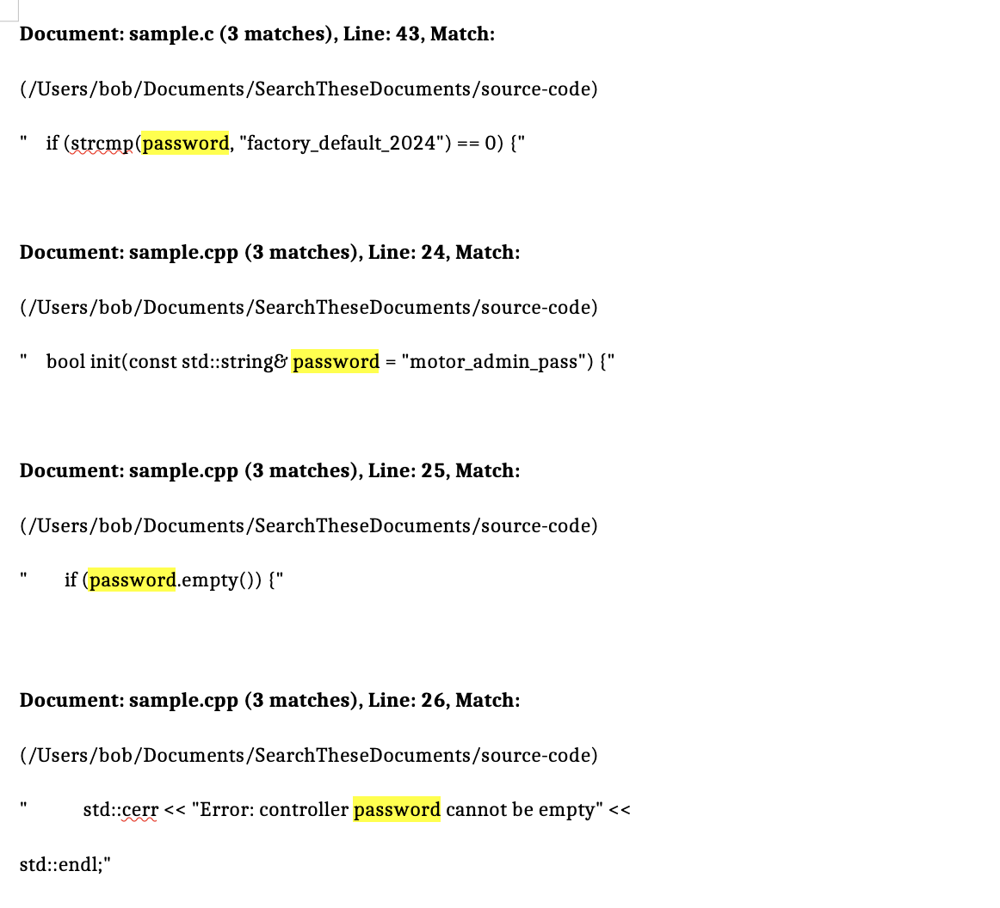

**Example 2: Search for "heart" on the main screen:**

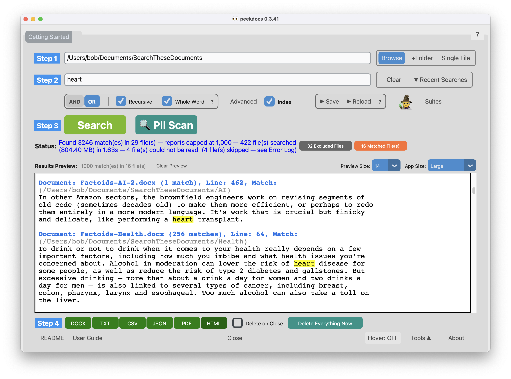

**Resulting highlighted HTML report — every match highlighted:**

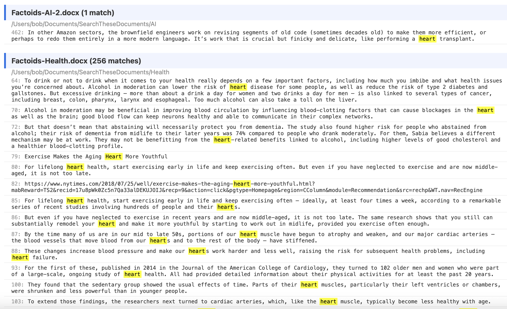

**Resulting highlighted docx report — every match highlighted:**


**Example 3: Say you had scanned and saved this original insurance document as a jpg file. Now you need the VIN and policy details for your Honda:**

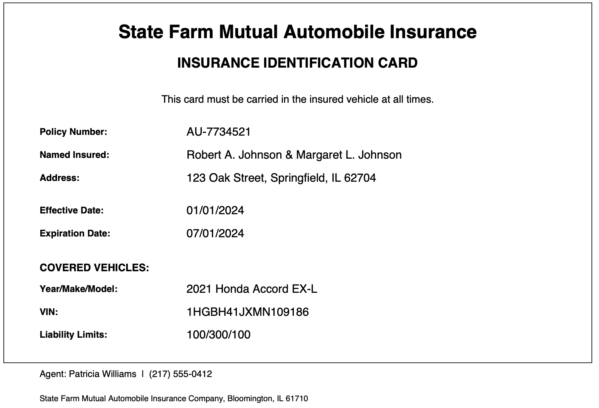

**From the main screen, search on "honda" with Lines Before and Lines After (under Advanced Search Options) set to 2 to capture the surrounding context:**

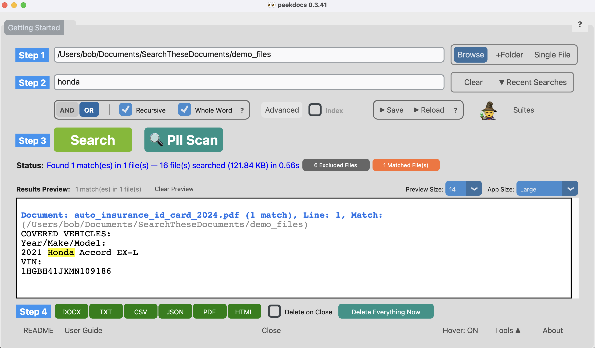

**Lines Before and Lines After are set in the Advanced Search Options page, which pops up when you click 'Advanced' on the main page:**

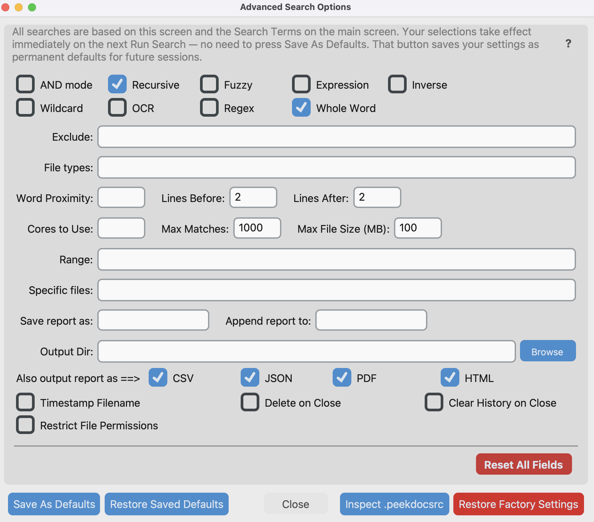

**PII Scan — helps locate personally identifiable information you may have inadvertently left in your files:**


**PII Scan results:**


**Advanced Search Options (click 'Advanced' on main screen):**

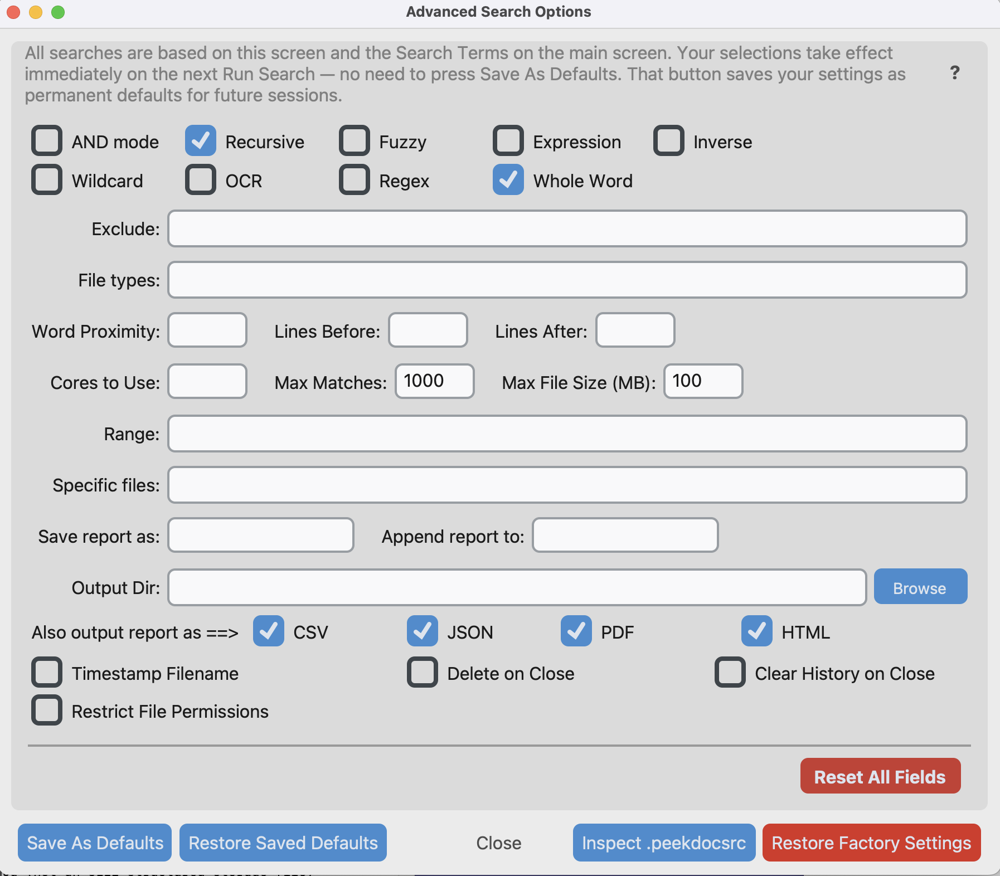

**Search Suites (click 'Suites' on main screen):**

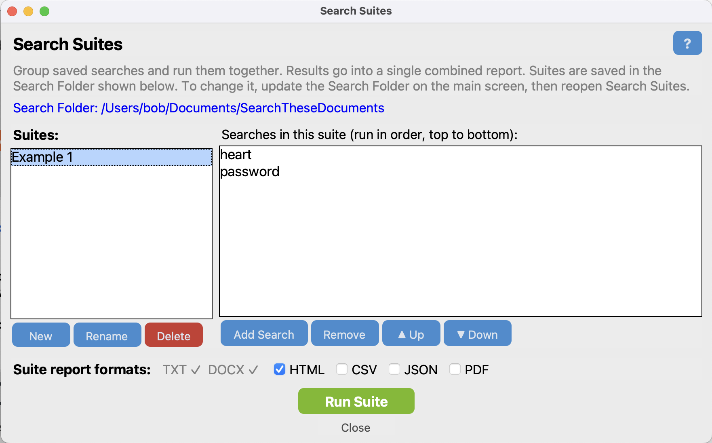

**Search Wizard (5 of 21 entries shown, click 'Wizard' icon on main screen):**

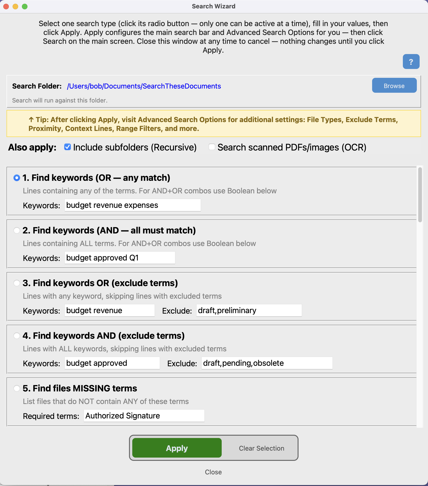

**Every screen has explanatory hover text for every button and data field. Hover turns on and off — last row.**

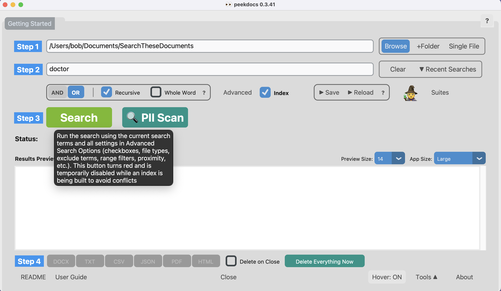

**Every screen has a help menu with Table of Contents — ? at upper-right corner.**

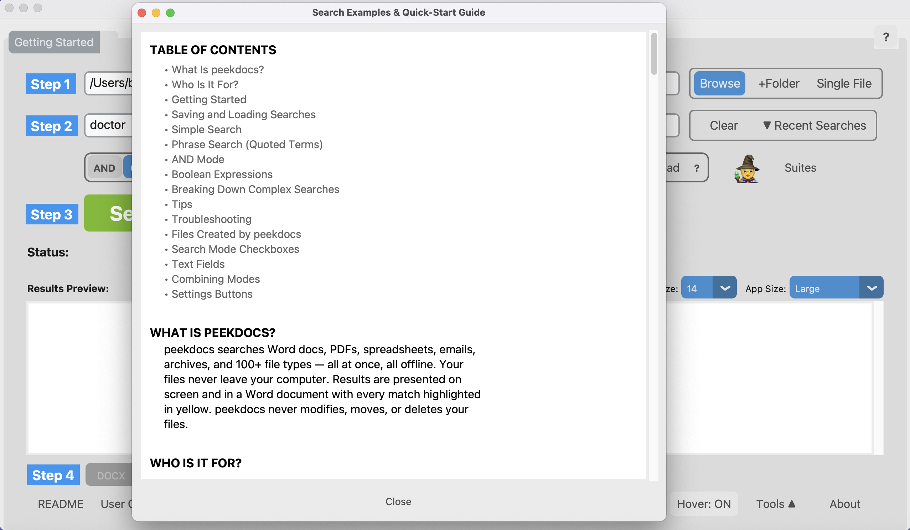

**'Tools' Menu (main screen — lower right corner):**

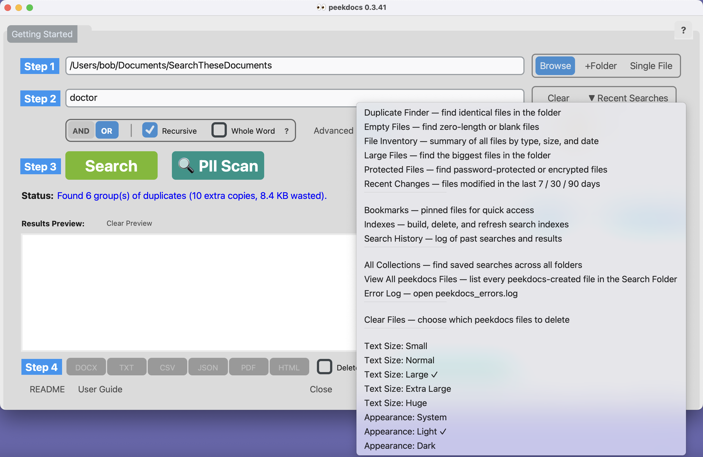

**Simple for everyone, powerful when you need it.** Most users never leave the search bar and PII Scan button. Power users can go deeper with regex, Boolean logic, range queries, fuzzy matching, wildcards, proximity search, a command-line interface, and a Python API.

Works in any language. Runs on Windows, macOS, and Linux. No fees, no subscriptions, no cloud. Everything stays on your computer. Nothing is uploaded anywhere. Your files are never altered or deleted. Free and open-source.

**[See peekdocs in action →](https://robertdschoening.com/peekdocs)**

## Features

- **PII Scan** — **Do you know what's hiding in your documents?** One click finds Social Security numbers, credit cards, passwords (including pw, p/w, login, username, user ID, UID), tax IDs, emails, phone numbers, dates of birth, and user-configurable dollar-amount ranges — with a highlighted report showing exactly where. Results are categorized by severity (high/moderate/info) with per-file details. **Custom patterns:** advanced users can add their own regex (e.g., UK NINO, Canadian SIN, German Steuer-ID, company account IDs) to extend the scan beyond the built-in categories
- **Offline and private** — your documents never leave your computer. peekdocs never uploads, transmits, alters, moves, or deletes your files. No cloud, no accounts, no subscriptions. Everything runs locally and stays local
- **100+ file types** — Word, PDF, Excel, PowerPoint, emails (.eml, .msg, .pst, .mbox), archives (.zip, .7z, .rar), source code (Python, C/C++, Java, Go, Rust, and more), engineering files (MATLAB, Verilog, VHDL, SPICE, DXF, Visio), Apple Pages/Numbers/Keynote, calendars (.ics), contacts (.vcf), e-books, HTML, and more
- **Highlighted reports** — results saved to `.docx` and `.pdf` with yellow-highlighted matches, `.txt` with full context, and optional CSV and JSON output
- **Results preview** — see matches inline in the GUI with highlighted terms; right-click to copy, double-click a filename to open it. Matched files popup shows line numbers and includes a "View Text" option that displays the file's extracted content with line numbers and highlighted matches
- **Recent searches** — dropdown next to the search bar remembers your last 10 searches
- **Save Search / Load Search** — save a configured search by name and reload it later with one click
- **Search Suites** — group saved searches into a named suite and run them all at once (Tools → Search Suites)
- **Search Wizard** — guided search builder with 21 pre-built search types (SSN, phone, email, dollar range, Boolean, fuzzy, and more) plus a regex pattern builder with 8 profession categories — no flags or regex knowledge needed
- **Inverse search** — find files that are *missing* required content
- **Search modes** — plain keywords, AND/OR, Boolean expressions, regex, wildcards, fuzzy matching, whole-word, word proximity, line proximity
- **Range queries** — filter by dollar amounts, dates, percentages, ages, file sizes
- **OCR** — search scanned PDFs and images (requires Tesseract)
- **Works in any language** — peekdocs searches documents written in English, Spanish, French, German, Chinese, Japanese, Korean, Arabic, Hindi, Russian, Greek, and every other language. All text handling is Unicode-based. Type your search terms in any language and peekdocs finds them. **Note:** peekdocs performs exact text matching — it finds the character sequence you type, which works well for all languages including CJK (Chinese, Japanese, Korean). It does not perform language-specific processing such as word segmentation, stemming, or stop-word removal. Documentation and the GUI are in English only. In fairness, any search tool that uses Unicode can do the same thing — this is not unique to peekdocs
- **Multi-folder search** — search across multiple folders at once, with optional recursive searching into subfolders. Click **+Folder** to add folders, or type semicolon-separated paths. Results are combined from all folders
- **HTML export** — don't have Word or LibreOffice? Enable HTML in Advanced Search Options and click the HTML button — your highlighted report opens instantly in your web browser. Every computer has a browser, so no extra software is needed. The HTML file is stored locally on your computer — nothing is uploaded or made public. Also easy to share via email — the recipient just opens the file in their browser
- **Three interfaces** — terminal CLI, point-and-click GUI (`peekdocs-gui`), Python API
- **Cross-platform** — Windows, macOS, Linux
- **Search index** — optional SQLite FTS5 index for faster repeated searches
- **Read-only** — peekdocs never modifies, moves, or deletes your files. It does create its own output files (reports, indexes, settings) and can delete those when you ask (e.g., Clear Results, Delete Index)
- **Delete on Close** — check the **Delete on Close** checkbox (on the main screen next to the report buttons, or in Advanced Search Options) to automatically delete all search result files and the search index when you close peekdocs. Applies to every folder searched during the session — not just the last one. The index is included because it contains extracted text from every indexed file. You can check or uncheck it at any time — it only matters at the moment you close the app. Review your results first, then check the box and close. Saved reports (`peekdocs_report_*`), accumulated reports (`peekdocs_accumulated_*`), saved searches (`.peekdocs_collection.json`), settings (`~/.peekdocsrc`), and bookmarks are never deleted.
- **Safe defaults** — files over 100 MB are automatically skipped to prevent slow searches and memory issues. Very large files (huge PDFs, massive spreadsheets, database exports) can take minutes to parse and may exhaust available memory. Skipped files appear in the **Excluded Files** list after each search, so you always know what was missed. To change the limit, set **Max File Size (MB)** in Advanced Search Options — or set it to 0 for no limit. Changing the limit automatically rebuilds the index on the next search. ZIP archives that would expand to over 500 MB are also skipped to prevent archive bombs. **Note:** raising Max File Size can sometimes result in *fewer* matched files, not more — a very large file with thousands of matches can consume most of the Max Matches budget (default 1,000), leaving fewer slots for matches from other files. If you see this, raise Max Matches too (or set it to 0 for unlimited)
- **Excluded Files view** — after each search, click the **View N excluded file(s)** button to see exactly which files were skipped and why (unsupported type, prior output, oversized, hidden, etc.) — no more guessing why a `find` count differs from peekdocs's file count
- **Tools menu** — built-in utilities beyond search:
  - **File Inventory** — instant summary of every file in a folder: total count, size breakdown by type, oldest and newest files
  - **Duplicate Finder** — finds identical files by content (not just name), shows how much space is wasted by extra copies
  - **Large Files** — shows the 50 biggest files so you can reclaim disk space
  - **Empty Files** — finds zero-byte files: failed downloads, placeholders, junk
  - **Recent Changes** — which files were modified in the last 7, 30, or 90 days
  - **Protected Files** — detects password-protected PDFs, Word/Excel/PowerPoint, ZIP/7z/RAR archives that peekdocs can't search
  - **Search History** — automatic diary of every search you run: date, terms, match count, file count, elapsed time
  - **Bookmarks** — pin files from search results for quick access later

### Why Developers Like It

- **Simple setup** — `pip install peekdocs` and you're running. No accounts, no configuration, no Docker containers.
- **Fast results** — 1,000 mixed-format documents in ~1 second. Milliseconds with the search index.
- **Local-first** — no cloud, no API keys, no internet required. Works on air-gapped machines.
- **Useful immediately** — solves a real problem on the first run. No learning curve for basic searches.
- **No enterprise nonsense** — no seat licenses, no sales calls, no feature gating, no telemetry. MIT license. Use it, modify it, share it.

### Supported File Types

| Category | Formats |
|----------|---------|
| **Documents** | .doc .docx .epub .html .key .md .odp .odt .pages .pdf .ppt .pptx .rst .rtf .tex |
| **Spreadsheets** | .csv .numbers .ods .tsv .xls .xlsx |
| **Email** | .eml .mbox .msg .pst |
| **Archives** | .7z .bz2 .gz .rar .tar .tgz .zip |
| **Calendar/Contacts** | .ics .vcf |
| **Source Code** | .asm .bat .c .cmake .cpp .cs .css .f .f90 .go .gradle .h .hpp .java .js .kt .lua .pl .ps1 .py .r .rb .rs .s .scala .scss .sh .swift .tcl .ts .vb |
| **Engineering** | .cir .dxf .m .sp .spice .sv .v .vhd .vhdl .vsdx |
| **Data/Config** | .cfg .conf .dockerfile .env .graphql .gql .ini .json .jsonl .log .makefile .ndjson .properties .proto .sql .tf .toml .txt .xml .yaml .yml |
| **Notebooks** | .ipynb (Jupyter) |
| **Images (OCR)** | .bmp .jpg .jpeg .png .tif .tiff (requires `-O` flag) |

**Note:** Apple Numbers (.numbers) and Keynote (.key) files created with recent versions of iWork use a protobuf-based internal format. peekdocs extracts whatever readable text exists inside these files, which may be partial. Older iWork files extract fully. Apple Pages (.pages) is fully supported.

## Installation

### Prerequisites

*Using Option A (standalone download)? Skip this section — no prerequisites needed.*

- **Python 3.10+** (required for Options B, C, D) — check if it's already installed: `python3 --version` (macOS/Linux) or `python --version` (Windows). If not installed, download from [python.org/downloads](https://www.python.org/downloads/). **Note:** Python version numbers are not decimals — 3.13 is newer than 3.9 (it's the 13th release, not "three point one three").
  - **macOS users:** Your Mac may come with an older Python (3.9.x) pre-installed. If `python3 --version` shows 3.9.x, you need a newer version. Install from [python.org/downloads](https://www.python.org/downloads/) or via Homebrew (`brew install python`). Don't worry — installing a newer Python does **not** replace or affect the old version. Each version installs to its own folder (e.g., system Python lives at `/usr/bin/python3`, Homebrew Python at `/opt/homebrew/bin/python3.13`). They live side by side, and any programs that use the older version will continue to work. After installing, the plain `python3` command may still point to the old 3.9 — use `python3.13` (or whichever version you installed) instead. You also need tkinter for the GUI: `brew install python-tk@3.13` (replace 3.13 with your version if different).
  - **Windows users:** Windows does not come with Python pre-installed, but you may have installed it previously. Open a Command Prompt and type `python --version`. If you see a version number (e.g., `Python 3.12.4`), Python is already installed and in your PATH — you're good to go. If the version is older than 3.10, install a newer one — it won't replace the old version (each installs to its own folder, e.g., `C:\Users\YourName\AppData\Local\Programs\Python\Python313\`). If you see "not recognized" or the Microsoft Store opens, Python is either not installed or not in your PATH. Download it from [python.org/downloads](https://www.python.org/downloads/) and make sure to check **"Add Python to PATH"** at the bottom of the first installer screen. This ensures that `pip`, `python`, and `peekdocs` commands work from any Command Prompt window. If you've already installed Python without this option, the easiest fix is to re-run the Python installer and check the box.
  - **Linux users (Ubuntu, Debian, Linux Mint, Pop!_OS):** Most distros include Python 3.10+ already. If yours is older, you can install a newer version alongside it (e.g., via the `deadsnakes` PPA: `sudo add-apt-repository ppa:deadsnakes/ppa && sudo apt install python3.13`) — this won't replace your system Python (it installs to `/usr/bin/python3.13` alongside the existing `/usr/bin/python3`). The base `python3` package does not include `venv`, `pip`, or `tkinter`. You must install them before creating a virtual environment. Run this single command to get everything peekdocs needs:
    ```bash
    sudo apt install python3-venv python3-pip python3-tk
    ```
    Without `python3-venv` and `python3-pip`, `python3 -m venv venv` will fail with an `ensurepip` error. Without `python3-tk`, the CLI works but the GUI (`peekdocs-gui`) will not launch. This is a one-time setup.
- **pip** (Python's package installer) — included automatically when you install Python 3.10+. No separate installation needed. **pipx** is a separate tool that must be installed via pip (see Option B below).
- **Tkinter** (required for GUI) — no action needed on Windows (the Python installer includes it). On macOS with Homebrew Python, install it: `brew install python-tk@3.13` (replace 3.13 with your version). On Linux: `sudo apt install python3-tk` (already included in the Linux command above). If you installed Python from [python.org](https://www.python.org/downloads/) on macOS, tkinter is already included.
- **Tesseract** (optional, for OCR) — OCR (Optical Character Recognition) reads text from scanned PDFs and images (PNG, JPG, TIFF, BMP, GIF). Most users don't need this — it's only for documents that are pictures of text rather than actual text. If you do need it: macOS: `brew install tesseract` | Windows: [download](https://github.com/UB-Mannheim/tesseract/wiki) | Linux: `sudo apt install tesseract-ocr`
- **UnRAR** (optional, for .rar archives) — only needed if you want to search inside .rar files. macOS: `brew install unrar` | Windows: comes with [WinRAR](https://www.win-rar.com/) | Linux: `sudo apt install unrar`

**Everything else installs automatically.** When you run `pip install peekdocs`, pip downloads and installs all 17 Python libraries peekdocs needs (PDF reader, Word/Excel/PowerPoint parsers, email reader, etc.) — about 50 packages, ~244 MB total on disk. You don't have to install any of them yourself. See [Dependencies](docs/USER_GUIDE.md#dependencies) in the User Guide for the full list and what each one does.

### Option A: Standalone Download (no Python needed)

The simplest way to get peekdocs. No Python, no terminal commands, no installation — just download and run.

1. Go to the [Releases page](https://github.com/exbuf/peekdocs/releases/latest)
2. Download the file for your platform:
   - **Windows:** `peekdocs-gui-windows.exe`
   - **macOS:** `peekdocs-gui-macos.zip` (unzip it, then open `peekdocs-gui.app`)
   - **Linux:** `peekdocs-gui-linux`
3. Run it — that's it. No installation needed.

**Windows SmartScreen warning:** When you first run the `.exe`, Windows may show a blue warning: "Windows protected your PC." This is normal for free, open-source software that hasn't purchased a code-signing certificate ($200+/year). It does not mean the software is unsafe. To proceed: click **"More info"**, then click **"Run anyway"**. You'll only see this once.

**CLI users:** The Releases page also has command-line versions (`peekdocs-cli-windows.exe`, `peekdocs-cli-macos.zip`, `peekdocs-cli-linux`).

**Upgrading:** Download the new version from the Releases page and replace the old file. Your settings and saved searches are stored in your home directory, not in the executable — nothing is lost.

---

*Options B through D below are alternative installation methods for users who prefer pipx, git, or pip. If you used Option A, you're done — skip ahead to [Quick Start](#quick-start).*

### Option B: Quick Install with pipx

First, check if pipx is installed by typing `pipx --version`. If it says "not recognized" or "command not found," install it:

```bash
pip install pipx          # Windows
brew install pipx         # macOS (pip won't work — gives "externally-managed-environment" error)
pipx ensurepath           # adds pipx to your PATH (all platforms)
```

**Close and reopen your terminal** (Command Prompt on Windows) after running `ensurepath` (it only takes effect in a new window). Then install peekdocs:

1. Go to [github.com/exbuf/peekdocs](https://github.com/exbuf/peekdocs)
2. Click the green **Code** button → **Download ZIP**
3. Open any terminal or Command Prompt window — it doesn't matter what folder you're in. Run:

   ```
   pipx install C:\Users\YourName\Downloads\peekdocs-main.zip              # Windows (replace YourName)
   pipx install --python python3.13 ~/Downloads/peekdocs-main              # macOS
   pipx install ~/Downloads/peekdocs-main                                  # Linux
   ```

   **macOS notes:** (1) The `--python python3.13` flag tells pipx to use your newer Python instead of the old system Python 3.9. Replace `3.13` with whichever version you installed. (2) Safari auto-extracts ZIP files, so you'll have a `peekdocs-main` folder (not a `.zip` file) in Downloads.

**Have git?** You can skip the download and install directly: `pipx install git+https://github.com/exbuf/peekdocs.git` (on macOS, add `--python python3.13`)

After installation, `peekdocs` and `peekdocs-gui` (on Windows: `peekdocs.exe` and `peekdocs-gui.exe`) work from any terminal or Command Prompt, any folder, every time — even after restarting your computer. It's a one-time install, not something you run daily. This is the easiest way to install. To search your documents, either navigate your terminal to your documents folder first, or pass the folder path with the `-d` flag (e.g., `peekdocs budget -d C:\Users\YourName\Documents`).

**Fully isolated.** pipx installs peekdocs in its own private virtual environment (venv), completely separate from your system Python and all other programs. Unlike Options C and D below, you won't see `(venv)` in your terminal prompt — pipx manages the environment automatically so you never have to think about it. It will not install, upgrade, downgrade, or conflict with anything else on your computer. The only change to your system is two new commands (`peekdocs` and `peekdocs-gui`). To uninstall completely: `pipx uninstall peekdocs`. To upgrade to a newer version, uninstall the old one first (`pipx uninstall peekdocs`), then install the new ZIP — your settings and saved searches are not affected. See the [User Guide](docs/USER_GUIDE.md#will-peekdocs-affect-my-existing-python-installation) for details.

### Option C: Manual Install (with git)

```bash
git clone https://github.com/exbuf/peekdocs.git
cd peekdocs
python3 -m venv venv
source venv/bin/activate        # Windows: venv\Scripts\activate
pip install --upgrade pip setuptools wheel   # required on some Linux distros — see note below
pip install -e .
```

**Important:** With a manual install, you must activate the virtual environment (`source venv/bin/activate`) every time you open a new terminal. When activated, you'll see `(venv)` at the beginning of your terminal prompt — this means peekdocs commands will work. If you see "command not found" when typing `peekdocs`, you forgot to activate — look for the missing `(venv)` prefix. See the [User Guide](docs/USER_GUIDE.md#which-installation-method-did-you-use) for details and how to switch to pipx.

**"setup.py not found" error on Linux?** Some Linux distributions ship older versions of pip and setuptools that don't support `pyproject.toml`-based builds (which peekdocs uses). The fix is `pip install --upgrade pip setuptools wheel` inside the virtual environment before running `pip install -e .` — this is already included in the commands above. Make sure the `(venv)` prefix is showing in your terminal prompt before running these commands.

### Option D: Manual Install (no git, no sign-up)

No git? No problem. Download peekdocs as a ZIP file directly from your browser:

1. Go to [github.com/exbuf/peekdocs](https://github.com/exbuf/peekdocs)
2. Click the green **Code** button
3. Click **Download ZIP**
4. Extract the ZIP file, copy the extracted `peekdocs-main` folder and paste it to where you want it
5. Open a terminal and navigate to the extracted folder:

   **Windows:**
   ```cmd
   cd C:\Users\YourName\Downloads\peekdocs-main
   python -m venv venv
   venv\Scripts\activate
   pip install -e .
   ```

   **macOS/Linux:**
   ```bash
   cd ~/Downloads/peekdocs-main
   python3 -m venv venv
   source venv/bin/activate
   pip install --upgrade pip setuptools wheel
   pip install -e .
   ```

**Important:** Same as Option C — you must activate the virtual environment each time you open a new terminal. Look for `(venv)` at the start of your prompt to confirm it's active. See the [User Guide](docs/USER_GUIDE.md#which-installation-method-did-you-use) for details.

### Upgrading

Your saved searches, settings, indexes, and reports are stored outside the peekdocs installation — in your home directory and your document folders. Upgrading replaces only the code. Nothing else is touched. Specifically, these files are **never overwritten** by an upgrade:

- `~/.peekdocsrc` — your saved settings and preferences
- `~/.peekdocs_history.json` — your search history
- `~/.peekdocs_bookmarks.json` — your bookmarks
- `.peekdocs_collection.json` (in each search folder) — your saved searches and search suites
- `.peekdocs.db` (in each search folder) — your search index
- `peekdocs_report_*`, `peekdocs_accumulated_*` files — your saved reports

- **pipx (installed from ZIP):** `pipx uninstall peekdocs`, download the new ZIP, then `pipx install` it again (same steps as the original install)
- **pipx (installed with git):** `pipx upgrade peekdocs`
- **Standalone (Option A):** download the new version from the [Releases page](https://github.com/exbuf/peekdocs/releases/latest) and replace the old file
- **git (Option C):** `cd peekdocs && git pull && pip install -e .`
- **ZIP (Option D):** download the new ZIP, replace the folder, activate the venv, run `pip install -e .`

See the [User Guide](docs/USER_GUIDE.md#will-peekdocs-affect-my-existing-python-installation) for full details on what is and isn't preserved.

## CLI at a Glance (condensed — run `peekdocs -h` for full reference)

Type `peekdocs` with no arguments to see a quick command reference:

```
$ peekdocs

── Search Modes (examples — flags can be combined freely) ────────
  peekdocs term1 term2           OR search (any term matches)
  peekdocs -a term1 term2        AND search (all terms required in same line)
  peekdocs -e "(A AND B) OR C"   Boolean expression with AND, OR, NOT, parens
  peekdocs -x "\d{3}-\d{4}"      Regex pattern matching
  peekdocs -w "budg*"            Wildcard (* = any chars, ? = one char)
  peekdocs -z budgt              Fuzzy matching (typo-tolerant)
  peekdocs -W bob                Whole-word only (not "bobcat")
  peekdocs -p 5 budget revenue   Word proximity (terms within 5 words of each other)
  peekdocs -P 3 budget acme      Line proximity (terms within 3 lines of each other)
  peekdocs --inverse budget      Find files that do NOT contain "budget"
  peekdocs -n draft budget       Find "budget" but exclude lines containing "draft"
  peekdocs -s quarterly budget   Save a named copy of the report
  peekdocs --open docx budget    Search and auto-open the highlighted Word report
  peekdocs --open html budget    Search, generate HTML, and open in browser

── Common Options ───────────────────────────────────────────────
  peekdocs -r budget               Search all subfolders recursively
  peekdocs -t pdf,docx budget      Search only PDF and Word files
  peekdocs -A 5 -B 5 budget        Show 5 lines before and after each match
  peekdocs -R amount:1000..5000 "" Filter by dollar range
  peekdocs -O budget               Enable OCR for scanned PDFs and images
  peekdocs --max-file-size 500     Skip files larger than 500 MB (default 100, 0 = no limit)
  peekdocs --index                 Build search index for faster repeated searches

── PII Scan ─────────────────────────────────────────────────────
  peekdocs --pii-scan            Scan current folder for SSNs, credit cards, passwords, etc.
  peekdocs --pii-scan -r         Scan all subfolders recursively

── Cleanup ──────────────────────────────────────────────────────
  peekdocs --list-files          List all peekdocs-created files
  peekdocs --clear               Delete peekdocs_results* files
  peekdocs --clear-all           Delete all peekdocs output files

Type peekdocs -h for full help (all flags, file types, regex patterns).
```

Condensed version of `peekdocs -h` (all flags and options):

```
Search modes:
  (default)          OR    -a AND    -e "EXPR" Boolean    -x Regex
  -w Wildcard    -z Fuzzy    -W Whole-word    -p Word proximity
  -P Line proximity    --inverse

Filters:  -t pdf,docx  -r (recursive)  -n draft (exclude)  -O (OCR)
          -R amount:1000..5000  --max-file-size 500  -f report.pdf
Output:   -o csv,json,pdf,html  -s name (save)  --timestamp
          --open docx  --open html  -sa archive (append)
Index:    --index (build)  --index-refresh  --index-clear
PII:      --pii-scan  --pii-scan -r (recursive)
Cleanup:  --clear  --clear-all  --list-files
Settings: --config KEY=VAL  --config --reset  --check
```

Run `peekdocs -h` for the full list of flags, file types, and regex patterns.

## Quick Start

### Terminal

If you used Option A (standalone download) or Option B (pipx), peekdocs is always ready — just open any terminal. If you used the manual install (Option C or D), navigate to the folder where `pyproject.toml` is located (the peekdocs project folder) and activate the virtual environment first:

```bash
cd /path/to/peekdocs                 # the folder containing pyproject.toml
source venv/bin/activate             # macOS/Linux (you'll see (venv) in your prompt)
venv\Scripts\activate                # Windows
```

**Tip:** Type `peekdocs` with no arguments to see a handy cheat sheet of all search modes, common options, PII scan, and cleanup commands — right above your command prompt. Type `peekdocs -h` for the full reference with all flags, file types, and regex patterns.

Then navigate to your documents and search:

```bash
cd /path/to/your/documents
peekdocs budget                      # search for "budget"
peekdocs budget revenue              # OR search (any term)
peekdocs -a budget revenue           # AND search (both terms)
peekdocs -r budget                   # include subfolders
peekdocs -t pdf,docx budget          # only PDFs and Word docs
peekdocs -x "\d{3}-\d{2}-\d{4}"     # regex (SSN pattern)
peekdocs -e "(budget OR revenue) AND NOT draft"   # Boolean expression
peekdocs -R amount:1000..5000 budget # range query
peekdocs -R date:2024-01-01..2024-12-31 invoice  # date range (also accepts 01/01/2024 format)
peekdocs -P 3 budget acme            # line proximity (terms within 3 lines)
peekdocs --open docx budget          # search and auto-open the .docx report
peekdocs --open html budget          # auto-generate HTML and open in your browser
peekdocs --open csv budget           # auto-generate CSV and open in Excel/LibreOffice
peekdocs --open pdf budget           # auto-generate PDF and open in a PDF viewer
peekdocs --open json budget          # auto-generate JSON and open in a text editor
peekdocs -sa archive --open docx budget  # append to accumulated report and open it
peekdocs -sa archive --open html budget  # append and open accumulated report in browser
peekdocs --clear                    # delete peekdocs_results* files in current directory
peekdocs --clear-all                # delete all peekdocs output files (results, saved reports, index)
```

If you used the manual install, you'll see `(venv)` before each command in your terminal — that's normal and means the virtual environment is active.

Results are saved to `peekdocs_results.txt` and `peekdocs_results.docx` (highlighted) in the current directory — the same folder your terminal is in when you run the search. If you enabled additional formats (CSV, JSON, PDF, HTML), those are saved too. **All result files are overwritten each time you run a new search.** To keep previous results, use `-s my_report` to save a named copy (saved as `peekdocs_report_my_report.txt/.docx` so peekdocs never searches its own reports), or `--timestamp` to add a date/time stamp to each filename so nothing is ever overwritten. When clicked, the .docx report opens automatically in whatever word processor you have — Microsoft Word or [LibreOffice](https://www.libreoffice.org/download/download-libreoffice/) (free) are recommended. peekdocs blocks reports from opening in Google Docs, Apple Pages, or any cloud-based application that may upload your data. The .txt report works on any computer with no extra software.

To clean up output files: `peekdocs --clear` (deletes results files) or `peekdocs --clear-all` (deletes results, saved reports, error log, and index). Neither touches your saved searches or settings.

Run `peekdocs -h` for the full flag reference with examples. The complete flag list with detailed descriptions is in the [User Guide](docs/USER_GUIDE.md#flag-use-summary). All flags can be combined freely except: regex (`-x`), fuzzy (`-z`), and wildcard (`-w`) are mutually exclusive (pick one); and expression mode (`-e`) cannot be combined with AND (`-a`), exclude (`-n`), or proximity (`-p`) since those are built into the expression syntax.

### GUI

```bash
peekdocs-gui
```

See [Screenshots](#screenshots) for what the GUI looks like.

1. Click **Browse** to select a folder (or **File** to search a single file)
2. Type your search terms
3. Click **Run Search**
4. View results in the preview pane or click **DOCX** to open the highlighted report

Most users won't need anything beyond the search bar — type your keywords and click Run Search. For more advanced searches, you have two choices: configure **Advanced Search Options** yourself (regex, fuzzy, Boolean, range queries, and all other settings), or let the **Search Wizard** do it for you — pick a search type from 21 pre-built patterns, fill in your values, and click Apply. The wizard configures Advanced Search Options automatically. Both are in the **Tools** menu, along with **PII Scan** (one-click sensitive data detection) and **Search Suites** (run a group of saved searches together).

**If buttons overlap or text looks too large**, use the **Text Size** dropdown on the bottom-right toolbar to adjust (Normal is recommended).

### Python API

```python
from peekdocs import search

result = search(["budget", "revenue"], directory="/path/to/docs")

print(f"Found {len(result.matches)} matches in {len(result.files_searched)} files")
for match in result.matches:
    print(f"  {match.filename}:{match.line_num}: {match.text}")
```

See the [API Reference](docs/API.md) for all parameters and options.

## Documentation

| Document | Description |
|----------|-------------|
| [User Guide](docs/USER_GUIDE.md) | Complete reference — GUI, CLI flags, search modes, indexing, file reference |
| [API Reference](docs/API.md) | Python library API — `search()` function, parameters, return values |
| [FAQ & Troubleshooting](docs/TROUBLESHOOTING.md) | Common questions and solutions for Windows, macOS, and Linux |
| [Changelog](CHANGELOG.md) | Version history and release notes |
| [Contributing](CONTRIBUTING.md) | How to report bugs, suggest features, and submit code |

## Why peekdocs?

Every search tool — from Google to Spotlight to $2,500 enterprise software — does the same thing at its core: match a pattern against text. Any modern tool can search in any spoken language, because they all use Unicode. The difference is never the matching. It's what happens around it: what files can it read, how does it present the results, how easy is it to use, and what can you do with the output.

peekdocs reads 100+ file formats that most tools can't touch — Word, PDF, Excel, email archives, .7z, .rar, scanned images. It produces a highlighted Word report with every match in context — not a list of filenames in a terminal, but a real document you can save, print, or hand to someone. It finds sensitive data with one click (PII Scan). Save your searches by name and reload them later. Group them into search suites and run an entire set of searches with one click — the same 10 searches you ran last quarter, rerun in seconds. And it does all of this in a GUI that a non-technical person can use without reading a manual.

If all you need is to find a word in a document, any search tool works. If you want to *see inside your own files* — what's there, what's sensitive, and what you might have forgotten about — that's what peekdocs was built for.

## Why Not Just Use OS Search?

Windows Search, macOS Spotlight, and Linux file managers can search file contents — but they have real limitations:

- **Format gaps** — OS search often can't read inside `.pst`, `.msg`, `.7z`, `.rar`, `.odt`, `.eml`, `.mbox`, Jupyter notebooks, or scanned PDFs. peekdocs reads 100+ file types.
- **No highlighting** — OS search tells you *which file* matched, but not *where* in the file. peekdocs shows the matched text with surrounding context, highlighted in yellow.
- **No PII scanning** — no built-in way to scan for SSNs, credit cards, or passwords across all your files.
- **No saved searches or suites** — you can't name a search, save it, and run it again next month. peekdocs can.
- **No regex, Boolean, fuzzy, proximity, or range queries** — OS search is keyword-only.
- **Inconsistent indexing** — Spotlight and Windows Search depend on background indexing services that may be disabled, incomplete, or slow to update. peekdocs searches files directly (or with its own optional index).
- **No reports** — OS search can't produce a highlighted Word document or CSV of all matches that you can save, print, or share.

peekdocs isn't a replacement for your OS — it's the tool you reach for when your OS can't find what you need.

## Why Not Just Use AI?

AI document tools (ChatGPT, Copilot, NotebookLM) require uploading your files to a cloud server. A corporation sees your tax returns, medical records, and passwords. Your data may be used for training. A breach exposes everything you uploaded. And you pay $20+/month for the privilege.

For finding specific content in your documents — keywords, patterns, SSNs, credit cards, phone numbers, account numbers — peekdocs does what AI does, without uploading anything. Your files stay on your computer. No account, no internet connection, no subscription, no third party.

**There's also a practical problem:** AI tools have upload limits and format restrictions. You can't upload 500 tax PDFs, 2,000 emails, and 10 years of contracts to ChatGPT — and even if you could, most AI tools can't read .msg, .pst, .7z, .rar, .odt, .xls, .doc, or scanned images. By the time you've uploaded your first few files to an AI tool, peekdocs would already be done searching hundreds. It reads 100+ file types at once, on your machine, with no file count or size limit.

What AI adds beyond search — summarization, question answering, semantic understanding — requires giving up your privacy. Most people searching for "where's my insurance policy number" or "do any of my files contain passwords" don't need that. They need to find something. peekdocs finds it.

## Why Not Just Use Grep?

**Credit where it's due:** grep is an excellent tool. For plain text files, it's fast, reliable, and battle-tested for decades. With piping, a skilled developer can extend it to binary formats: `pdftotext file.pdf - | grep term` works for PDFs, `unzip -p file.docx word/document.xml | grep term` works (roughly) for Word, `xlsx2csv file.xlsx | grep term` for Excel, and `tesseract image.png stdout | grep term` for OCR. grep also has built-in regex (`-E`/`-P`), recursive search (`-r`), inverse matching (`-rL`), context lines (`-B`/`-A`), and whole-word matching (`-w`). A determined developer could write a bash script that loops over files, detects types, pipes each through the right converter, and greps the output.

**Where peekdocs goes beyond what grep can practically do:**

- **Highlighted reports** — grep outputs plain text to a terminal. peekdocs produces a `.docx`, `.pdf`, or `.html` with yellow-highlighted matches, organized by file with surrounding context — a document you can save, print, or hand to someone. No amount of grep piping produces this. (Microsoft Word is not required — when clicked, the report opens automatically in any word processor. [LibreOffice](https://www.libreoffice.org/download/download-libreoffice/) (free) is recommended. peekdocs blocks reports from opening in Google Docs, Apple Pages, or any cloud-based application that may upload your data.)
- **PII scanning with categorized severity** — helps locate personally identifiable information you may have inadvertently left in your files. Not just regex matching, but categorized findings (high/moderate/info), false-positive filtering (URLs, DOIs, environment variables), custom patterns, and a formatted report. You could run 10 separate `grep -P` calls for SSN/credit card/phone patterns, but the categorization, filtering, and reporting are not practically replicable.
- **Boolean expressions, proximity, fuzzy matching, range queries** — `(budget OR revenue) AND NOT draft`, "find A within 5 words of B", typo-tolerant matching, and `amount:1000..5000` are not expressible in grep.
- **100+ file types in one command** — the bash script to handle all 100+ types with appropriate converters would be hundreds of lines, fragile, and require installing and maintaining 10+ external tools. peekdocs: `pip install peekdocs` and you're done.
- **GUI** — for anyone who doesn't live in a terminal.
- **Save/reload searches, bookmarks, search history, file analysis tools** — application features that don't exist in grep's world.
- **Search suites** — save multiple searches by name and run them all together with one click. grep has no concept of saved searches or grouped batch execution.
- **Search index with auto-refresh** — grep has no index. You'd need a separate tool (recoll, xapian) — at which point you're not using grep anymore.
- **Cross-platform consistency** — a grep pipeline that works on Linux may break on macOS (different grep versions, missing converters, different tool flags). peekdocs works identically on all three platforms.

**The honest summary:** For plain-text search in a terminal, grep is faster and simpler — use it. For searching across mixed-format documents (PDFs, Word, Excel, email archives), producing shareable highlighted reports, scanning for sensitive data, or giving a non-terminal user a search tool they can actually use, peekdocs does what would take hundreds of lines of custom scripting to approximate — and does it in one command.

## Performance

**Test machine:** MacBook Pro, Apple M-series, 24 GB RAM, SSD, Python 3.13. peekdocs used 7 of 14 cores (its default is half; adjustable in Advanced Search Options). Your results will vary depending on CPU, RAM, disk type (SSD vs hard drive), and whether files are local or on a network drive.

### Mixed-format test (realistic documents)

The file mix represents a typical home or small business folder:

| File type | % of files | Examples |
|-----------|--:|-----|
| PDF | 35% | Bank statements, receipts, tax forms, manuals |
| Word (.docx) | 25% | Letters, resumes, reports, contracts |
| Plain text (.txt, .csv, .log) | 15% | Notes, data exports, logs |
| Excel (.xlsx) | 10% | Budgets, lists, financial records |
| Email (.eml) | 8% | Exported correspondence |
| PowerPoint (.pptx) | 5% | Presentations |
| Other (.html, .rtf) | 2% | Saved web pages, legacy docs |

**Results (files stored locally on SSD).** Each test folder contained the mix of file types shown above. Individual file sizes varied (PDFs 50–500 KB, Word docs 20–200 KB, text files 1–50 KB, etc.). "Total size" is the entire folder.

| Files | Total folder size | Search time |
|------:|-----------:|------------:|
| **1,000** | 13 MB | **~1 second** (no index) |
| **10,000** | 133 MB | **~5 seconds** (no index) |
| **50,000** | 663 MB | **~22 seconds** (no index) |
| **105 real Word docs** | 1,878 MB | **~4 seconds** without index, **0.24 seconds** with index |

10× more files doesn't mean 10× longer — peekdocs processes files in parallel across multiple CPU cores.

### Plain-text stress test

We also tested with small .txt files (~113 bytes each) to see how peekdocs handles extreme file counts:

| Files | Search time |
|------:|------------:|
| 10,000 | 1.4 seconds |
| 50,000 | 4.1 seconds |
| **1,000,000** | **90 seconds** |

**What does testing 1,000,000 files prove?** These were tiny text files (~113 bytes each), not real documents — nobody has a million small .txt files. The test confirms that peekdocs doesn't crash, doesn't run out of memory, and produces correct results at extreme scale. It's a stress test of the software's stability, not a realistic performance benchmark. The mixed-format results above are what real-world performance looks like.

### Should you build an index?

For most users, direct search is fast enough — just click Run Search. An index helps when you have large files or search the same folder repeatedly:

| Situation | Index helps? | Why |
|-----------|:-----------:|-----|
| Large files (PDFs, Word, Excel) | **Yes** | Skips expensive parsing — 18× faster in real-world test |
| Same folder searched repeatedly | **Yes** | Pre-pays parsing cost once |
| Files on a network drive | **Yes** | Reads local index instead of files over the network |
| Small files, small folder | **No** | Direct search is already fast enough |
| One-time search you won't repeat | **No** | Build time won't be recouped |

To try it: click Build Index in Manage Indexes (Tools menu) or run `peekdocs --index`.

**Network folders:** If your files are on a network drive, searches will be slower because every file must be read over the network. Building an index is strongly recommended — the first build is slow, but all subsequent searches query the local index instead.

**Why Python?** Python was chosen because it has mature, battle-tested libraries for every file format peekdocs supports — PyMuPDF for PDFs, python-docx for Word, openpyxl for Excel, python-pptx for PowerPoint, and dozens more. In C++ or Rust, equivalent libraries either don't exist or would require years of integration work. Python also runs on Windows, macOS, and Linux without recompilation, installs with a single `pip` command (no compiling from source), and produces readable open-source code that anyone can inspect or extend. The Python API means any Python programmer can call peekdocs directly from their own scripts. As for speed: the performance-critical work — PDF decoding, ZIP decompression, regex matching — is handled by C-backed libraries under the hood. Python orchestrates; C does the heavy lifting. Multiprocessing (separate OS processes, not threads) means Python's GIL (Global Interpreter Lock — a concurrency limitation) is not a factor.

## Platform Notes

**Tested on:** macOS (development machine), Windows 10/11, and Linux Mint 22.3 (Cinnamon) in a VirtualBox VM on Windows. The CLI and GUI work on all three platforms.

- **High-DPI displays (4K monitors)** — if buttons overlap or text looks too large, use the **Text Size** dropdown on the bottom-right toolbar to adjust. Normal is recommended for most screens
- **Antivirus software (Windows)** — some antivirus programs flag Python scripts as suspicious. If peekdocs is blocked, add your Python installation or the peekdocs folder to your antivirus allow list
- **Files locked by other programs (Windows)** — Windows locks files that are open in another program. If peekdocs reports "permission denied" on a file, close the program that has it open and search again. Errors are logged to `peekdocs_errors.log`
- **Corporate firewalls** — if `pip` or `pipx` can't download packages, use the [ZIP download](#option-c-manual-install-no-git-no-sign-up) installation method instead
- **macOS file picker vs Windows** — on macOS, the file picker includes a preview panel; on Windows, it does not — this is an OS difference, not peekdocs
- **Linux GUI requires python3-tk** — the CLI works without it, but `peekdocs-gui` needs tkinter. Install with `sudo apt install python3-tk` (see [Prerequisites](#prerequisites))

### File Handling

peekdocs handles a wide range of real-world file issues automatically on all platforms:

| Issue | Windows | macOS | Linux | What happens |
|-------|:-------:|:-----:|:-----:|-------------|
| Word/Excel lock files (`~$`) | Yes | Yes | Rare | Silently skipped |
| System files (Thumbs.db, .DS_Store) | Yes | Yes | — | Silently skipped |
| Temp files (`~`) | Yes | Yes | Yes | Silently skipped |
| Symlinks | Rare | Yes | Yes | Silently skipped |
| Password-protected archives | Yes | Yes | Yes | Reported with clear message |
| Cloud-only placeholders (OneDrive, iCloud) | Yes | Yes | Rare | Reported: "download the file first" |
| Path length limit (260 chars) | Yes | — | — | Files in archives silently skipped |
| Raw .gz files (not tar) | Yes | Yes | Yes | Decompressed and searched |
| SSL .key files | Yes | Yes | Yes | Detected as non-Keynote, skipped |
| BOM in text files | Common | Rare | Rare | Stripped automatically |
| macOS resource forks (`._`) | — | Yes | — | Silently skipped |
| Named pipes / sockets | — | Possible | Yes | Detected via stat(), skipped |
| Virtual filesystems (/proc, /sys) | — | — | Yes | Excluded from recursive search |
| Corrupted files | Yes | Yes | Yes | Logged to error log, search continues |

**Details by platform:**

**All platforms:**

- **Word/Excel lock files** (`~$filename.docx`) — silently skipped. Temporary files created when a document is open, not real documents.
- **Temp files** (files starting with `~`) — silently skipped to avoid processing backup and recovery files from other applications.
- **Symlinks** — silently skipped to prevent infinite loops when a symlink points back to a parent folder during recursive search.
- **Password-protected archives** (`.zip`, `.7z`, `.rar`) — reported with a clear message: "appears to be password-protected." peekdocs cannot read encrypted archives.
- **Cloud-only placeholders** (OneDrive, iCloud) — files that haven't been downloaded yet are detected and reported: "may be a cloud-only placeholder. Download the file first."
- **Raw .gz files** — gzip-compressed files that aren't tar archives (e.g., compressed log files) are decompressed and searched instead of failing.
- **SSL .key files** — certificate key files that share the `.key` extension with Apple Keynote are detected as non-zip and silently skipped.
- **Byte Order Mark (BOM)** — text files with a UTF-8 BOM are handled automatically. The BOM is stripped so it doesn't interfere with search matches at the start of a file.
- **Python version compatibility** — tar archive extraction works on both Python 3.10 (without filter safety) and Python 3.11.4+ (with filter safety). Falls back gracefully on older versions.
- **Corrupted or misnamed files** — files that can't be read (wrong format, corrupted, truncated) are logged to `peekdocs_errors.log` with a description of the error, and the search continues with the remaining files.

**Windows:**

- **System files** (`Thumbs.db`, `desktop.ini`) — silently skipped.
- **Path length limit** — when extracting archives, files with paths exceeding Windows' 260-character limit are silently skipped instead of failing the entire archive.

**macOS:**

- **System files** (`.DS_Store`, `.Spotlight-V100`, `.Trashes`) — silently skipped.
- **Resource fork files** (`._filename`) — silently skipped. macOS metadata shadow files that duplicate every real file.

**Linux:**

- **Named pipes and sockets** — silently skipped. Opening a named pipe (FIFO) or Unix socket without a writer would hang the process indefinitely. peekdocs detects these via `stat()` and skips them.
- **Virtual filesystems** (`/proc`, `/sys`, `/dev`, `.gvfs`) — automatically excluded during recursive searches. These contain infinite or pseudo-files that would hang the process.

For more, see the [FAQ & Troubleshooting](docs/TROUBLESHOOTING.md).

## Glossary

| Term | What it means |
|------|--------------|
| **Air-gapped** | A computer with no network connection — no Wi-Fi, no Ethernet, no internet. Used for the most sensitive work. peekdocs works perfectly on air-gapped machines since it has no network requirements |
| **API** | Application Programming Interface — a way for programs to use peekdocs from Python code, not just the GUI or terminal. Example: `from peekdocs import search` |
| **BOM** | Byte Order Mark — an invisible character at the very start of a text file that indicates the file's encoding. Common in files created by Windows Notepad. peekdocs strips it automatically so it doesn't interfere with searches |
| **Boolean expression** | A search using AND, OR, and NOT to combine terms. Example: `(budget OR revenue) AND NOT draft` |
| **CLI** | Command-Line Interface — the terminal version of peekdocs. You type commands like `peekdocs budget -r` instead of clicking buttons |
| **Command Prompt** | The Windows terminal application where you type commands. On macOS it's called Terminal |
| **FTS5** | Full-Text Search 5 — a fast search technology built into SQLite that peekdocs uses for its search index |
| **Fuzzy matching** | Finding approximate matches — catches typos like "budgt" when searching for "budget" |
| **grep** | A classic Unix command-line tool for searching text in files. Very fast for plain text, but can't read Word, PDF, Excel, or email files |
| **.gz file** | A file compressed with gzip. Often used for log files (e.g., `access.log.gz`) or combined with tar (`.tar.gz`). peekdocs searches both tar.gz archives and standalone .gz compressed files |
| **GUI** | Graphical User Interface — the point-and-click window version of peekdocs (launched with `peekdocs-gui`) |
| **Homebrew** | A popular package manager for macOS. Used to install Python, pipx, and other tools. Website: [brew.sh](https://brew.sh) |
| **Index** | A pre-built database of your files' contents that makes repeated searches much faster. Like a book's index — instead of reading every page, you look up the word and go straight to the right page |
| **MIT License** | A permissive open-source license that lets anyone use, copy, modify, and share the software for free, with no restrictions |
| **OCR** | Optical Character Recognition — technology that reads text from images and scanned PDFs. Requires Tesseract (optional) |
| **Password-protected archive** | A .zip, .7z, or .rar file that requires a password to open. peekdocs cannot read encrypted archives — it detects them and reports a clear message instead of a confusing error |
| **PATH** | A system setting that tells your computer where to find programs. If a command says "not recognized," the program probably isn't in your PATH |
| **PII** | Personally Identifiable Information — data that can identify a person: Social Security numbers, credit card numbers, passwords, phone numbers, etc. |
| **pip** | Python's built-in package installer. Comes with Python automatically. Used to install Python programs and libraries |
| **pipx** | A tool that installs Python programs (like peekdocs) in isolated environments so they don't interfere with anything else on your computer |
| **PyInstaller** | A tool that packages Python programs into standalone executables (.exe on Windows, .app on macOS) so users don't need Python installed |
| **PyPI** | Python Package Index (pronounced "pie-pee-eye") — the official repository where Python packages are published. Like an app store for Python programs |
| **Python** | The programming language peekdocs is written in. Users need Python 3.10 or newer installed (unless using the standalone download) |
| **Regex** | Regular Expression — a pattern language for matching text. Example: `\d{3}-\d{2}-\d{4}` matches Social Security numbers like 123-45-6789 |
| **Search suite** | A named group of saved searches that run together with one click. Create them in the GUI (Tools → Search Suites) or run from the CLI with `--suite` |
| **SSL .key file** | A certificate key file used for website encryption (HTTPS). These share the `.key` extension with Apple Keynote presentations but are not zip archives. peekdocs detects the difference and skips certificate files |
| **SQLite** | A lightweight database engine built into Python. peekdocs uses it for the search index — no separate database software needed |
| **SSD** | Solid State Drive — a fast storage drive with no moving parts. Searches are faster on SSDs than on older spinning hard drives |
| **Symlink** | Symbolic link — a shortcut that points to another file or folder. peekdocs skips symlinks during search to prevent infinite loops when a symlink points back to a parent folder |
| **Tesseract** | Free OCR software that reads text from images. Optional — only needed if you want to search scanned documents or photos of text |
| **Unicode** | The standard that lets computers handle text in every language — English, Chinese, Arabic, emoji, and everything else. peekdocs uses Unicode throughout |
| **venv** | Virtual environment — an isolated copy of Python where peekdocs and its libraries are installed without affecting the rest of your system. You'll see `(venv)` in your terminal prompt when one is active |
| **Wildcard** | A search pattern where `*` matches any characters and `?` matches one character. Example: `budg*` matches "budget," "budgeting," "budgetary" |

## For IT and Security Teams

If you're evaluating peekdocs for your organization, here are the answers to the questions your security team will ask:

| Question | Answer |
|----------|--------|
| **Does it send data anywhere?** | No. peekdocs has no network calls, no telemetry, no tracking, no analytics, no phone-home. It never connects to the internet. All processing happens locally on the user's machine. |
| **Does it store what it finds?** | It depends on the feature. **PII Scan:** No — results are shown on screen only, and no file is ever written to disk. This is a deliberate safety measure to avoid concentrating sensitive data into a single file. **Regular search:** Yes — results are written to disk as `.txt` and `.docx` reports (plus optional CSV, JSON, PDF, HTML). These files contain matched text from your documents. Use **Delete on Close** to automatically remove them when you close the app, or **Delete Everything Now** to remove them immediately. Reports are blocked from opening in cloud apps. If your search folder is cloud-synced, peekdocs automatically redirects reports to a safe local folder (`~/peekdocs_reports`) so no report files are uploaded. |
| **What about the search index?** | The optional search index (`.peekdocs.db`) is a SQLite database that contains the extracted text of every indexed file — this means it holds a searchable copy of your document content, including any sensitive data in those documents. Treat the index file with the same care as the documents themselves. The index is never required (uncheck "Index" to search files directly), and **Delete Everything Now** on the main screen deletes the index along with all result files, preview content, and search history. If you index a folder containing sensitive documents, consider deleting the index when you're done. |
| **Can it access files the user can't?** | No. peekdocs runs with the user's own file permissions. It cannot read files the user doesn't already have access to. It does not elevate privileges or bypass OS security. |
| **Is it a compliance tool?** | No. It is a search and discovery aid. It does not certify compliance with any regulation. See [Disclaimer](#disclaimer). |
| **What does it install?** | Python packages only — no system services, no drivers, no registry entries, no background processes. It runs when launched and stops when closed. |
| **Can it modify or delete user files?** | No. peekdocs only reads user files. It creates its own report and index files (all prefixed with "peekdocs" for easy identification) but never modifies, moves, or deletes any user documents. |
| **Is the source code available?** | Yes. Fully open-source under the MIT License. Available for audit at [github.com/exbuf/peekdocs](https://github.com/exbuf/peekdocs). |
| **How is it installed?** | Via PyPI (`pipx install peekdocs`) — the standard Python package registry. No unsigned executables required. |

### Data architecture

peekdocs stores data in three locations. No data is stored anywhere else — no registry, no hidden folders, no cloud.

**Per-folder files** (in each search folder, or redirected to `~/peekdocs_reports` for cloud-synced folders):

| File | Contains | Sensitive? | Cleanup |
|------|----------|-----------|---------|
| `peekdocs_results.*` (.txt, .docx, .csv, .json, .pdf, .html) | Search results with matched text | Yes — contains text from your documents | Delete on Close, Delete Everything Now, Clear Files |
| `peekdocs_suite_results.*` | Combined suite search results | Yes | Same as above |
| `peekdocs_report_*` | Named saved reports | Yes | Clear Files only (user must explicitly choose) |
| `peekdocs_accumulated_*` | Appended multi-search reports | Yes | Clear Files only |
| `.peekdocs.db` (.db, .db-wal, .db-shm) | Search index — extracted text of every indexed file | **Yes — full document text** | Delete on Close, Delete Everything Now, Clear Files |
| `.peekdocs_collection.json` | Saved search names and settings | No — contains settings, not document content | Clear Files only |
| `peekdocs_errors.log` | File paths that couldn't be read | Low — paths only, no content | Clear Files |

**Home directory** (`~`):

| File | Contains | Sensitive? | Cleanup |
|------|----------|-----------|---------|
| `~/.peekdocsrc` | Settings, recent searches, last search terms and folder | Moderate — reveals what was searched and where | Clear History on Close clears search terms, folder, and recent searches |
| `~/.peekdocs_history.json` | Timestamped log of past searches | Moderate — reveals search activity | Clear History on Close, Delete Everything Now |
| `~/.peekdocs_bookmarks.json` | Pinned file paths | Low — paths only | Clear Files |

**In memory only** (never written to disk):

| Data | Contains | Cleanup |
|------|----------|---------|
| PII Scan results | SSNs, credit cards, passwords found in files | Gone when the Sensitive Data Scan Results window is closed |
| Results Preview | Matched text displayed on screen | Clear Preview button, or close the app |

All peekdocs-created files use the `peekdocs` prefix or `.peekdocs` prefix, making them easy to identify and audit. peekdocs never writes to system directories, the registry, or any location outside the search folder and home directory.

### Known limitations (what peekdocs cannot control)

peekdocs takes extensive steps to protect user data, but the following are outside the application's control. We document them here so IT teams can make informed decisions:

- **CLI process arguments.** When the GUI runs a search, it launches `peekdocs` as a subprocess with search terms in the command line. On Unix/macOS, other users on the same machine can see process arguments via `ps aux`. If someone searches for a specific SSN or account number, that term is briefly visible in the process list while the search runs.
- **Report file permissions.** Check **Restrict File Permissions** in Advanced Search Options to set all report files to owner-only read/write (chmod 600) on Unix/macOS. This prevents other users on shared machines from reading your search results. Off by default — leave unchecked if colleagues need to access reports in a shared folder. No effect on Windows (NTFS permissions are managed differently).
- **Temp files from archives.** Searching inside `.zip`, `.7z`, and `.rar` files may extract content to temporary directories. If the process is killed mid-search, those temp files could persist. Under normal operation they are cleaned up automatically.
- **Process memory.** Sensitive data found during a PII Scan or search sits in Python process memory until garbage collected. The operating system may write process memory to swap/page files on disk. This is standard behavior for all desktop applications and is not practically exploitable on a single-user machine, but it means sensitive data could theoretically persist in swap space after the application closes.
- **Error log file paths.** The error log (`peekdocs_errors.log`) contains file paths of documents that could not be read. This reveals which folders and files were being searched, though not the content of those files.
- **Microsoft 365 desktop apps.** peekdocs launches the local Word desktop application (`WINWORD.EXE` / `Microsoft Word.app`) — never Word Online or any browser-based editor. However, if the user is signed into a Microsoft 365 account, the desktop Word app may show the file in their "Recent" list on office.com, prompt to upload to OneDrive, or auto-save if the file is in a OneDrive-synced folder. peekdocs cannot control the internal cloud features of local applications after launching them. If this is a concern, use LibreOffice (which has no cloud integration) or the HTML report (which opens in your browser directly from local disk).
- **Forced process termination.** Delete on Close and Clear History on Close run during normal app shutdown. If the process is force-killed (kill -9, Task Manager End Process, or a system crash), cleanup does not run and report files, search history, and indexes remain on disk. Use Delete Everything Now before closing if immediate cleanup is critical.
- **Custom regex patterns.** User-supplied regex patterns (in the search bar, PII Scan custom patterns, or the Search Wizard) have no execution timeout. A pathological pattern (e.g., catastrophic backtracking) could cause the search to hang indefinitely. peekdocs validates regex syntax but does not limit pattern complexity.
- **Cloud folder detection is path-based.** peekdocs detects cloud-synced folders by looking for keywords like "OneDrive," "Dropbox," "Google Drive," and "iCloud" in the folder path. A folder with a cloud keyword in its name (e.g., `MyDropboxAnalysis`) would be falsely detected as cloud-synced and reports would be redirected to `~/peekdocs_reports`. Rename the folder to avoid the false trigger.
- **Safe output folder fallback.** If `~/peekdocs_reports` is itself inside a cloud-synced directory (e.g., the entire home directory is synced to OneDrive), peekdocs falls back to the system temp directory (`/tmp` on Unix/macOS, `%TEMP%` on Windows). This is automatic and requires no user action.
- **Backup software.** Report files written to disk may be picked up by backup software (Time Machine, Windows Backup, Backblaze, Carbonite, etc.) and uploaded to cloud storage. peekdocs blocks cloud-synced *folders* but cannot detect or block background backup services that copy files after they are written. Use **Delete on Close** or **Delete Everything Now** to remove report files before backups run.

## Testing

**Unit tests** — 681 pytest tests that verify correctness: exact match counts, error messages, edge cases, argument validation, regex patterns, PII detection accuracy, expression parsing, range queries, and more.

```bash
pytest tests/ -v
```

**Integration test** — 56 end-to-end searches that verify operation: every flag and combination runs without crashing, all output formats are generated, file type coverage across 100+ sample files is reported, and match counts are confirmed stable. Results are saved to `peekdocs_global_test_results.txt`. Both scripts are tested on macOS, Linux, and Windows before each release. See the script headers for details.

```bash
cd samples/test-files
bash peekdocs_global_test_unix.sh "test file for peekdocs"    # macOS / Linux
# Windows: powershell -ExecutionPolicy Bypass -File peekdocs_global_test_windows.ps1 "test file for peekdocs"
```

## Contributing

Ideas, bug reports, and pull requests are welcome. See [CONTRIBUTING.md](CONTRIBUTING.md) for details.

If peekdocs saves you time, star the repo and share feedback — it helps others discover the tool.

## Author

Built by [Robert D. Schoening](https://robertdschoening.com) — retired electrical engineer, former IBM engineer, US software patent holder, and solo developer. Developed with [Claude Code](https://claude.ai/code) by Anthropic. All code reviewed, tested, and maintained by the author.

**Why I built this.** After retiring, I had decades of personal files — tax returns, medical records, insurance policies, old project documents — scattered across folders with no easy way to search them all at once. The tools that exist are either cloud-based (upload my files to someone's server? No thanks), expensive, or limited to one file type. I also wanted to learn what it's like to build real software with AI — and my personal files problem seemed like the perfect learning vehicle. I wanted something that searches everything, stays offline, and doesn't cost anything. So I built it with Claude Code. Then I realized if I needed this, other people do too. peekdocs is the tool I wanted to exist — so I made it exist, and gave it away.

## Disclaimer

peekdocs is provided as-is under the [MIT License](LICENSE), without warranty of any kind. It is a search and reporting tool and does not provide legal, regulatory, or compliance advice. The PII Scan feature is a discovery aid, not a security product — it uses regex pattern matching and may produce false positives or miss data that does not match its built-in patterns. A clean scan does not guarantee that all sensitive data has been identified. Always review results in context before making decisions. Users are solely responsible for how they use the tool and interpret its results.

## License

Copyright (c) 2026 Robert D. Schoening. This project is licensed under the [MIT License](LICENSE).
