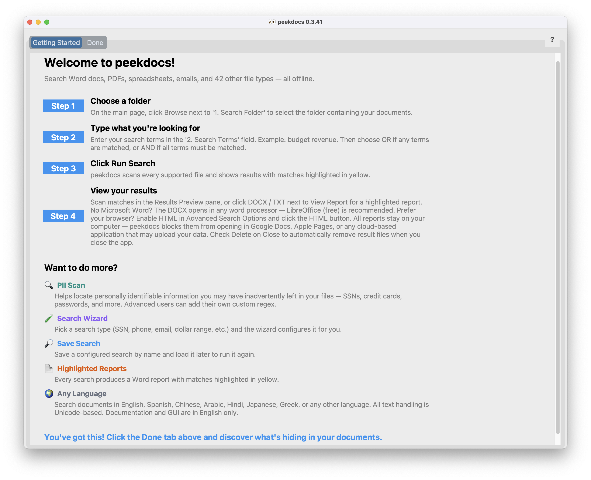
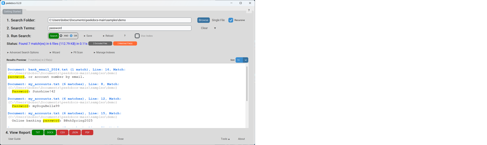
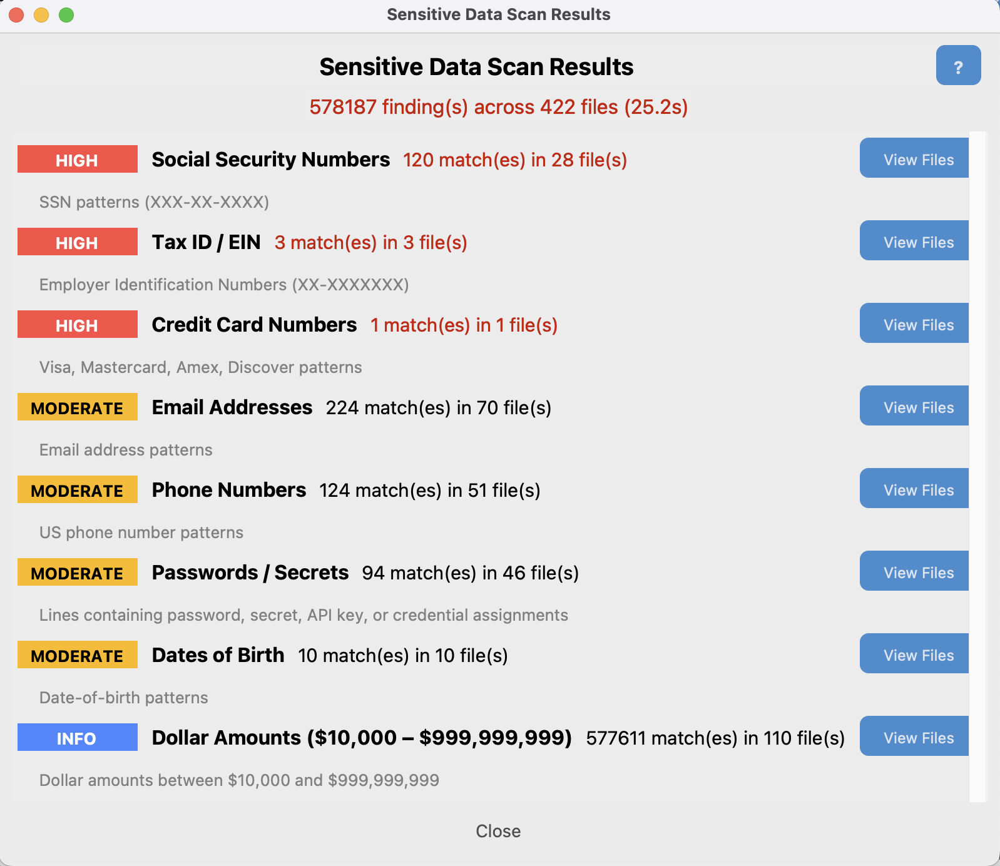

# peekdocs

**Free &nbsp;&nbsp;·&nbsp;&nbsp; Open-Source &nbsp;&nbsp;·&nbsp;&nbsp; No Cloud &nbsp;&nbsp;·&nbsp;&nbsp; Tested on 1,000,000 files**

[](https://www.python.org/downloads/) &nbsp;&nbsp; [](LICENSE) &nbsp;&nbsp; [](docs/USER_GUIDE.md)

<p align="center"><b><a href="#gui">Point-and-click GUI</a> &nbsp;&nbsp;•&nbsp;&nbsp; <a href="#terminal">Terminal CLI</a> &nbsp;&nbsp;•&nbsp;&nbsp; <a href="#python-api">Python API</a></b></p>

> peekdocs **document search app** searches your Word docs, PDFs, source code, data sheets, spreadsheets, emails and archives — 86 file types, all searched at once, all offline. Yellow-highlighted results with surrounding context, sensitive-data (PII) scanning, text-from-images (OCR) for scanned documents, and search modes from simple keywords to advanced patterns (regex).
>
> Runs entirely on your computer — your files are never uploaded, altered, or deleted. (peekdocs creates its own local report and index files, which you can delete at any time.) Free. No fees, no subscriptions.

**Contents:** [Who Is It For?](#who-is-it-for) · [Features](#features) · [Supported File Types](#supported-file-types) · [Installation](#installation) · [Quick Start](#quick-start) · [Documentation](#documentation) · [Why peekdocs?](#why-peekdocs) · [Why Not Just Use AI?](#why-not-just-use-ai) · [Why Not Just Use Grep?](#why-not-just-use-grep) · [Performance](#performance) · [Platform Notes](#platform-notes) · [Author](#author) · [License](#license)

## Who Is It For?

**Computer users** — anyone with large collections of files they need to search through:

- **Home users** — almost everyone has tax returns, medical records, insurance policies, journals or diaries they need to retrieve information from. Or a laptop they may sell that might still contain personal information. Once installed, type your keyword(s), click Run Search, done. No configuration, no manual. Or click **PII Scan** to check your files for Social Security numbers, credit cards, and other sensitive data that shouldn't be there — one click, no setup
- **Programmers** — VS Code is an excellent editor, but peekdocs searches the files it doesn't natively search: legacy specs and requirements in Word/PDF, email archives from past projects, vendor documentation and SDK guides in PDF, archived releases inside .zip/.7z files, scanned whiteboard photos (OCR), old project logs and meeting notes, and API keys accidentally saved in documents (PII Scan). A developer who needs to find "what did the client say about the authentication requirement in 2019" can't do that in VS Code if the answer is in a .docx email attachment inside a .zip archive. peekdocs can. Tip: use Lines Before/After in Advanced Search Options to capture surrounding code context — not just the matching line, but the function or block it belongs to. Supported source code formats: .py, .c, .cpp, .h, .hpp, .html, .java, .js, .ts, .go, .rs, .rb, .sh, .bat, .ps1, .r, .swift, .kt, .cs, .vb, .f90, .f, .asm, .s, .pl, .tcl, .makefile
- **Engineers** — search hundreds of datasheets, design reviews, test reports, and failure analyses for a specific component value, part number, or tolerance. Find which documents reference a standard (MIL-STD-810, IEC 61508, ISO 9001). Search old design reviews and trade studies to find why a decision was made years ago. Locate error codes and symptoms across equipment manuals and maintenance logs. Find calibration records, inspection reports, and certification dates. Search change orders and ECNs for a specific part number. Find every document that references a vendor, supplier, or material. Search old test data reports for baseline measurements. OCR reads scanned engineering drawings and handwritten notes. Engineers accumulate PDFs like nobody else — datasheets, standards, specs, reports, manuals — and most are in formats that grep (a popular command-line text search tool, limited to plain text files) and VS Code can't read. The highlighted Word report can be attached to a design review or emailed directly. Supported engineering formats: .m (MATLAB), .v .vhd .vhdl .sv (Verilog/VHDL/SystemVerilog), .cir .sp .spice (SPICE netlists), .dxf (AutoCAD interchange), .vsdx (Visio diagrams)
- **Power users** — regex, Boolean expressions, range queries, fuzzy matching, wildcards, proximity search, OCR, a terminal CLI, and a Python API. All search modes work from both the GUI and the command line. The PII Scan and Search Wizard are GUI-only features
- **Small businesses** — find information across contracts, invoices, reports, and correspondence. Save searches by name and reload them later. Search across vendor contracts for specific terms, pricing, or expiration dates. Locate transactions and policy references before an audit. (peekdocs is a search tool, not compliance or auditing software — it helps you find what's in your files, not certify regulatory status)
- **Researchers** — search across hundreds of downloaded journal articles (PDF), interview transcripts, survey responses, field notes, and datasets for a specific term, author, citation, or data point. Find a methodology reference buried in last year's literature review. Search grant proposals and progress reports for specific aims or deliverables. OCR reads scanned source materials and historical documents. The highlighted Word report serves as an annotated bibliography or evidence trail
- **Students and writers** — search across course notes, research papers, interview transcripts, and assignments in any format
- **Teachers** — search years of lesson plans for a specific topic or standard. Find old tests, quizzes, and worksheets that covered a particular concept — across Word docs, PDFs, and scanned handouts (OCR). Search parent correspondence for a specific student or issue. Find what you wrote on report cards last year. PII Scan is critical for IEP documents and student accommodation records, which contain highly sensitive data
- **Librarians** — search donated document collections and digital archives without opening files one by one. Find specific titles, authors, or ISBNs across acquisition lists, catalog records, and spreadsheets. Search grant applications, board meeting minutes, and policy documents across years. PII Scan on patron records before archiving or sharing
- **Tax season** — search years of tax returns, W-2s, 1099s, and receipts for a specific deduction, amount, or account number. Find what you need in seconds instead of opening files one by one
- **Medical records** — find old lab results, prescriptions, doctor names, and diagnoses across years of PDFs from patient portals
- **Estate and family documents** — handling a relative's files? Search for wills, insurance policies, account numbers, passwords, and important records across an entire folder of unfamiliar documents
- **Home renovation and vehicles** — find contractor invoices, permits, appliance model numbers, warranty dates, VIN numbers, and maintenance records buried in old documents
- **Warranties and receipts** — "when did I buy the dishwasher?" Search years of email receipts and scanned warranties to find purchase dates, model numbers, and return policies
- **Genealogy** — search scanned family documents, old letters (OCR), immigration records, and historical PDFs for names, dates, and places
- **Selling or donating a computer** — run the PII Scan before handing off a device to make sure no Social Security numbers, credit cards, or passwords are left behind
- **Customer disputes** — find the original email, invoice, or agreement with a specific customer across years of correspondence
- **Employee onboarding** — new hires searching policy manuals, benefit documents, and training materials for specific topics
- **Email archives** — search exported email files (.eml, .msg, .pst, .mbox) for old correspondence, attachments, and contacts. Most general-purpose search tools can't read email formats — peekdocs can

**What makes peekdocs different:**

- **[86 file types at once](#supported-file-types)** — Word, PDF, Excel, PowerPoint, email (.eml, .msg, .pst), archives (.zip, .7z, .rar), source code, engineering files, e-books, calendars, contacts, and more. All searched simultaneously in a single pass.
- **Highlighted results** — matches are highlighted two ways. The **Results Preview** pane shows matches instantly inside the app for quick scanning — right-click to copy, double-click a filename to open it. The `.docx` **Word report** is a standalone document with every match highlighted in yellow, organized by file with surrounding context, search metadata, and match counts — a polished report you can save, print, email, or share with anyone. Both show the same matches; the preview is for quick review, the report is for keeping or sharing. (A `.txt` plain-text report is also generated automatically, and CSV, JSON, PDF, and HTML output are available optionally.) Don't have Microsoft Word? When clicked, the `.docx` report opens automatically in any word processor — [LibreOffice](https://www.libreoffice.org/download/download-libreoffice/) (free), Google Docs, Apple Pages, or others.
- **One-click PII Scan** (Personally Identifiable Information) — worried about sensitive data inadvertently left in your files? One click finds Social Security numbers, credit cards, passwords (including pw, p/w, login, username, user ID, UID, passcode, PIN), tax IDs, emails, phone numbers, dates of birth, and user-configurable dollar-amount ranges — before someone else does. Results categorized by severity (high/moderate/info). Add your own custom regex patterns for specialized detection.
- **11 search modes** — plain keywords, AND/OR, Boolean expressions (`(budget OR revenue) AND NOT draft`), regex, wildcards, fuzzy matching (typo-tolerant), whole-word, word proximity (terms within N words on the same line), line proximity (terms within N lines of each other), inverse search (find files that DON'T contain a term), and range queries (filter by dollar amounts, dates, percentages, ages, file sizes).
- **Three interfaces** — point-and-click GUI (`peekdocs-gui`), terminal CLI (`peekdocs`), and Python API (`from peekdocs import search`). All search modes work from all three interfaces (PII Scan and Search Wizard are GUI-only). Use the GUI for daily work, the CLI for scripting, the API for integration.
- **Scanned documents** — OCR reads text from scanned PDFs and images (.jpg, .png, .tiff, .bmp) that many search tools skip. Requires Tesseract.
- **Search inside archives** — searches inside .zip, .7z, and .rar files without extracting them first. Find a document buried in a compressed backup without unzipping anything.
- **Multi-folder search** — search across multiple top-level folders at once using the +Folder button, with optional recursive searching into subfolders. Results are combined from all folders. With recursive mode, you can even search your entire computer from a single search — point it at your root folder and peekdocs will search every supported file on the drive (system files that can't be read are logged and skipped).
- **Search Wizard** — configures complex searches for you with pre-built patterns for 7 professions (Business, Legal, Medical, Engineering, HR, Real Estate, Compliance). No regex or technical knowledge needed.
- **Save and reload searches** — save a configured search by name and reload it later with one click. Each folder has its own collection of saved searches.
- **Search index** — optional SQLite FTS5 index for faster repeated searches. Build once, search in milliseconds. Auto-refresh keeps the index current when files change.
- **Built-in file analysis tools** — the Tools menu includes File Inventory (summary by type/size/date), Duplicate Finder (identical files by content hash), Large Files, Empty Files, Recent Changes, Protected Files (password-encrypted detection), Search History (automatic log of past searches), and Bookmarks (pin files for quick access).
- **Offline and private** — your documents never leave your computer. peekdocs never uploads, transmits, alters, moves, or deletes your files. No cloud, no accounts, no subscriptions, no internet connection required.
- **Cross-platform** — Windows, macOS, and Linux. Tested on all three.
- **Performance** — tested on 1,000,000 files. 1,000 mixed-format documents searched in ~1 second. See [Performance](#performance) for detailed benchmarks.
- **Hover tips everywhere** — not sure what a button or field does? Hover your mouse over it and a helpful tooltip explains what it does and how to use it. No need to open the manual. Toggle on/off from the Tools menu. Saved automatically.
- **Adjustable text size** — five sizes from Small to Huge, accessible from the Tools menu. All text, labels, and buttons scale together. Helpful for users with low vision or high-DPI displays. Saved automatically.
- **Dark mode** — switch between Dark, Light, or System (follows your OS setting) from the Tools menu. Saved automatically. Note: on Windows, popup windows may briefly flash white before the dark theme is applied — this is a normal Windows/tkinter limitation, not a bug. If the flashing is distracting, switch to Appearance: Light in the Tools menu.

**How it works:**

1. Point it at a folder on your computer
2. Type what you're looking for
3. Click Run Search
4. View results in the Results Preview window, or optionally open the highlighted `.docx` report

That's it. No server, no configuration, no account. Typical searches complete in 1–5 seconds for personal document collections. An optional search index makes repeated searches even faster.

### See it in action

*Click any image to enlarge, or visit [robertdschoening.com/peekdocs](https://robertdschoening.com/peekdocs) for full-size screenshots and a video walkthrough.*

**Getting Started tab — friendly introduction for first-time users:**



**Search for "password" — results highlighted instantly:**



**PII Scan — one click finds sensitive data hiding in your files:**




**Highlighted Word report — every match in yellow, with context:**


**Simple for everyone, powerful when you need it.** Most users never leave the search bar and PII Scan button. Power users can go deeper with regex, Boolean logic, range queries, fuzzy matching, wildcards, proximity search, a command-line interface, and a Python API.

Works in any language. Runs on Windows, macOS, and Linux. No fees, no subscriptions, no cloud. Everything stays on your computer. Nothing is uploaded anywhere. Your files are never altered or deleted. Free and open-source.

**[See peekdocs in action →](https://robertdschoening.com/peekdocs)**

## Features

- **PII Scan** — **Do you know what's hiding in your documents?** One click finds Social Security numbers, credit cards, passwords (including pw, p/w, login, username, user ID, UID), tax IDs, emails, phone numbers, dates of birth, and user-configurable dollar-amount ranges — with a highlighted report showing exactly where. Results are categorized by severity (high/moderate/info) with per-file details. **Custom patterns:** advanced users can add their own regex (e.g., UK NINO, Canadian SIN, German Steuer-ID, company account IDs) to extend the scan beyond the built-in categories
- **Offline and private** — your documents never leave your computer. peekdocs never uploads, transmits, alters, moves, or deletes your files. No cloud, no accounts, no subscriptions. Everything runs locally and stays local
- **86 file types** — Word, PDF, Excel, PowerPoint, emails (.eml, .msg, .pst, .mbox), archives (.zip, .7z, .rar), source code (Python, C/C++, Java, Go, Rust, and more), engineering files (MATLAB, Verilog, VHDL, SPICE, DXF, Visio), Apple Pages/Numbers/Keynote, calendars (.ics), contacts (.vcf), e-books, HTML, and more
- **Highlighted reports** — results saved to `.docx` and `.pdf` with yellow-highlighted matches, `.txt` with full context, and optional CSV and JSON output
- **Results preview** — see matches inline in the GUI with highlighted terms; right-click to copy, double-click a filename to open it. Matched files popup shows line numbers and includes a "View Text" option that displays the file's extracted content with line numbers and highlighted matches
- **Recent searches** — dropdown next to the search bar remembers your last 10 searches
- **Save Search / Load Search** — save a configured search by name and reload it later with one click
- **Search Wizard** — guided search builder with 20+ pre-built patterns (SSN, phone, email, dollar range, and more) — no flags or regex knowledge needed
- **Inverse search** — find files that are *missing* required content
- **Search modes** — plain keywords, AND/OR, Boolean expressions, regex, wildcards, fuzzy matching, whole-word, word proximity, line proximity
- **Range queries** — filter by dollar amounts, dates, percentages, ages, file sizes
- **OCR** — search scanned PDFs and images (requires Tesseract)
- **Works in any language** — peekdocs searches documents written in English, Spanish, French, German, Chinese, Japanese, Korean, Arabic, Hindi, Russian, Greek, and every other language. All text handling is Unicode-based. Type your search terms in any language and peekdocs finds them. **Note:** peekdocs performs exact text matching — it finds the character sequence you type, which works well for all languages including CJK (Chinese, Japanese, Korean). It does not perform language-specific processing such as word segmentation, stemming, or stop-word removal. Documentation and the GUI are in English only. In fairness, any search tool that uses Unicode can do the same thing — this is not unique to peekdocs
- **Multi-folder search** — search across multiple folders at once, with optional recursive searching into subfolders. Click **+Folder** to add folders, or type semicolon-separated paths. Results are combined from all folders
- **HTML export** — in addition to TXT, DOCX, CSV, JSON, and PDF, results can be exported as a styled HTML page with highlighted matches — easy to share via email or open in any browser
- **Three interfaces** — terminal CLI, point-and-click GUI (`peekdocs-gui`), Python API
- **Cross-platform** — Windows, macOS, Linux
- **Search index** — optional SQLite FTS5 index for faster repeated searches
- **Read-only** — peekdocs never modifies, moves, or deletes your files. It does create its own output files (reports, indexes, settings) and can delete those when you ask (e.g., Clear Results, Delete Index)
- **Safe defaults** — files over 100 MB are automatically skipped to prevent slow searches and memory issues. Very large files (huge PDFs, massive spreadsheets, database exports) can take minutes to parse and may exhaust available memory. Skipped files are logged to `peekdocs_errors.log` so you know what was missed. To change the limit, set **Max File Size (MB)** in Advanced Search Options — or set it to 0 for no limit. Changing the limit automatically rebuilds the index on the next search. ZIP archives that would expand to over 500 MB are also skipped to prevent archive bombs
- **Excluded Files view** — after each search, click the **View N excluded file(s)** button to see exactly which files were skipped and why (unsupported type, prior output, oversized, hidden, etc.) — no more guessing why a `find` count differs from peekdocs's file count
- **Tools menu** — built-in utilities beyond search:
  - **File Inventory** — instant summary of every file in a folder: total count, size breakdown by type, oldest and newest files
  - **Duplicate Finder** — finds identical files by content (not just name), shows how much space is wasted by extra copies
  - **Large Files** — shows the 50 biggest files so you can reclaim disk space
  - **Empty Files** — finds zero-byte files: failed downloads, placeholders, junk
  - **Recent Changes** — which files were modified in the last 7, 30, or 90 days
  - **Protected Files** — detects password-protected PDFs, Word/Excel/PowerPoint, ZIP/7z/RAR archives that peekdocs can't search
  - **Search History** — automatic diary of every search you run: date, terms, match count, file count, elapsed time
  - **Bookmarks** — pin files from search results for quick access later

### Supported File Types

| Category | Formats |
|----------|---------|
| **Documents** | .doc .docx .epub .html .key .md .odp .odt .pages .pdf .ppt .pptx .rst .rtf .tex |
| **Spreadsheets** | .csv .numbers .ods .tsv .xls .xlsx |
| **Email** | .eml .mbox .msg .pst |
| **Archives** | .7z .bz2 .gz .rar .tar .tgz .zip |
| **Calendar/Contacts** | .ics .vcf |
| **Source Code** | .asm .bat .c .cpp .cs .f .f90 .go .h .hpp .java .js .kt .pl .ps1 .py .r .rb .rs .s .sh .swift .tcl .ts .vb |
| **Engineering** | .cir .dxf .m .sp .spice .sv .v .vhd .vhdl .vsdx |
| **Data/Config** | .cfg .ini .json .log .makefile .sql .toml .txt .xml .yaml .yml |
| **Images (OCR)** | .bmp .jpg .jpeg .png .tif .tiff (requires `-O` flag) |

**Note:** Apple Numbers (.numbers) and Keynote (.key) files created with recent versions of iWork use a protobuf-based internal format. peekdocs extracts whatever readable text exists inside these files, which may be partial. Older iWork files extract fully. Apple Pages (.pages) is fully supported.

## Installation

### Prerequisites

- **Python 3.10+** — check if it's already installed: `python3 --version` (macOS/Linux) or `python --version` (Windows). If not installed, download from [python.org/downloads](https://www.python.org/downloads/). **Note:** Python version numbers are not decimals — 3.13 is newer than 3.9 (it's the 13th release, not "three point one three").
  - **macOS users:** Your Mac may come with an older Python (3.9.x) pre-installed. If `python3 --version` shows 3.9.x, you need a newer version. Install from [python.org/downloads](https://www.python.org/downloads/) or via Homebrew (`brew install python`). After installing, the plain `python3` command may still point to the old 3.9 — use `python3.13` (or whichever version you installed) instead. You also need tkinter for the GUI: `brew install python-tk@3.13` (replace 3.13 with your version if different).
  - **Windows users:** Windows does not come with Python pre-installed, but you may have installed it previously. Open a Command Prompt and type `python --version`. If you see a version number (e.g., `Python 3.12.4`), Python is already installed and in your PATH — you're good to go. If you see "not recognized" or the Microsoft Store opens, Python is either not installed or not in your PATH. Download it from [python.org/downloads](https://www.python.org/downloads/) and make sure to check **"Add Python to PATH"** at the bottom of the first installer screen. This ensures that `pip`, `python`, and `peekdocs` commands work from any Command Prompt window. If you've already installed Python without this option, the easiest fix is to re-run the Python installer and check the box.
  - **Linux users (Ubuntu, Debian, Linux Mint, Pop!_OS):** The base `python3` package does not include `venv`, `pip`, or `tkinter`. You must install them before creating a virtual environment. Run this single command to get everything peekdocs needs:
    ```bash
    sudo apt install python3-venv python3-pip python3-tk
    ```
    Without `python3-venv` and `python3-pip`, `python3 -m venv venv` will fail with an `ensurepip` error. Without `python3-tk`, the CLI works but the GUI (`peekdocs-gui`) will not launch. This is a one-time setup.
- **pip** (Python's package installer) — included automatically when you install Python 3.10+. No separate installation needed. **pipx** is a separate tool that must be installed via pip (see Option A below).
- **Tkinter** (required for GUI) — no action needed on Windows (the Python installer includes it). On macOS with Homebrew Python, install it: `brew install python-tk@3.13` (replace 3.13 with your version). On Linux: `sudo apt install python3-tk` (already included in the Linux command above). If you installed Python from [python.org](https://www.python.org/downloads/) on macOS, tkinter is already included.
- **Tesseract** (optional, for OCR) — OCR (Optical Character Recognition) reads text from scanned PDFs and images (PNG, JPG, TIFF, BMP, GIF). Most users don't need this — it's only for documents that are pictures of text rather than actual text. If you do need it: macOS: `brew install tesseract` | Windows: [download](https://github.com/UB-Mannheim/tesseract/wiki) | Linux: `sudo apt install tesseract-ocr`

### Option A: Quick Install with pipx (recommended)

First, check if pipx is installed by typing `pipx --version`. If it says "not recognized" or "command not found," install it:

```bash
pip install pipx          # Windows
brew install pipx         # macOS (pip won't work — gives "externally-managed-environment" error)
pipx ensurepath           # adds pipx to your PATH (all platforms)
```

**Close and reopen your terminal** (Command Prompt on Windows) after running `ensurepath` (it only takes effect in a new window). Then install peekdocs:

1. Go to [github.com/exbuf/peekdocs](https://github.com/exbuf/peekdocs)
2. Click the green **Code** button → **Download ZIP**
3. Open any terminal or Command Prompt window — it doesn't matter what folder you're in. Run:

   ```
   pipx install C:\Users\YourName\Downloads\peekdocs-main.zip              # Windows (replace YourName)
   pipx install --python python3.13 ~/Downloads/peekdocs-main              # macOS
   pipx install ~/Downloads/peekdocs-main                                  # Linux
   ```

   **macOS notes:** (1) The `--python python3.13` flag tells pipx to use your newer Python instead of the old system Python 3.9. Replace `3.13` with whichever version you installed. (2) Safari auto-extracts ZIP files, so you'll have a `peekdocs-main` folder (not a `.zip` file) in Downloads.

**Have git?** You can skip the download and install directly: `pipx install git+https://github.com/exbuf/peekdocs.git` (on macOS, add `--python python3.13`)

After installation, `peekdocs` and `peekdocs-gui` (on Windows: `peekdocs.exe` and `peekdocs-gui.exe`) work from any terminal or Command Prompt, any folder, every time — even after restarting your computer. It's a one-time install, not something you run daily. This is the easiest way to install. To search your documents, either navigate your terminal to your documents folder first, or pass the folder path with the `-d` flag (e.g., `peekdocs budget -d C:\Users\YourName\Documents`).

**Fully isolated.** pipx installs peekdocs in its own private virtual environment (venv), completely separate from your system Python and all other programs. Unlike Options B and C below, you won't see `(venv)` in your terminal prompt — pipx manages the environment automatically so you never have to think about it. It will not install, upgrade, downgrade, or conflict with anything else on your computer. The only change to your system is two new commands (`peekdocs` and `peekdocs-gui`). To uninstall completely: `pipx uninstall peekdocs`. To upgrade to a newer version, uninstall the old one first (`pipx uninstall peekdocs`), then install the new ZIP — your settings and saved searches are not affected. See the [User Guide](docs/USER_GUIDE.md#will-peekdocs-affect-my-existing-python-installation) for details.

### Option B: Manual Install (with git)

```bash
git clone https://github.com/exbuf/peekdocs.git
cd peekdocs
python3 -m venv venv
source venv/bin/activate        # Windows: venv\Scripts\activate
pip install --upgrade pip setuptools wheel   # required on some Linux distros — see note below
pip install -e .
```

**Important:** With a manual install, you must activate the virtual environment (`source venv/bin/activate`) every time you open a new terminal. When activated, you'll see `(venv)` at the beginning of your terminal prompt — this means peekdocs commands will work. If you see "command not found" when typing `peekdocs`, you forgot to activate — look for the missing `(venv)` prefix. See the [User Guide](docs/USER_GUIDE.md#which-installation-method-did-you-use) for details and how to switch to pipx.

**"setup.py not found" error on Linux?** Some Linux distributions ship older versions of pip and setuptools that don't support `pyproject.toml`-based builds (which peekdocs uses). The fix is `pip install --upgrade pip setuptools wheel` inside the virtual environment before running `pip install -e .` — this is already included in the commands above. Make sure the `(venv)` prefix is showing in your terminal prompt before running these commands.

### Option C: Manual Install (no git, no sign-up)

No git? No problem. Download peekdocs as a ZIP file directly from your browser:

1. Go to [github.com/exbuf/peekdocs](https://github.com/exbuf/peekdocs)
2. Click the green **Code** button
3. Click **Download ZIP**
4. Extract the ZIP file, copy the extracted `peekdocs-main` folder and paste it to where you want it
5. Open a terminal and navigate to the extracted folder:

   **Windows:**
   ```cmd
   cd C:\Users\YourName\Downloads\peekdocs-main
   python -m venv venv
   venv\Scripts\activate
   pip install -e .
   ```

   **macOS/Linux:**
   ```bash
   cd ~/Downloads/peekdocs-main
   python3 -m venv venv
   source venv/bin/activate
   pip install --upgrade pip setuptools wheel
   pip install -e .
   ```

**Important:** Same as Option B — you must activate the virtual environment each time you open a new terminal. Look for `(venv)` at the start of your prompt to confirm it's active. See the [User Guide](docs/USER_GUIDE.md#which-installation-method-did-you-use) for details.

### Upgrading

Your saved searches, settings, indexes, and reports are stored outside the peekdocs installation — in your home directory and your document folders. Upgrading replaces only the code. Nothing else is touched.

- **pipx (installed from ZIP):** `pipx uninstall peekdocs`, download the new ZIP, then `pipx install` it again (same steps as the original install)
- **pipx (installed with git):** `pipx upgrade peekdocs`
- **git (Option B):** `cd peekdocs && git pull && pip install -e .`
- **ZIP (Option C):** download the new ZIP, replace the folder, activate the venv, run `pip install -e .`

See the [User Guide](docs/USER_GUIDE.md#will-peekdocs-affect-my-existing-python-installation) for full details on what is and isn't preserved.

## Quick Start

### Terminal

If you installed with pipx (Option A), peekdocs is always ready — just open any terminal. If you used the manual install (Option B), navigate to the folder where `pyproject.toml` is located (the peekdocs project folder) and activate the virtual environment first:

```bash
cd /path/to/peekdocs                 # the folder containing pyproject.toml
source venv/bin/activate             # macOS/Linux (you'll see (venv) in your prompt)
venv\Scripts\activate                # Windows
```

Then navigate to your documents and search:

```bash
cd /path/to/your/documents
peekdocs budget                      # search for "budget"
peekdocs budget revenue              # OR search (any term)
peekdocs -a budget revenue           # AND search (both terms)
peekdocs -r budget                   # include subfolders
peekdocs -t pdf,docx budget          # only PDFs and Word docs
peekdocs -x "\d{3}-\d{2}-\d{4}"     # regex (SSN pattern)
peekdocs -e "(budget OR revenue) AND NOT draft"   # Boolean expression
peekdocs -R amount:1000..5000 budget # range query
peekdocs -R date:2024-01-01..2024-12-31 invoice  # date range (also accepts 01/01/2024 format)
peekdocs -P 3 budget acme            # line proximity (terms within 3 lines)
peekdocs --open docx budget          # search and auto-open the .docx report
peekdocs --open txt budget           # auto-open the .txt report instead
```

If you used the manual install, you'll see `(venv)` before each command in your terminal — that's normal and means the virtual environment is active.

Results are saved to `peekdocs_results.txt` and `peekdocs_results.docx` (highlighted) in the current directory — the same folder your terminal is in when you run the search. Subsequent searches overwrite these files. To keep previous results, use `-s my_report` to save a named copy (saved as `DO_NOT_SEARCH_my_report.txt/.docx` so peekdocs never searches its own reports), or `--timestamp` to add a date/time stamp to each filename so nothing is ever overwritten. When clicked, the .docx report opens automatically in whatever word processor you have — Microsoft Word, [LibreOffice](https://www.libreoffice.org/download/download-libreoffice/) (free), Google Docs, or Apple Pages. The .txt report works on any computer with no extra software.

To clean up output files: `peekdocs --clear` (deletes results files) or `peekdocs --clear-all` (deletes results, saved reports, error log, and index). Neither touches your saved searches or settings.

Run `peekdocs -h` for the full flag reference with examples. The complete flag list with detailed descriptions is in the [User Guide](docs/USER_GUIDE.md#flag-use-summary). All flags can be combined freely except: regex (`-x`), fuzzy (`-z`), and wildcard (`-w`) are mutually exclusive (pick one); and expression mode (`-e`) cannot be combined with AND (`-a`), exclude (`-n`), or proximity (`-p`) since those are built into the expression syntax.

### GUI

```bash
peekdocs-gui
```

1. Click **Browse** to select a folder (or **File** to search a single file)
2. Type your search terms
3. Click **Run Search**
4. View results in the preview pane or click **DOCX** to open the highlighted report

Open **Advanced Search Options** for regex, fuzzy, Boolean, range queries, and all other settings. Use the **Search Wizard** for guided search configuration with 20+ pre-built patterns. Click **PII Scan** to find sensitive data with one click.

**If buttons overlap or text looks too large**, use the **Text Size** dropdown on the bottom-right toolbar to adjust (Normal is recommended).

### Python API

```python
from peekdocs import search

result = search(["budget", "revenue"], directory="/path/to/docs")

print(f"Found {len(result.matches)} matches in {len(result.files_searched)} files")
for match in result.matches:
    print(f"  {match.filename}:{match.line_num}: {match.text}")
```

See the [API Reference](docs/API.md) for all parameters and options.

## Documentation

| Document | Description |
|----------|-------------|
| [User Guide](docs/USER_GUIDE.md) | Complete reference — GUI, CLI flags, search modes, indexing, file reference |
| [API Reference](docs/API.md) | Python library API — `search()` function, parameters, return values |
| [FAQ & Troubleshooting](docs/TROUBLESHOOTING.md) | Common questions and solutions for Windows, macOS, and Linux |
| [Changelog](CHANGELOG.md) | Version history and release notes |
| [Contributing](CONTRIBUTING.md) | How to report bugs, suggest features, and submit code |

## Why peekdocs?

Every search tool — from Google to Spotlight to $2,500 enterprise software — does the same thing at its core: match a pattern against text. Any modern tool can search in any spoken language, because they all use Unicode. The difference is never the matching. It's what happens around it: what files can it read, how does it present the results, how easy is it to use, and what can you do with the output.

peekdocs reads 86 file formats that most tools can't touch — Word, PDF, Excel, email archives, .7z, .rar, scanned images. It produces a highlighted Word report with every match in context — not a list of filenames in a terminal, but a real document you can save, print, or hand to someone. It finds sensitive data with one click. And it does all of this in a GUI that a non-technical person can use without reading a manual.

If all you need is to find a word in a document, any search tool works. If you want to *see inside your own files* — what's there, what's sensitive, and what you might have forgotten about — that's what peekdocs was built for.

## Why Not Just Use AI?

AI document tools (ChatGPT, Copilot, NotebookLM) require uploading your files to a cloud server. A corporation sees your tax returns, medical records, and passwords. Your data may be used for training. A breach exposes everything you uploaded. And you pay $20+/month for the privilege.

For finding specific content in your documents — keywords, patterns, SSNs, credit cards, phone numbers, account numbers — peekdocs does what AI does, without uploading anything. Your files stay on your computer. No account, no internet connection, no subscription, no third party.

**There's also a practical problem:** AI tools have upload limits and format restrictions. You can't upload 500 tax PDFs, 2,000 emails, and 10 years of contracts to ChatGPT — and even if you could, most AI tools can't read .msg, .pst, .7z, .rar, .odt, .xls, .doc, or scanned images. By the time you've uploaded your first few files to an AI tool, peekdocs would already be done searching hundreds. It reads 86 file types at once, on your machine, with no file count or size limit.

What AI adds beyond search — summarization, question answering, semantic understanding — requires giving up your privacy. Most people searching for "where's my insurance policy number" or "do any of my files contain passwords" don't need that. They need to find something. peekdocs finds it.

## Why Not Just Use Grep?

**Credit where it's due:** grep is an excellent tool. For plain text files, it's fast, reliable, and battle-tested for decades. With piping, a skilled developer can extend it to binary formats: `pdftotext file.pdf - | grep term` works for PDFs, `unzip -p file.docx word/document.xml | grep term` works (roughly) for Word, `xlsx2csv file.xlsx | grep term` for Excel, and `tesseract image.png stdout | grep term` for OCR. grep also has built-in regex (`-E`/`-P`), recursive search (`-r`), inverse matching (`-rL`), context lines (`-B`/`-A`), and whole-word matching (`-w`). A determined developer could write a bash script that loops over files, detects types, pipes each through the right converter, and greps the output.

**Where peekdocs goes beyond what grep can practically do:**

- **Highlighted Word report** — grep outputs plain text to a terminal. peekdocs produces a `.docx` with yellow-highlighted matches, organized by file with surrounding context — a document you can save, print, or hand to someone. No amount of grep piping produces this. (Microsoft Word is not required — when clicked, the report opens automatically in any word processor: [LibreOffice](https://www.libreoffice.org/download/download-libreoffice/) (free), Google Docs, Apple Pages, or others.)
- **PII scanning with categorized severity** — not just regex matching, but categorized findings (high/moderate/info), false-positive filtering (URLs, DOIs, environment variables), custom patterns, and a formatted report. You could run 10 separate `grep -P` calls for SSN/credit card/phone patterns, but the categorization, filtering, and reporting are not practically replicable.
- **Boolean expressions, proximity, fuzzy matching, range queries** — `(budget OR revenue) AND NOT draft`, "find A within 5 words of B", typo-tolerant matching, and `amount:1000..5000` are not expressible in grep.
- **86 file types in one command** — the bash script to handle all 86 types with appropriate converters would be hundreds of lines, fragile, and require installing and maintaining 10+ external tools. peekdocs: `pip install peekdocs` and you're done.
- **GUI** — for anyone who doesn't live in a terminal.
- **Search index with auto-refresh** — grep has no index. You'd need a separate tool (recoll, xapian) — at which point you're not using grep anymore.
- **Cross-platform consistency** — a grep pipeline that works on Linux may break on macOS (different grep versions, missing converters, different tool flags). peekdocs works identically on all three platforms.
- **Save/reload searches, bookmarks, search history, file analysis tools** — application features that don't exist in grep's world.

**The honest summary:** For plain-text search in a terminal, grep is faster and simpler — use it. For searching across mixed-format documents (PDFs, Word, Excel, email archives), producing shareable highlighted reports, scanning for sensitive data, or giving a non-terminal user a search tool they can actually use, peekdocs does what would take hundreds of lines of custom scripting to approximate — and does it in one command.

## Performance

**How fast is peekdocs?** Executive summary using Benchmark 2 (below) mixed-format results (PDFs, Word docs, Excel spreadsheets, emails, PowerPoint, and text files — the kind of documents a home user or small business actually has):

| Your folder has... | Total size | Search time* |
|---------------------|-----------|------------|
| **1,000 files** | 13 MB | **~1 second** |
| **10,000 files** | 133 MB | **~5 seconds** |
| **50,000 files** | 663 MB | **~22 seconds** |
| **105 real Word docs** | 1,878 MB | **~4 seconds** (0.24 seconds with index) |

*\* Your results will vary depending on your machine's CPU speed, number of cores, RAM, and disk type (SSD vs hard drive).* These are direct search times (peekdocs opens and reads each file on the fly, no pre-built index needed) on a modern machine with SSD. Notice that 10× more files doesn't mean 10× longer — peekdocs processes files in parallel across multiple CPU cores, so search time scales much less than linearly. peekdocs was also stress-tested on 1,000,000 plain-text files — it completed without crashing, without running out of memory, and with correct results.

For most users, searches are fast enough that you just click Run Search and results appear. Full test details, index comparisons, and cold-cache analysis below.

---

**Detailed test results:**

We conducted two benchmarks: Benchmark 1 used plain-text file types (.txt) to stress-test peekdocs at extreme scale (up to 1,000,000 files). Benchmark 2 used a realistic mix of file types (.pdf, .docx, .xlsx, .pptx, .eml, .txt, .html, .rtf) to measure real-world performance.

All tests on MacBook Pro, Apple M-series, 14 cores (peekdocs used 7 — its default is half; adjustable in Advanced Search Options), 24 GB RAM, SSD, Python 3.13.

**Benchmark 1: Plain-text files** — 10K / 50K / 1M single-line .txt files (~113 bytes each), keyword present in every file (worst case):

| Files | Direct Search (warm cache) | Direct Search (cold cache) | With index | Index build | Index size |
|------:|--------------------:|--------------------:|-----------:|------------:|-----------:|
| 10,000 | 1.4 seconds | ~1.4 seconds† | 4.0 seconds | 1.0 seconds | 3 MB |
| 50,000 | 4.1 seconds | 87.5 seconds | 9.1 seconds | 5.3 seconds | 17 MB |
| 1,000,000 | 90 seconds | ~90 seconds† | 240 seconds | 110 seconds | 311 MB |

*† Cold-cache times for 10K and 1M were nearly identical to warm cache. On a machine with 24 GB RAM, the OS has enough memory to keep these files cached even after attempting to flush. The 87.5-second cold-cache result at 50K was captured from a genuinely cold session earlier in testing. Cold cache makes the biggest difference on machines with less RAM or with spinning hard drives.*

At 1M files: no crashes, no memory issues, correct results. The index was slower (240s vs 90s) because processing a million FTS5 result rows is more expensive than reading a million tiny cached text files. File discovery (listing all filenames) took over 200 seconds alone — an OS limitation, not peekdocs.

**Cold cache vs warm cache:** Your OS keeps recently accessed files in RAM. A "warm cache" search is fast because the OS serves files from memory. A "cold cache" search — after rebooting or switching folders — must read from disk: 87.5 seconds vs 4.1 seconds for the same 50,000 files, a 21× difference. This affects every search tool (grep, Spotlight, Windows Search), not just peekdocs. In the plain-text test, an index eliminated this penalty — 9.1 seconds cold or warm. The same principle applies to mixed-format files, though we did not measure mixed-format cold cache directly.

**Should you build an index?** It depends on your files, not just how many you have. A folder of 1,000 small files (13 MB total) searches in about 1 second without an index — no need. But a folder of 105 large Word docs (1.9 GB total) dropped from 4.4 seconds to 0.24 seconds with an index — an 18× speedup. The key factor is **total data size and file format**, not file count. To try it: click Build Index in Manage Indexes or run `peekdocs --index`. If your files change, set Auto-Refresh to keep the index current automatically. Use the **Use Index** checkbox to switch between indexed and direct search anytime.

| Situation | Index helps? | Why |
|-----------|:-----------:|-----|
| Large files (PDFs, Word, Excel) | **Yes** | Skips expensive binary parsing — 18× faster in real-world test |
| First search after reboot (cold cache) | **Yes** | Loads one database file instead of thousands |
| Same folder searched repeatedly | **Yes** | Pre-pays parsing cost once |
| Small files, small folder | **No** | Direct search is already fast enough |
| One-time search you won't repeat | **No** | Build time won't be recouped |
| Files change frequently | **Maybe** | Auto-Refresh helps, but frequent rebuilds have a cost |

**Note on OCR:** If OCR is enabled for scanned images, add 1–3 seconds per image on the first search. The index stores OCR results so subsequent searches don't repeat it.

**Benchmark 2: Mixed-format files.** Same machine. File mix designed to represent a typical home or small business folder:

| File type | % | Count per 1,000 | Why | Typical size |
|-----------|--:|----------------:|-----|-------------|
| PDF | 35% | 350 | Bank statements, receipts, tax forms, manuals, scanned docs | 50–500 KB |
| Word (.docx) | 25% | 250 | Letters, resumes, reports, notes, contracts | 20–200 KB |
| Plain text (.txt, .csv, .log) | 15% | 150 | Notes, data exports, logs | 1–50 KB |
| Excel (.xlsx) | 10% | 100 | Budgets, lists, inventory, financial records | 15–100 KB |
| Email (.eml) | 8% | 80 | Exported correspondence | 5–30 KB |
| PowerPoint (.pptx) | 5% | 50 | Presentations, pitches | 50–300 KB |
| Other (.html, .rtf) | 2% | 20 | Saved web pages, legacy docs | 10–50 KB |

Each file contains realistic multi-paragraph content. Average ~13 KB per file. (The mixed-format benchmark stops at 50,000 files because generating 1 million binary files — 350,000 PDFs, 250,000 Word docs, etc. — would take hours. The 1,000,000-file test in the plain-text benchmark above confirms peekdocs handles that scale. To estimate 1M mixed-format files, multiply the 50K results by roughly 20–25×: direct search would take approximately 7–9 minutes. The multiplier is slightly higher than 20× because OS cache pressure and file discovery overhead increase at extreme scale.)

Broad search ("invoice" — matches in most files, warm cache):

| Files | Total size | Direct Search | Indexed Search | Index Build | Index Size |
|------:|-----------:|--------------:|---------------:|------------:|-----------:|
| 1,000 | 13 MB | 1.1 seconds | 3.8 seconds | 2.4 seconds | 4 MB |
| 10,000 | 133 MB | 4.6 seconds | 129 seconds | 24.6 seconds | 41 MB |
| 50,000 | 663 MB | 22 seconds | timed out (>10 min) | 152 seconds | 208 MB |

Selective search ("BENCHMARK_SEARCH_TARGET" — matches in ~5 files per 1,000, warm cache):

| Files | Direct Search | Indexed Search |
|------:|--------------:|---------------:|
| 1,000 | 0.75 seconds | 3.5 seconds |
| 50,000 | 21.2 seconds | 21.2 seconds |

**What the mixed-format test revealed:**

- **Direct search on real documents is fast.** 1,000 mixed PDFs, Word docs, and spreadsheets searched in 1.1 seconds. 50,000 files in 22 seconds. The C-backed parsers (PyMuPDF, python-docx, openpyxl) handle binary formats efficiently.
- **The index struggles with high match counts.** When "invoice" appeared in most of the 10,000 files (65,370 matches), the indexed search took 129 seconds vs 4.6 seconds for direct. At 50,000 files (326,850 matches), the indexed search timed out. The FTS5 engine has to process every matching row, which becomes the bottleneck when most files match.
- **The index ties direct search when matches are few.** With a selective search term at 50,000 files, both direct and indexed search completed in 21.2 seconds — identical. The index doesn't hurt, but it doesn't help either on warm cache with few result rows.
- **The index's real value is cold cache and repeat use.** The warm-cache test is biased toward direct search because the OS is serving files from memory. In real life — after rebooting, switching folders, or searching a folder you haven't touched in days — the index eliminates the cold-cache penalty entirely.
- **Real-world confirmation:** A search of 105 actual Word documents (1,878 MB total — averaging ~18 MB per file, much larger than our test files) completed in 4.4 seconds with direct search. With an index (21-second one-time build), the same search completed in 0.24 seconds — an 18× speedup. This is the clearest demonstration of the index's value: for large binary files, it skips the expensive parsing step entirely and searches pre-extracted text in a fraction of a second. You only build the index once — after that, every different search on the same folder benefits from the same speed.

**How the two benchmarks compare:**

The plain-text and mixed-format tests used different file types and sizes but produced consistent, explainable results:

| Comparison | Plain-text | Mixed-format | Why |
|------------|-----------|-------------|-----|
| 10,000 files (warm) | 1.4 seconds | 4.6 seconds | Mixed is 3.3× slower — PDFs take 50–200ms each to parse vs 1–5ms for plain text |
| 50,000 files (warm) | 4.1 seconds | 22 seconds | Mixed is 5.4× slower — 663 MB of binary files vs 5.6 MB of text, plus more cache pressure |
| 1K mixed → 10K mixed | — | 1.1s → 4.6s | 10× more files, only 4.2× longer — parallelism across 7 cores |
| 10K mixed → 50K mixed | — | 4.6s → 22s | 5× more files, 4.8× longer — nearly linear at this scale |

One result that might look odd: 10,000 plain-text files (1.4s) is faster than 1,000 mixed files (1.1s), even though it has 10× more files. The reason is data volume — 10K text files total just 1.12 MB, while 1K mixed files total 13 MB with expensive binary formats (PDF, DOCX, XLSX) that require decompression and parsing. File count matters less than format complexity and total data size.

**Why Python?** Python was chosen because it has mature, battle-tested libraries for every file format peekdocs supports — PyMuPDF for PDFs, python-docx for Word, openpyxl for Excel, python-pptx for PowerPoint, and dozens more. In C++ or Rust, equivalent libraries either don't exist or would require years of integration work. Python also runs on Windows, macOS, and Linux without recompilation, installs with a single `pip` command (no compiling from source), and produces readable open-source code that anyone can inspect or extend. The Python API means any Python programmer can call peekdocs directly from their own scripts. As for speed: the performance-critical work — PDF decoding, ZIP decompression, regex matching — is handled by C-backed libraries under the hood. Python orchestrates; C does the heavy lifting. Multiprocessing (separate OS processes, not threads) means Python's GIL (Global Interpreter Lock — a concurrency limitation) is not a factor.

## Platform Notes

**Tested on:** macOS (development machine), Windows 10/11, and Linux Mint 22.3 (Cinnamon) in a VirtualBox VM on Windows. The CLI and GUI work on all three platforms.

- **High-DPI displays (4K monitors)** — if buttons overlap or text looks too large, use the **Text Size** dropdown on the bottom-right toolbar to adjust. Normal is recommended for most screens
- **Antivirus software (Windows)** — some antivirus programs flag Python scripts as suspicious. If peekdocs is blocked, add your Python installation or the peekdocs folder to your antivirus allow list
- **Files locked by other programs (Windows)** — Windows locks files that are open in another program. If peekdocs reports "permission denied" on a file, close the program that has it open and search again. Errors are logged to `peekdocs_errors.log`
- **Corporate firewalls** — if `pip` or `pipx` can't download packages, use the [ZIP download](#option-c-manual-install-no-git-no-sign-up) installation method instead
- **macOS file picker vs Windows** — on macOS, the file picker includes a preview panel; on Windows, it does not — this is an OS difference, not peekdocs
- **Linux GUI requires python3-tk** — the CLI works without it, but `peekdocs-gui` needs tkinter. Install with `sudo apt install python3-tk` (see [Prerequisites](#prerequisites))

For more, see the [FAQ & Troubleshooting](docs/TROUBLESHOOTING.md).

## Author

Built by [Robert D. Schoening](https://robertdschoening.com) — retired electrical engineer, former IBM engineer, US software patent holder, and solo developer. peekdocs exists to make powerful document search accessible to everyone, for free — no paywalls, no feature limits, no catch. Developed with extensive use of [Claude Code](https://claude.ai/code) by Anthropic.

## Disclaimer

peekdocs is provided as-is under the [MIT License](LICENSE), without warranty of any kind. It is a search and reporting tool and does not provide legal, regulatory, or compliance advice. The PII Scan feature uses regex pattern matching and may produce false positives or miss data that does not match its built-in patterns — always review results in context before making decisions. Users are solely responsible for how they use the tool and interpret its results.

## License

Copyright (c) 2026 Robert D. Schoening. This project is licensed under the [MIT License](LICENSE).
